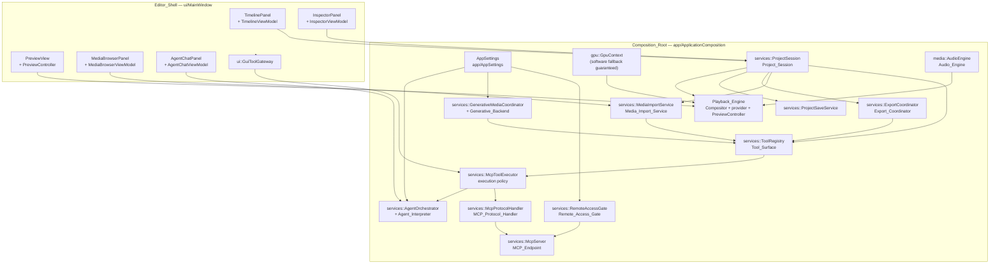
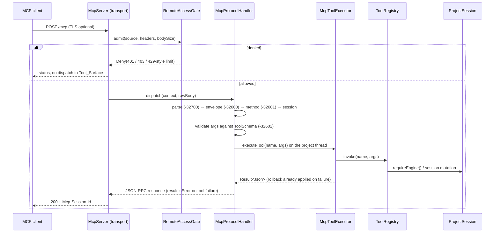
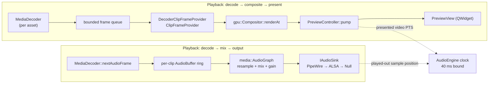
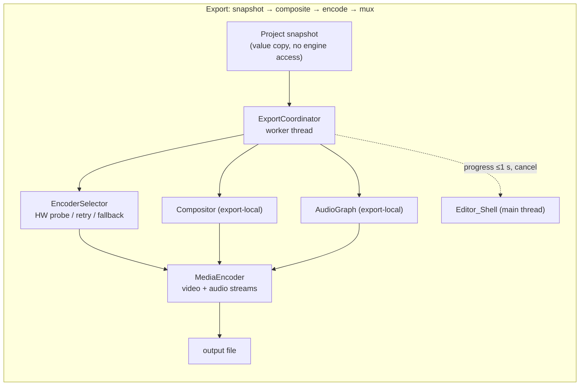

# Design Document

## Overview

Palmier Pro for Linux already contains the parts of a video editor. `src/core` holds a
validated project model with an atomic, undoable command path (`TimelineEngine`,
`EditCommand`, `UndoRedoStack`). `src/media` holds probing, validation, video decode, video
encode, an audio mix graph, and a render loop (`ExportEngine`). `src/gpu` holds device
selection with a guaranteed software fallback, a frame pool, a compositor, and a
hardware-codec routing bridge. `src/services` holds the shared tool surface, an execution
policy with rollback and timeouts, an HTTP endpoint, project persistence, auth/BYOK, and the
agent orchestrator. `src/ui` holds five Qt-free view models, each unit-tested.

What is missing is the *assembly*. `ApplicationComposition` never constructs an
`ExportEngine`, a `Compositor`, a `MediaDecoder`, or a `PreviewController`. `MainWindow`
shows a `QLabel`. `ToolRegistry` has no project, track, or media tools and its
`timeline.export` hook is never wired. `McpToolExecutor` holds a bare `TimelineEngine*` with
no notion of "which project is open". `McpServer` answers a bespoke `{"ok":…}` envelope
rather than JSON-RPC 2.0. There is no audio decode, no audio output, no audio in the export
muxer. `PALMIER_HAVE_NVENC`/`PALMIER_HAVE_QSV` are never defined in CI, so the hardware
encode paths are compiled out.

**Strategy: assemble, do not rewrite.** Every requirement in this feature is satisfied by one
of four moves, in descending preference:

1. **Wire an existing component into the object graph** (export, compositor, decoder,
   preview, save/open, panels, view models).
2. **Add a thin new component at a seam the existing code already exposes**
   (`ClipFrameProvider`, `ToolRegistryHooks`, `McpRequestHandler`, `IDecodeBackend`,
   `IEncodeBackend`, `IResampler`, `IntentInterpreter`, `IGenerativeBackend`).
3. **Extend an existing component's interface** where the header explicitly defers work
   (`MediaDecoder` audio, `MediaEncoder` audio stream, `ExportEngine` audio path,
   `TimelineEngine::reset`).
4. **Introduce one genuinely new abstraction** — `Project_Session` — because "which project
   is open, where it lives on disk, and whether it is modified" has no representation today
   and Requirements 3 and 4 cannot be expressed without it.

Two cross-cutting rules fall out of the requirements and shape everything below:

- **One execution path.** Requirements 1.7, 9.4 and 11.5 demand that a GUI gesture, an MCP
  `tools/call` and an agent utterance produce identical project state and identical undo
  history. The mechanism is that all three submit a *named tool invocation with JSON
  arguments* to the same `ToolRegistry` through the same execution policy. The GUI stops
  mutating `TimelineEngine` directly.
- **One argument specification.** Requirement 9.12 is a property: the schema advertised by
  `tools/list` must accept exactly what the handler accepts. The mechanism is that both the
  advertised JSON Schema and the runtime validator are *generated from one `ToolSchema`
  value*, so they cannot drift.

The result is a runnable editor: launch, import, edit, play with audio, save, re-open, export
with GPU encode and CPU fallback, drive it all from Claude Code / Codex / Cursor over standard
MCP, optionally over an authenticated remote binding, with offline-capable defaults for both
generative media and natural-language agent reasoning.

---

## Architecture

### Composed object graph



Every accessor named in Requirement 1.1 returns a reference to the single instance the
composition root owns for the lifetime of the process; construction order is strictly
dependency order and any construction failure aborts startup before the shell is shown
(Requirement 1.9).

### Request admission: where the gate and the protocol handler sit



The gate is strictly *upstream* of the protocol handler, which is strictly upstream of the
executor, which is the only thing that touches `ToolRegistry`. A rejected request therefore
provably never reaches the Tool_Surface (Requirements 10.4, 10.5, 10.6).

### Runtime pipelines





---

## Key design decisions

### D1. Project_Session — the central new abstraction

**Decision.** Introduce `services::ProjectSession` (`src/services/ProjectSession.{hpp,cpp}`).
It owns exactly one `TimelineEngine` for its whole lifetime, plus the `MediaManager` media
library, the project identity, the optional on-disk document path, a monotonically increasing
**revision counter**, and the derived **modified** flag. `McpToolExecutor`'s
`TimelineEngine*` member is replaced by a `ProjectSession*`, and
`buildDefaultToolRegistry` takes a `ProjectSession&` so every handler resolves the engine
*at invocation time* rather than capturing it at construction time.

Opening a different project does **not** replace the `TimelineEngine` object. It calls a new
`TimelineEngine::reset(Project)` which swaps the project value in place, clears the undo and
redo stacks, and emits a `ChangeSet` with a new `ChangeOrigin::Reset`.

**Alternatives considered.**

| Alternative | Why rejected |
|---|---|
| Keep the raw `TimelineEngine*` and add a second pointer for "document path" | Requirements 3.2/3.4/4.1/4.6 all quantify over *the session*: "make it the current project", "report it as unmodified with its on-disk location known". Splitting that state across the composition root and the executor puts the invariant "path and dirty flag always describe the current project" nowhere. |
| `ProjectSession` owns a `unique_ptr<TimelineEngine>` and replaces the object on open | `TimelineEngine` is non-copyable and non-movable, and five view models plus the compositor's frame provider and the `InspectorViewModel` all hold `TimelineEngine&` and an active `Subscription`. Replacing the object dangles all of them and forces a rebind protocol through the whole UI. |
| Multiple concurrent sessions (a session per MCP client) | Requirement 3.5 and 9.4 both speak of "the current project", singular, and the GUI shows one project. Multi-session would make GUI/MCP equivalence (1.7) meaningless. MCP *protocol* sessions are multiple (D3); the *project* session is one. |

**Rationale.** A stable engine identity keeps every existing observer, view model and
subscription valid across `project.open`, so Requirement 4.3's "refresh the timeline,
preview, inspector and media browser panels to the loaded state" is satisfied by the existing
`ChangeSet` broadcast rather than by new plumbing. The revision counter gives the dirty flag
and the off-thread save a precise definition (D6). Resolving the engine per invocation is what
makes `project.open` observable to tools that were registered before it happened.

**Atomicity of session-level tools.** `project.create` and `project.open` are *not*
`EditCommand`s and are not undoable. They build a complete `Project` value in a local
variable and only call `reset()` on full success, so a failed open leaves the previous
project, its path, its modified flag and its undo history byte-for-byte unchanged
(Requirements 3.9, 4.10). Because `reset()` emits `ChangeOrigin::Reset` rather than
`ChangeOrigin::Apply`, the executor's applied-command counter (which drives rollback) does not
count it and will never try to "undo" a project load.

### D2. Single execution path for GUI, MCP and agent

**Decision.** The GUI submits named tool invocations. `ui::GuiToolGateway`
(`src/ui/GuiToolGateway.{hpp,cpp}`) exposes one method per user gesture; each builds a `Json`
argument object and calls `McpToolExecutor::executeTool(name, args)` — the identical entry
point `McpProtocolHandler` and `AgentOrchestrator` use. The existing view models keep their
read-side projection (`TimelineViewModel::trackAt/clipAt`, `InspectorViewModel`'s selected
clip) but their *mutating* gesture methods are re-pointed at the gateway instead of at
`TimelineEngine::apply`.

Undo history is recorded exactly once because it is recorded in exactly one place:
`TimelineEngine::apply` pushes onto `UndoRedoStack`, and the only code that calls `apply` for
an editing operation is a `ToolRegistry` handler. `Edit > Undo`/`Redo` call
`TimelineEngine::undo()/redo()` directly (they are history navigation, not edits) and are
enabled from `canUndo()/canRedo()` (Requirements 1.8, 1.11).

**Alternatives considered.**

| Alternative | Why rejected |
|---|---|
| GUI keeps calling `TimelineEngine::apply` with `EditCommand`s; declare equivalence by construction | The existing `edit_equivalence_property_test.cpp` already shows this needs a *separate* per-gesture argument-marshalling path to stay in step. Two marshalling paths is exactly the drift Requirement 1.7 forbids, and a GUI gesture would bypass the executor's schema validation and rollback. |
| Route the GUI through the JSON-RPC layer (localhost round-trip) | Adds serialization latency and a socket dependency to every keystroke, and makes the GUI unusable when the endpoint fails to bind. |
| Give the GUI a typed façade that internally builds `EditCommand`s shared with the tools | The commands are already shared; the *validation, rollback and timeout policy* is what must be shared, and that lives in the executor above the commands. |

**Rationale.** Funnelling through `executeTool` means the GUI inherits argument validation,
whole-invocation rollback and the time budget for free, and the equivalence property becomes a
statement about one function rather than about three code paths.

**Cost acknowledged.** GUI gestures pay a `Json` construction per edit. Measured against a
1 s undo budget (Requirement 1.8) and a 200 ms UI responsiveness budget (Requirement 7.3) this
is immaterial; the argument objects are a handful of members.

### D3. MCP protocol layer: three separated concerns

**Decision.** Split what is today one bespoke path into three components:

1. **`services::McpServer`** (existing, modified) — *transport only*: sockets, TLS, HTTP
   framing, headers, status codes. It gains a `RemoteAccessGate*` admission hook, non-loopback
   binding, an optional TLS layer, and the ability to answer with an empty body and status
   202.
2. **`services::McpProtocolHandler`** (new, `src/services/McpProtocolHandler.{hpp,cpp}`) —
   *JSON-RPC 2.0 method dispatch*: envelope validation, `initialize`,
   `notifications/initialized`, `tools/list`, `tools/call`, error codes, session lookup. It
   holds a `ToolRegistry&`, an `McpToolExecutor&` and an `McpSessionRegistry&`, and knows
   nothing about sockets.
3. **`services::McpToolExecutor`** (existing, modified) — *execution policy only*:
   validation, rollback, budget. Unchanged in spirit; retargeted at `ProjectSession`.

**Session management.** `services::McpSessionRegistry`
(`src/services/McpSessionRegistry.{hpp,cpp}`) mints a session on successful `initialize`: a
256-bit value from `std::random_device` rendered as 64 lowercase hex characters (satisfies
"opaque, at least 32 characters", Requirement 9.11) returned in the `Mcp-Session-Id` response
header and accepted in the same request header thereafter. The registry tracks
`initialized`, `lastSeen`, `createdAt`, and enforces the concurrent-session maximum and the
idle timeout (Requirements 10.9, 10.11). Uniqueness across the process lifetime is guaranteed
by retaining issued ids in a `std::unordered_set` that is never pruned, only the *live*
records expire.

**Schema/handler agreement (Requirement 9.12).** This is the decision that makes 9.12 a real
property rather than a hope. A new value type `services::ToolSchema`
(`src/services/ToolSchema.{hpp,cpp}`) describes each argument once:

```cpp
struct ArgSpec {
    std::string  name;
    JsonKind     kind;                        // Object|Array|String|Integer|Number|Bool
    bool         required = false;
    std::string  description;
    std::optional<std::int64_t> minInt, maxInt;
    std::optional<double>       minNum, maxNum;
    std::optional<std::size_t>  minLength, maxLength;
    std::vector<std::string>    enumValues;   // closed value set
    bool         uuid = false;                // canonical UUID string
};
```

`ToolSchema::toJsonSchema()` renders the draft-07 object schema published by `tools/list`;
`ToolSchema::validate(const Json&)` enforces *exactly the same* constraint set and is what
`McpToolExecutor` calls before any command is created. Handlers then read
already-validated values and never re-derive an acceptance rule. Any constraint a handler
needs that the vocabulary cannot express must be added to the vocabulary first — that is the
enforcement mechanism, and the property test (P-Schema) generates arbitrary argument objects
and asserts `validate(args).isOk() == handlerAccepts(args)`.

**Alternatives considered.**

| Alternative | Why rejected |
|---|---|
| Hand-write `inputSchema` next to each handler (status quo) | Already drifted: `timeline.add_clip` requires `sourceOutNs > sourceInNs` in the handler with no schema expression, and `additionalProperties: true` lets unknown keys through silently. 9.12 would fail on generated inputs. |
| Reflectively derive the schema from a C++ argument struct | No reflection in C++20 without a macro/codegen layer; a macro DSL is harder to read than the `ArgSpec` list and harder to test. |
| Validate only in the handler and publish a permissive schema | Directly contradicts 9.3 ("naming each accepted argument and listing the required arguments") and 9.9 (out-of-bounds values must yield ‑32602 *before* execution). |
| Keep JSON-RPC framing inside `McpToolExecutor` | The executor is driven by the GUI and the agent, which have no envelopes, no ids and no sessions. Framing there would force synthetic envelopes on both. |

### D4. Remote_Access_Gate — secure by default, fail closed to loopback

**Decision.** `services::RemoteAccessGate` (`src/services/RemoteAccessGate.{hpp,cpp}`) has
two responsibilities, deliberately separated:

- **Bind-time admission** — `validate(const RemoteAccessConfig&) -> BindDecision`. Absent
  configuration yields `127.0.0.1:19789` (Requirement 10.1). With `enabled == true` it
  requires all three of a syntactically valid IPv4/IPv6 literal, a bearer token of 32–512
  printable ASCII characters, and `acknowledged == true`; and, if TLS material is configured,
  that the certificate and key both load and form a matching pair. Any unmet prerequisite
  produces a `BindDecision` that *still binds loopback* and carries a list of named unmet
  prerequisites for the startup error, never echoing the token (Requirements 10.3, 10.12).
  Enabled without TLS emits exactly one warning before the first accepted request and still
  performs the non-loopback bind (Requirement 10.7).
- **Per-request admission** — `admit(const RequestContext&) -> Admission`. On a loopback-only
  binding it returns `Allow` unconditionally, so a request with neither `Authorization` nor
  `Origin` is served exactly as today (Requirement 10.10, the compatibility property). On a
  non-loopback binding it checks, in order: source-address block list (rate limit), bearer
  token (constant-time compare, 401), `Origin` against the allow-list plus the bound address
  and loopback hosts (403), and session-count limit for session-initiating requests.

Rejections are recorded through a `RejectionLog` sink with a UTC millisecond timestamp, the
source address and a reason **code** — the presented credential is never passed to the logger,
so no substring of it can appear (Requirement 10.8). Five 401s from one source inside a 60 s
sliding window install a 60 s block for that source only (Requirement 10.13).

**Alternatives considered.** Putting admission inside `McpProtocolHandler` was rejected because
Origin/token/TLS/rate-limit decisions are transport facts and must be answerable *before* a
body is parsed — Requirement 10.4's 500 ms bound and "SHALL NOT dispatch that request to the
Tool_Surface" both argue for the earliest possible hook. Making remote access opt-in *at build
time* was rejected because Requirement 10 describes runtime configuration and Requirement 16.3
documents runtime inputs.

**TLS.** Served by OpenSSL 3.x (Apache-2.0, compatible with GPLv3) behind
`src/services/TlsTransport.{hpp,cpp}` and the guard `PALMIER_HAVE_OPENSSL`, mirroring the
project's existing `PALMIER_HAVE_*` style. When the guard is absent, configuring TLS is an
unmet prerequisite and the gate falls back to loopback. A plaintext request on a TLS port
fails the handshake and is closed and logged without ever producing an `HttpRequest`
(Requirement 10.6).

### D5. Threading model

The `TimelineEngine`, `ProjectSession`, all view models and all Qt objects have **main-thread
affinity**. Nothing else is allowed to touch them.

| Work | Thread | Owns | Crosses the boundary as |
|---|---|---|---|
| GUI, view models, project mutation, undo/redo, tool execution | Qt main thread | `ProjectSession`, `TimelineEngine`, `MediaManager`, all `*ViewModel`, `MainWindow` | — |
| Video decode for playback | `DecodeWorkerPool` (N = 2, `src/media/DecodeWorkerPool.{hpp,cpp}`) | one `MediaDecoder` per active asset | decoded frames pushed to a bounded lock-protected queue per clip; the provider pops |
| Audio decode + mix + output | audio callback thread owned by the sink | `AudioGraph` instance, per-clip audio ring buffers | `std::atomic<std::int64_t>` played-out sample counter read by the sync check |
| Decoder teardown | `DecoderTeardownQueue` single thread (`src/media/DecoderTeardownQueue.{hpp,cpp}`) | `MediaDecoder` objects handed over for destruction | `unique_ptr` moved into the queue; caller returns immediately |
| Export | one `std::thread` per export, owned by `ExportCoordinator` | a **value copy** `Project`, an export-local `GpuContext`, `Compositor`, decoders, `AudioGraph`, `MediaEncoder` | `Project` snapshot in; `ExportProgress`/`ExportResult` out via a thread-safe callback marshalled to the main thread |
| Save | one `std::jthread` per save, owned by `ProjectSaveService` caller | a **value copy** `Project` plus the target path | `SaveOutcome`/`Error` plus the captured revision number out via a marshalled callback |
| MCP accept + per-connection I/O | `McpServer` accept thread | sockets, TLS objects, session registry (mutex-guarded) | `tools/call` execution is **marshalled onto the main thread** |

**Main-thread marshalling for tool calls.** `McpProtocolHandler` holds a
`MainThreadInvoker` seam:

```cpp
using MainThreadInvoker = std::function<Result<Json>(std::function<Result<Json>()> work,
                                                     std::chrono::milliseconds budget)>;
```

The Qt composition supplies an implementation that posts to the main thread and waits with the
60 s budget of Requirement 9.16, returning a `Timeout` error if the budget elapses. Headless
builds and tests supply an inline invoker that runs the work on the calling thread — which is
exactly what the existing `mcp_http_integration_test.cpp` needs to keep working.

**Alternatives considered.** Making `TimelineEngine` internally synchronised was rejected: it
would need a lock around every command *and* every observer callback, and the observers are Qt
views that must run on the main thread anyway — the lock would only move the marshalling
inside the engine while making `snapshot()` contend with playback. Running export on the main
thread with `QApplication::processEvents()` interleaving was rejected: it makes reentrancy
possible mid-export and cannot honour Requirement 7.3's 200 ms bound while a frame is being
composited and encoded.

**Why export copies the project.** Requirement 7.1 requires the project to be unchanged and
reported unmodified for every export outcome, and Requirement 7.8 requires two successive
exports of a *fixed* timeline to be identical. A value snapshot gives both properties by
construction, and removes all cross-thread access to the engine. `Project` is a plain
aggregate of vectors, so the copy is cheap relative to an encode.

### D6. Save and open without blocking the UI

**Decision.** `ProjectSession::requestSave(path)` captures `(Project snapshot, revision r)`,
hands them to a worker thread that calls `ProjectSaveService::save`, and returns immediately.
Completion is marshalled back: on success, if the session's revision is still `r`, the dirty
flag is cleared and the document path recorded; if the revision has advanced (the user edited
during the write), the file is still valid and the path is recorded but the session stays
modified. On failure the in-memory project, its modified state and any previously saved file
are untouched and an error notice names the destination (Requirements 4.4, 14.6, 14.7).

The atomic write already implemented in `ProjectSaveService` (temp file + `rename`) is what
makes "previously saved file preserved byte-for-byte" true; this decision only moves it off
the UI thread and adds the revision guard.

The unsaved-changes prompt (Requirement 4.5) is a three-button modal that performs **no state
change and writes no file while displayed**; `save` continues the pending close/open only if
the write reports success, `discard` continues without writing, `cancel` abandons the pending
operation. It is implemented as an explicit `PendingIntent` state machine in
`ui::ProjectFileActions` so the "exactly one outcome, no further prompting" clause is a state
transition rather than nested callbacks.

### D7. Audio: decode, sink, sync

**Decision — decoder.** Extend `media::MediaDecoder` with an audio surface that mirrors the
existing video surface and reuses the same `IDecodeBackend` seam philosophy:

```cpp
struct AudioFrame {                       // media/MediaDecoder.hpp
    bool        endOfStream = false;
    Duration    presentation{Duration::zero()};
    AudioBuffer buffer;                   // interleaved f32, media/AudioGraph.hpp
};
Result<void>       openAudioStream(int streamIndex);   // -1 = primary audio stream
Result<AudioFrame> nextAudioFrame();
Result<void>       seekAudio(Duration ts);
bool               hasAudio() const noexcept;
```

`IDecodeBackend` gains `decodeAudio()` and `seekAudio()`; the FFmpeg backend implements them
with `libswresample` conversion into the interleaved-float `AudioBuffer` the existing
`AudioGraph` already consumes. Audio decode is always software — there is no hardware audio
decode path to route — so the `CodecBridge` is not involved and no fallback logic is needed.

**Decision — output sink.** New `media::IAudioSink` (`src/media/AudioSink.{hpp,cpp}`) with
three implementations chosen in order at startup:

1. **PipeWire** (`libpipewire-0.3`, **MIT** licence — the project was relicensed from the LGPL to
   the MIT License in November 2018, per
   [Wikipedia: PipeWire](https://en.wikipedia.org/wiki/PipeWire) — and MIT is a permissive
   licence compatible with GPLv3; only the MIT-licensed core client library is linked, not the
   separately-licensed JACK/ALSA/BlueZ compatibility components), guard
   `PALMIER_HAVE_PIPEWIRE`, option
   `PALMIER_ENABLE_PIPEWIRE` (default ON). Chosen as primary because it is the default audio
   server on every currently supported desktop distribution family, exposes a callback-driven
   float stream that matches the engine's internal format with no conversion, and reports
   played-out sample position, which the A/V sync check needs.
2. **ALSA** (`libasound2`, **LGPL-2.1-or-later**; the "or later" clause permits use under
   LGPL-3.0, which is compatible with GPLv3), guard `PALMIER_HAVE_ALSA`, option
   `PALMIER_ENABLE_ALSA` (default ON). Fallback for hosts without PipeWire and for
   headless/CI images.
3. **NullAudioSink** — always compiled, consumes and discards buffers while reporting a
   monotonic sample position. This is what makes Requirement 6.7 ("audio output unavailable"
   → suppress audio, keep video, show a notice) a normal code path rather than an error path,
   and what lets the audio tests run in CI with no sound card.

Rejected: SDL2 (a whole windowing/input library for one output stream), PulseAudio (being
superseded, and PipeWire's Pulse shim covers it), JACK (pro-audio deployment assumption),
writing raw ALSA `hw:` access (bypasses the user's sound server).

**Decision — A/V sync (Requirement 6.3, 40 ms).** The **audio sink is the clock**. The sink
exposes `playedFrames()` as an atomic counter; `AudioEngine::presentationPosition()` converts
it to a `Duration` at the 48 kHz output rate. `PreviewController` asks the audio clock for the
current position each `pump()` and:

- if the next video frame's PTS is more than one frame interval *behind* the audio position,
  the frame is counted as **dropped** and skipped (this is the source of the drop accounting in
  Requirements 5.2 and 5.7);
- if it is more than one frame interval *ahead*, presentation waits;
- otherwise the frame is presented.

Because video slews to audio and audio is never resampled to chase video, the measured skew is
bounded by one video frame interval plus the sink's buffer quantum. With a 1024-frame quantum
at 48 kHz (21.3 ms) and a 30 fps timeline (33.3 ms), the bound is comfortably inside 40 ms; the
sink requests a quantum of at most 512 frames (10.7 ms) when the frame rate exceeds 48 fps.
When no sink is available the `NullAudioSink` still advances its counter from a steady clock, so
video timing is unchanged (Requirement 6.7).

**Decision — export audio.** `MediaEncoder` gains a second stream:

```cpp
struct AudioEncodeSpec { int sampleRate = 48000; int channels = 2;
                         std::string codecName = "aac"; std::int64_t bitrateBitsPerSecond = 192000; };
std::optional<AudioEncodeSpec> audio;     // added to EncodeSpec
Result<void> submitAudio(const AudioBuffer& buffer, Duration presentation);
```

`ExportEngine::run` interleaves: for each video frame it renders and submits the frame, then
submits the audio for that frame's interval, mixed by an export-local `AudioGraph` from the
same clip set. `finish()` flushes both streams and writes the trailer. An empty audio timeline
still gets one silent stream spanning the timeline duration (Requirement 6.11), produced by
mixing zero sources into a full-length buffer — which `AudioGraph::mix` already does when a
`frameCount` is supplied.

### D8. Encoder_Selector

**Decision.** New `media::EncoderSelector` (`src/media/EncoderSelector.{hpp,cpp}`) sits above
`gpu::CodecBridge` and below `MediaEncoder`, and returns exactly one selection:

```cpp
struct EncoderSelection {
    gpu::CodecId codec;
    std::string  encoderName;        // "h264_nvenc" | "libx264" | …
    bool         hardware = false;
    bool         softwareFallback = false;   // true only when !hardware
    std::string  fallbackReason;             // empty unless softwareFallback
};
```

The **single-selection invariant** (Requirement 8.8) is structural: `EncoderSelection` is a
value with one `encoderName`, and the only constructors are `EncoderSelection::hardware(...)`
(sets `hardware=true`, `softwareFallback=false`) and `EncoderSelection::software(codec,
reason)` (sets `hardware=false`, `softwareFallback = !reason.empty()`). There is no code path
that can set both flags, and the property test enumerates all 3 codecs × 8 compiled-in states
to confirm it.

Selection algorithm:

1. If hardware is not requested, or no hardware path is compiled in for the vendor, or the
   codec is absent from `GpuCaps::encodeCodecs`, select software immediately (Requirement 8.4).
2. Otherwise run the **capability probe** with a 3000 ms deadline. The probe runs on a
   detached thread and is awaited with `std::future::wait_for(3000ms)`; a timeout is treated
   as "no compatible device" and selects software. A detached thread rather than a joined one
   is deliberate: a wedged vendor driver must not be able to block startup or an export
   (Requirements 8.4, 8.7).
3. On a positive probe, select the vendor encoder. If `MediaEncoder::create` then fails
   *before the first frame*, retry hardware initialization **exactly once**; if that also
   fails, select the software encoder for the same codec with resolution, frame rate and bit
   rate unchanged, and set `softwareFallback = true` with a reason naming hardware
   initialization failure (Requirement 8.3).
4. A hardware failure *after* at least one frame is a hard export failure: stop, delete the
   partial file, report a mid-export hardware encode failure (Requirement 8.11). Switching
   encoders mid-stream is not attempted — it would corrupt the output, which is exactly why
   `MediaEncoder`'s existing header fixes its fallback at initialization.

Software encoder names come from the existing `gpu::softwareEncoderName`: `libx264`,
`libx265`, `libvpx-vp9` (Requirement 8.4).

**Build-flag fix (Requirements 8.1, 8.9).** Three coordinated changes:

- `cmake/PalmierDependencies.cmake`: vendor SDK lookups (`libva`, `vpl`/`libmfx`,
  `ffnvcodec`) become **optional** — a miss records `PALMIER_VAAPI_AVAILABLE=OFF` (etc.) and
  a status message instead of appending to the fatal missing-dependency list.
- `src/media/CMakeLists.txt`: define `PALMIER_HAVE_VAAPI/QSV/NVENC` only when
  `PALMIER_ENABLE_* AND <sdk>_FOUND`, and link the imported target only in that same branch.
  Today `src/media` defines them from `PALMIER_ENABLE_*` alone and links
  `PkgConfig::LIBVA`/`PkgConfig::LIBVPL` unconditionally, which is why the options cannot be
  left ON without the SDKs — this is the actual root cause of the audit's item 8.
  `src/gpu/CMakeLists.txt` already has the correct `ENABLE AND FOUND` form and is the model.
- `cmake/PalmierSummary.cmake`: print each vendor path as `enabled (SDK found)` /
  `disabled (SDK not found)` / `disabled (option OFF)`, which is the summary line Requirements
  8.1 and 8.9 require.
- `.github/workflows/ci.yml`: install `nv-codec-headers` and `libvpl-dev` and configure with
  all three options ON, so `PALMIER_HAVE_NVENC`/`QSV`/`VAAPI` are actually defined in CI and
  the hardware code paths are compiled and type-checked. Hardware *execution* still skips
  without a device (Requirement 15.5).

### D9. Pluggable backends and the licence boundary

**Decision — Agent_Interpreter.** `services::AgentInterpreterRegistry`
(`src/services/AgentInterpreterRegistry.{hpp,cpp}`) maps a configuration id to an
`IntentInterpreter` factory. Ids: `offline` (default), `hosted`, `byok`. The default is a real,
useful implementation — `services::OfflineIntentInterpreter`
(`src/services/OfflineIntentInterpreter.{hpp,cpp}`) — a table of at least 12 documented
phrase patterns matched case-insensitively on the whitespace-trimmed utterance, resolving to
tool invocations with captured arguments, issuing no network request and answering well inside
1 s (Requirement 11.3). This replaces `makeUnconfiguredInterpreter()`, which returns
`FailedPrecondition` for everything.

Documented offline phrases (the set Requirement 11.3 and 16.4 refer to): `split the clip at
the playhead`, `mute track N`, `unmute track N`, `add a video track`, `add an audio track`,
`delete the selected clip`, `import <path>`, `export as mp4 to <path>`, `save the project`,
`undo`, `redo`, `show the timeline`.

**Decision — Generative_Backend.** `services::GenerativeBackendRegistry`
(`src/services/GenerativeBackendRegistry.{hpp,cpp}`) maps ids `offline` | `hosted` | `byok` to
`IGenerativeBackend` factories. All three are compiled in; selection is a configuration string,
so no recompilation is needed (Requirement 12.2). `hosted` and `byok` are **clients**: HTTPS
request/response code under GPLv3 in this repository, reading credentials from `SecretStore`
at runtime. No endpoint credential value is checked in. The closed-source *service* stays
outside the repository — the licence boundary is the network boundary, which is exactly the
arrangement upstream documents. A misconfigured or credential-less selection installs
`offline`, reports a startup error naming the rejected id and the unmet requirement, and still
constructs every other component (Requirement 12.8).

**Rationale for keeping the offline stub as the fallback rather than failing startup.**
Requirement 12.5 requires the editor to remain fully usable in Offline_Mode; making a bad
generative id fatal would make an optional feature able to prevent the editor from opening.

---

## Components and interfaces

Signatures below are the public surface each component must expose. Existing types are
referenced by their real names; `[new]` and `[modified]` mark the file's status.

### Session and composition

**`services::ProjectSession`** — `src/services/ProjectSession.{hpp,cpp}` `[new]`
Satisfies 1.1, 1.8, 1.10, 3.2, 3.4, 3.5, 3.9, 4.1–4.6, 4.10, 14.6, 14.7.

```cpp
class ProjectSession {
public:
    struct Status { Uuid projectId; std::string name; bool modified;
                    std::optional<std::filesystem::path> documentPath;
                    std::size_t trackCount, clipCount; std::uint64_t revision; };

    ProjectSession();                                  // empty default project (1.10)

    [[nodiscard]] TimelineEngine& engine() noexcept;   // stable for the session lifetime
    [[nodiscard]] MediaManager&   mediaLibrary() noexcept;
    [[nodiscard]] Status          status() const;
    [[nodiscard]] bool            modified() const noexcept;
    [[nodiscard]] std::uint64_t   revision() const noexcept;
    [[nodiscard]] const std::optional<std::filesystem::path>& documentPath() const noexcept;

    [[nodiscard]] Result<Uuid> createProject(std::string name, FrameRate fps,
                                             Resolution canvas, ColorSpace cs);   // 3.2, 3.8
    [[nodiscard]] Result<Status> openProject(const std::filesystem::path& path);   // 3.4, 3.9
    [[nodiscard]] Result<void>   requestSave(const std::filesystem::path& path,
                                             SaveCompletion onDone);               // 4.1, 14.6
    void markModified();                               // called on every ChangeOrigin::Apply
    [[nodiscard]] Subscription observeStatus(std::function<void(const Status&)>);
};
```

**`TimelineEngine`** — `src/core/TimelineEngine.{hpp,cpp}` `[modified]`
Adds `[[nodiscard]] CommandResult reset(Project initial);` (swaps the project, clears undo and
redo, emits `ChangeSet{origin = ChangeOrigin::Reset}`) and `ChangeOrigin::Reset` in
`src/core/ChangeSet.hpp`. Satisfies 3.4, 4.3.

**`app::ApplicationComposition`** — `src/app/ApplicationComposition.{hpp,cpp}` `[modified]`
Satisfies 1.1, 1.6, 1.9, 8.7, 11.1, 12.1, 12.2, 12.8.
New accessors, each returning the single owned instance:
`projectSession()`, `mediaImportService()`, `playbackEngine()`, `audioEngine()`,
`exportCoordinator()`, `toolRegistry()`, `compositor()`, `remoteAccessGate()`,
`mcpProtocolHandler()`, `agentInterpreterId()`, `generativeBackendId()`,
`codecBackendReport()` (Requirement 8.7), `gpuUnavailableNotice()` (existing),
`startupErrors()` (non-fatal startup diagnostics such as 12.8).
`AppConfig` gains `RemoteAccessConfig remote`, `std::string agentInterpreterId`,
`std::string generativeBackendId`, `AudioSinkPreference audioSink`,
`MainThreadInvoker mainThreadInvoker`.
Construction is wrapped so that a failure to construct any component named in Requirement 1.1
throws/returns a `ComponentConstructionError{componentName, reason}`; `main.cpp` reports it and
exits without showing the shell (Requirement 1.9).

```cpp
struct CodecBackendStatus { std::string name; bool compiledIn; bool usableOnHost; };
[[nodiscard]] std::vector<CodecBackendStatus> codecBackendReport() const;  // 8.7, ≤3000 ms
```

**`app::AppSettings`** — `src/app/AppSettings.{hpp,cpp}` `[new]`
Reads configuration from, in increasing precedence: built-in defaults, a TOML-free simple
`key=value` file at `$XDG_CONFIG_HOME/palmier-pro/config`, environment variables, command-line
flags. Produces an `AppConfig`. Satisfies 10.2, 11.1, 12.2, 16.3.

### Tool surface

**`services::ToolSchema`** — `src/services/ToolSchema.{hpp,cpp}` `[new]`
Satisfies 9.3, 9.9, 9.12.

```cpp
class ToolSchema {
public:
    ToolSchema& arg(ArgSpec spec);
    [[nodiscard]] Json         toJsonSchema() const;               // published by tools/list
    [[nodiscard]] Result<void> validate(const Json& input) const;  // used before execution
    [[nodiscard]] const std::vector<ArgSpec>& args() const noexcept;
};
```

**`services::ToolRegistry`** — `src/services/ToolRegistry.{hpp,cpp}` `[modified]`
`Tool` gains `ToolSchema schema;` and `inputSchema` becomes `schema.toJsonSchema()`.
`buildDefaultToolRegistry(ProjectSession&, ToolRegistryHooks)` replaces the
`TimelineEngine&` form; `ToolRegistryHooks` gains `importMedia`, `listMedia`, `saveProject`,
`openProject`, `createProject`, `projectInfo`, `exportTimeline` (existing), `generate`
(existing). `SetTransitionCommand` moves out of the .cpp into `core/EditCommands` as a real
`EditCommand` (audit finding). Satisfies 3.1, 9.3, 9.12, 14.4.

**New tools.** All arguments are declared once in a `ToolSchema`. `Ns` suffixes are
nanosecond tick counts, matching `Duration`'s internal representation and the existing tools.

| Tool | Arguments | Success result |
|---|---|---|
| `project.create` | `name` string req (1–128), `fps` number req (1–240), `width` integer req (16–7680), `height` integer req (16–4320), `colorSpace` string opt (enum: `sRGB`,`Rec.709`,`Rec.2020`,`Rec.2100 PQ`,`Rec.2100 HLG`,`Display P3`,`Linear sRGB`; default `Rec.709`) | `{projectId, name, fps:{numerator,denominator}, canvas:{width,height}, colorSpace, modified:false, documentPath:null}` |
| `project.open` | `path` string req (1–4096) | `{projectId, name, trackCount, clipCount, documentPath, modified:false}` |
| `project.save` | `path` string opt (1–4096; omitted ⇒ recorded document path) | `{documentPath, bytesWritten, modified:false}` |
| `project.info` | — | `{projectId, name, fps, canvas, colorSpace, trackCount, clipCount, assetCount, durationNs, modified, documentPath, undoDepth}` |
| `media.import` | `path` string req (1–4096) | `{assetId, sourcePath, containerFormat, durationMs, width?, height?, fps?, hasVideo, hasAudio, duplicate}` |
| `media.list` | — | `{assets:[{assetId, sourcePath, displayName}], count}` |
| `timeline.add_track` | `kind` string req (enum `video`,`audio`) | `{trackId, kind, index, trackCount}` |
| `timeline.remove_track` | `trackId` string req (uuid) | `{trackId, trackCount, clipCount}` |
| `timeline.export` | `outputPath` string req (1–4096), `container` string req (enum `mp4`,`mov`,`mkv`,`webm`), `codec` string req (enum `h264`,`hevc`,`vp9`), `width` integer req (128–3840), `height` integer req (128–2160), `fps` number req (1–120), `bitrateKbps` integer req (100–200000), `includeAudio` bool opt (default true), `preferHardware` bool opt (default true), `overwrite` bool opt (default false) | `{outputPath, framesEncoded, encoderName, usedHardwareEncode, usedSoftwareFallback, fallbackReason, containsAudio, durationNs}` |

`timeline.add_track` and `timeline.remove_track` are backed by new
`AddTrackCommand` / `RemoveTrackCommand` in `src/core/EditCommands.{hpp,cpp}` so they are
undoable through the same path as every other edit; `project.*` and `media.import` are session
operations and are not undoable (see D1).

**`services::McpToolExecutor`** — `src/services/McpToolExecutor.{hpp,cpp}` `[modified]`
`TimelineEngine*` → `ProjectSession*`; `validateAgainstSchema` delegates to
`ToolSchema::validate`; the default budget becomes 60 s to match Requirement 9.16; an
`InvocationSource { Gui, Mcp, Agent }` argument is added for logging only and does not affect
behaviour. Satisfies 1.7, 9.4, 9.5, 9.9, 9.16, 11.5.

### MCP

**`services::McpProtocolHandler`** — `src/services/McpProtocolHandler.{hpp,cpp}` `[new]`
Satisfies 9.1–9.16.

```cpp
struct McpRequestContext { std::string sourceAddress; std::optional<std::string> sessionId;
                           std::optional<std::string> authorization, origin;
                           std::size_t bodyBytes = 0; bool secureTransport = false; };
struct McpReply { int httpStatus = 200; std::string body;           // empty ⇒ zero-byte body
                  std::optional<std::string> newSessionId; };

class McpProtocolHandler {
public:
    static constexpr std::string_view kSupportedProtocolVersions[] = {"2025-06-18", "2025-03-26"};
    McpProtocolHandler(const ToolRegistry&, McpToolExecutor&, McpSessionRegistry&,
                       MainThreadInvoker, Options = {});
    [[nodiscard]] McpReply handle(const McpRequestContext&, std::string_view rawBody);
};
```

**`services::McpSessionRegistry`** — `src/services/McpSessionRegistry.{hpp,cpp}` `[new]`
Satisfies 9.10, 9.11, 9.14, 9.15, 10.9, 10.11.

```cpp
struct McpSessionRecord { std::string id; bool initialized = false; std::string protocolVersion;
                          std::chrono::steady_clock::time_point createdAt, lastSeen;
                          std::string sourceAddress; };
class McpSessionRegistry {
public:
    explicit McpSessionRegistry(Options);              // maxSessions 1..32 (default 8), idle 30..3600 s
    [[nodiscard]] Result<std::string> create(std::string sourceAddress, std::string protocolVersion);
    [[nodiscard]] Result<McpSessionRecord*> touch(std::string_view id);   // NotFound / Timeout(expired)
    void markInitialized(std::string_view id);
    std::size_t expireIdle();                          // called before every admission decision
    [[nodiscard]] std::size_t activeCount() const;
};
```

**`services::McpServer`** — `src/services/McpServer.{hpp,cpp}` `[modified]`
Gains `start(const BindDecision&)`, a `RemoteAccessGate*`, header capture into
`McpRequestContext`, `Mcp-Session-Id` emission, 202-with-empty-body support, a 1 MiB body cap
that yields ‑32700, and optional TLS via `TlsTransport`. `dispatch()` keeps its pure,
socket-free shape so the existing transport unit tests remain valid. Satisfies 9.1, 9.6, 9.10,
9.11, 10.1, 10.4–10.6.

**`services::RemoteAccessGate`** — `src/services/RemoteAccessGate.{hpp,cpp}` `[new]`
Satisfies 10.1–10.13.

```cpp
struct BindDecision { std::string host; std::uint16_t port; bool loopbackOnly;
                      bool tlsEnabled; std::vector<std::string> unmetPrerequisites;
                      std::optional<std::string> plaintextWarning; };
enum class RejectionReason { NoToken, MalformedToken, TokenMismatch, OriginNotAllowed,
                             SessionLimitReached, SourceBlocked, PlaintextOnTlsPort };
struct Admission { bool allowed; int httpStatus; RejectionReason reason; };

class RemoteAccessGate {
public:
    RemoteAccessGate(RemoteAccessConfig, RejectionLog&, Clock = {});
    [[nodiscard]] BindDecision validate() const;                       // 10.2, 10.3, 10.7, 10.12
    [[nodiscard]] Admission    admit(const McpRequestContext&);        // 10.4, 10.5, 10.9, 10.10, 10.13
    void noteSessionCreated(); void noteSessionClosed();
};
```

### Media, playback, audio, export

**`media::MediaDecoder`** `[modified]`, **`media::AudioSink`** `[new]`,
**`media::AudioEngine`** `[new]` — see D7 for signatures. Satisfies 6.1–6.4, 6.6, 6.7, 6.9.

```cpp
// media/AudioEngine.hpp
class AudioEngine {
public:
    static constexpr int kOutputSampleRate = 48000;
    static constexpr int kOutputChannels   = 2;
    AudioEngine(ProjectSession&, std::unique_ptr<IAudioSink>, DecoderTeardownQueue&);
    [[nodiscard]] Result<void> start(Duration from);      // 6.2
    void                       stop();
    [[nodiscard]] Duration     presentationPosition() const noexcept;   // the master clock
    [[nodiscard]] bool         outputAvailable() const noexcept;        // 6.7
    [[nodiscard]] const std::optional<std::string>& notice() const noexcept;
    [[nodiscard]] Result<AudioBuffer> renderRange(const Project&, Duration from, Duration to);  // export path
};
```

**`media::DecoderClipFrameProvider`** — `src/media/DecoderClipFrameProvider.{hpp,cpp}` `[new]`
Implements `gpu::ClipFrameProvider`: maps `(Clip, Duration timelinePosition)` to the clip's
source position `sourceIn + (position - timelineStart)`, keeps one `MediaDecoder` per asset in
an LRU cache, seeks when the requested position is not the next sequential frame, converts a
`DecodedFrame` to a `gpu::SourceFrame`, and hands retired decoders to
`DecoderTeardownQueue`. A decode failure is returned as an error, which
`Compositor::renderAt` already propagates without emitting a partial frame. Satisfies 5.1,
5.5, 14.8.

**`media::EncoderSelector`** `[new]` — see D8. Satisfies 8.1–8.4, 8.8.

**`services::ExportCoordinator`** — `src/services/ExportCoordinator.{hpp,cpp}` `[new]`
Satisfies 6.5, 6.10, 6.11, 7.1–7.11, 8.11.

```cpp
class ExportCoordinator {
public:
    ExportCoordinator(ProjectSession&, gpu::GpuContext&, DecoderTeardownQueue&);
    [[nodiscard]] Result<void> begin(const ExportRequest2&, ProgressSink, CompletionSink);  // 7.1, 7.2, 7.10
    void                       cancel();                                                    // 7.7
    [[nodiscard]] bool         running() const noexcept;
    [[nodiscard]] static Result<void> validate(const ExportRequest2&);                       // 7.6, 7.9, 7.11
};
```

`validate()` is a pure function called before any file is created, which is what makes "create
no file at the requested path" true for every rejection (Requirements 7.6, 7.9, 7.11).

**`services::MediaImportService`** — `src/services/MediaImportService.{hpp,cpp}` `[new]`
Satisfies 2.1–2.9.

```cpp
struct ImportedAsset { Uuid assetId; std::filesystem::path sourcePath; std::string containerFormat;
                       std::int64_t durationMs; std::optional<Resolution> resolution;
                       std::optional<FrameRate> frameRate; bool hasVideo, hasAudio, duplicate; };
class MediaImportService {
public:
    MediaImportService(ProjectSession&, media::MediaProbeBackend, Options = {});  // timeout 30 s
    [[nodiscard]] Result<ImportedAsset> import(const std::filesystem::path&);
    [[nodiscard]] bool isPending(const std::filesystem::path&) const;             // 2.9
};
```

Duplicate detection canonicalises with `std::filesystem::weakly_canonical` and compares the
resulting absolute path against the library, so the media-browser action and the `media.import`
tool converge on one entry (Requirements 2.5, 2.6).

### GUI

**`ui::MainWindow`** — `src/ui/MainWindow.{hpp,cpp}` `[modified]`
Satisfies 1.2–1.6, 4.1–4.3, 4.5, 4.9, 5.6, 6.7, 7.3.
Takes `app::ApplicationComposition&`. Builds five `QDockWidget`s — timeline (bottom), preview
(central), inspector (right), media browser (left), agent chat (right, tabbed with inspector) —
each holding the corresponding panel bound to the composition's single view model instance.
Menu bar in order: **File** (New, Open…, Save, Save As…, Quit), **Edit** (Undo, Redo, Delete
Clip, Split at Playhead), **Playback** (Play/Pause, Stop, Go to Start), **Export** (Export
Video…, Cancel Export), **Help** (Documentation, About). Minimum window size 1024×640 with
`setMinimumSize`, each dock `setMinimumSize(80, 60)`; docks are `QDockWidget`s so a hidden dock
is always one View-menu/tab action away (Requirement 1.4). Status bar hosts the persistent
GPU-unavailable notice, the software-compositing notice, the audio-unavailable notice, and the
export progress bar with a cancel button.

**`ui::GuiToolGateway`** — `src/ui/GuiToolGateway.{hpp,cpp}` `[new]`
One method per gesture (`moveClip`, `trimClip`, `splitClip`, `reorderClips`, `addClip`,
`deleteClip`, `addEffect`, `addTransition`, `addTrack`, `removeTrack`, `importMedia`,
`createProject`, `openProject`, `saveProject`, `exportTimeline`), each building JSON arguments
and calling `McpToolExecutor::executeTool(name, args, InvocationSource::Gui)`. Returns the
existing `ui::GestureResult` so panels keep their indication handling. Satisfies 1.7.

**`ui::ExportDialog`** `[new]`, **`ui::ProjectFileActions`** `[new]`,
**`ui::TimelinePanel`** `[new]` (a `QTreeView` over the existing `TimelineModel` plus a
transport bar), **`ui::PreviewView`** `[modified]` (drives `PreviewController::pump` from a
`QTimer` and paints the presented frame).

### Backends

**`services::OfflineIntentInterpreter`** `[new]`, **`services::AgentInterpreterRegistry`**
`[new]`, **`services::GenerativeBackendRegistry`** `[new]`,
**`services::HostedGenerativeBackend`** / **`services::ByokGenerativeBackend`** `[new]` — see
D9. Satisfies 11.1–11.10, 12.1–12.10.

**`gpu::EffectKernels` / `gpu::Compositor`** `[modified]` — add
`EffectType::InvertColors` to `src/core/Effect.hpp`, the software reference branch to
`applyEffectSoftware`, and the matching GLSL/SPIR-V kernel, so playback and export agree within
1/255 (Requirements 14.4, 14.5).

---

## Data models

### Project document (`.palmier`)

The existing format is retained verbatim; the schema version moves from **1.0** to **1.1**.
`SchemaVersion::isCompatible(reader, stored)` already requires the same major and
`reader.minor >= stored.minor`, so a 1.1 build reads 1.0 documents and a 1.0 build correctly
rejects a 1.1 document as unsupported (Requirement 3.9, 4.10).

Minor-version additions, all optional on read with documented defaults so 1.0 documents
round-trip unchanged:

| Field | Location | Type | Default when absent | Reason |
|---|---|---|---|---|
| `effects[].type = "invert_colors"` | Clip effect | stable key | — | New effect kind (14.4) |
| `tracks[].name` | Track | string | `""` | Track labelling in the timeline panel |
| `clipGroups` | Project | array of `{id, clipIds[]}` | `[]` | Multicam ripple-trim grouping (PR 397) |

Everything Requirement 4.7 quantifies over is already serialized: `id`, `name`,
`timelineFps` as an exact `{num, den}` rational, `canvas`, `colorSpace` as a stable key,
`tracks` in array order, per-track `clips` in array order, per-clip `sourceIn`/`sourceOut`/
`timelineStart` as integer nanosecond ticks, `effects` with named numeric parameters,
`transitionIn`, and `assets`. That is why the round-trip and idempotence properties (4.7, 4.8)
are stated over the *whole* document rather than a subset.

The document deliberately does **not** carry the document path (it is where the file is), the
modified flag (a session fact), the undo history (session-scoped by Requirement 4.5), or the
`MediaManager` per-clip version history (out of scope for 4.7's equality list).

### Export request and result

```cpp
struct ExportRequest2 {                       // services/ExportCoordinator.hpp
    std::filesystem::path outputPath;         // ≤4096 chars, parent must exist and be writable
    std::string           container;           // mp4 | mov | mkv | webm
    gpu::CodecId          codec;               // H264 | HEVC | VP9
    Resolution            resolution;          // 128..3840 × 128..2160
    FrameRate             frameRate;           // 1..120
    std::int64_t          bitrateKbps;         // 100..200000
    bool                  includeAudio  = true;
    bool                  preferHardware = true;
    bool                  overwrite     = false;
};
struct ExportOutcome {
    std::filesystem::path outputPath;
    std::size_t           framesEncoded = 0;
    std::size_t           plannedFrames = 0;   // ExportEngine::plannedFrameCount
    std::string           encoderName;
    bool                  usedHardwareEncode = false;
    bool                  usedSoftwareFallback = false;
    std::string           fallbackReason;
    bool                  containsAudio = false;
    Duration              duration{Duration::zero()};
    bool                  cancelled = false;
};
struct ExportProgressReport { int percent; std::size_t framesEncoded, totalFrames; Duration position; };
```

### MCP session record and remote-access config

```cpp
struct RemoteAccessConfig {                   // services/RemoteAccessGate.hpp
    bool                     enabled = false;
    std::string              bindAddress;                     // IPv4/IPv6 literal
    std::uint16_t            port = 19789;
    std::string              bearerToken;                     // 32..512 printable ASCII
    bool                     acknowledged = false;
    std::vector<std::string> originAllowList;                 // empty ⇒ bound address + loopback only
    std::optional<std::filesystem::path> tlsCertificate, tlsPrivateKey;
    int                      maxSessions = 8;                 // 1..32
    std::chrono::seconds     idleTimeout{300};                // 30..3600
};
```

`McpSessionRecord` is given above. Neither type ever stores a *presented* token; only the
configured token is held, and it is compared with a constant-time equality helper.

### Audio buffer format

The engine's internal working format is the existing `media::AudioBuffer`: interleaved 32-bit
float, `samples[frame * channels + ch]`, carrying its own sample rate and channel count. The
Audio_Engine output format is fixed at **48 000 Hz, 2 channels, `SampleFormat::F32`**
(`AudioFormat{48000, 2, SampleFormat::F32}`), which is the format `AudioGraph` mixes into, the
sink consumes, and the export audio stream is encoded from (Requirement 6.2). Decoder output
is accepted at 8 000–192 000 Hz and 1–8 channels and resampled per source by `AudioGraph`'s
existing per-source `IResampler` (Requirement 6.1). Presentation timestamps are `Duration`
nanosecond ticks and are non-decreasing per stream.

---

## Error handling

### One domain error, three renderings

Every component already returns `Result<T>` with an `ErrorCode`. The three surfaces render the
same error differently and nothing invents a second taxonomy:

| `ErrorCode` | GUI notice | Tool result (`tools/call`) | JSON-RPC error |
|---|---|---|---|
| `InvalidArgument` | Modal or status-bar message naming the rejected field and its accepted range | pre-execution ⇒ JSON-RPC ‑32602 | ‑32602 |
| `OutOfRange` | as above | ‑32602 | ‑32602 |
| `NotFound` (unknown tool) | — (GUI never names a missing tool) | — | ‑32602 (names the tool) |
| `NotFound` (missing clip/track/asset) | Status-bar message | `isError: true` + text | — (transport succeeded) |
| `FailedPrecondition` (no project open, export already running) | Disabled action or modal | `isError: true` + text | — |
| `Unsupported` (codec, container, schema version) | Modal naming the format | `isError: true` + text | — |
| `PermissionDenied`, `Io` (save/export destination) | Modal naming the destination path | `isError: true` + text | — |
| `Unauthenticated` (agent gate, generative gate) | Chat panel system notice, input text preserved | `isError: true` + text | — |
| `Timeout` (tool budget, probe, generation job) | Status-bar message | `isError: true` + "exceeded the execution time limit" | — |
| `Cancelled` (export cancelled) | Status-bar "export cancelled" | `isError: true` + text | — |

JSON-RPC codes are used only for *protocol-level* faults, exactly as Requirement 9 assigns
them: ‑32700 unparsable or oversized body (9.6), ‑32600 malformed envelope (9.7), ‑32601
unknown method (9.8), ‑32602 unknown tool / missing / wrong-typed / out-of-bounds argument
(9.9). A tool that *runs* and fails is a successful JSON-RPC call carrying
`result.isError = true` (9.5) — the distinction matters because a client must be able to tell
"I spoke the protocol wrongly" from "the editor refused my edit".

### Rollback and atomicity

Four nested guarantees, from innermost out:

1. **`EditCommand::apply`** — a failing command leaves the `Project` byte-for-byte unchanged
   (existing contract).
2. **`TimelineEngine::apply`** — snapshots, applies, re-checks
   `checkTimelineInvariants`, rolls back and records nothing on any failure (existing).
3. **`McpToolExecutor::executeTool`** — counts `ChangeOrigin::Apply` emissions during the
   invocation and, on tool failure or budget overrun, undoes exactly that many commands,
   restoring the pre-invocation project *and* the pre-invocation undo history. This is what
   makes Requirement 9.5 true even for a hypothetical multi-command tool, and it is unchanged
   by this feature beyond being retargeted at `ProjectSession`.
4. **Session operations** (`project.create`, `project.open`) — build a complete `Project`
   value locally, commit with `reset()` only on success. Nothing partial is ever observable
   (Requirements 3.9, 4.10).

### Cleanup on failed export and failed generation

- **Export.** `ExportCoordinator` records the output path before the encoder is created and
  installs a scope guard on the worker thread. On any failure, cancellation, or mid-export
  hardware failure, the guard calls `MediaEncoder::finish()` (best effort, to release the file
  handle) and then `std::filesystem::remove(outputPath)`, so no file remains at the requested
  path (Requirements 6.10, 7.5, 7.7, 8.11). Because validation runs before the encoder is
  created, a *rejected* request never creates a file to clean up. Overwrite protection checks
  existence during validation and preserves the existing file byte-for-byte (Requirement 7.11).
- **Generation.** The existing `GenerativeMediaCoordinator` already performs
  validate → gate → generate → place and returns the error verbatim; the added registry
  changes nothing about that. A `failed` job status, a job timeout, or a fetch failure leaves
  the project, the media library and the undo history in their pre-submission state, and any
  partially retrieved media file is removed by the client before returning (Requirements 12.7,
  12.10).
- **Save.** Already atomic via temp-file + `rename`; the async wrapper adds no new failure mode
  because the temp file lives in the destination directory and is removed on a failed write.

### Startup failures

| Condition | Behaviour |
|---|---|
| A component named in Requirement 1.1 fails to construct | Abort startup, do not show the shell, report the component name and reason (1.9) |
| No compatible GPU device | `GpuContext::softwareFallback()`; persistent status-bar notice from `gpuUnavailableNotice()`; all five panels open (1.6) |
| MCP endpoint port unavailable | Non-blocking warning; the editor runs fully without the endpoint (existing behaviour, retained) |
| Remote access misconfigured | Bind loopback, startup error naming each unmet prerequisite, token never echoed (10.3, 10.12) |
| Generative backend id unknown or credential-less | Install `offline`, startup error naming the id and the unmet requirement, every other component still constructed (12.8) |
| Audio output device unavailable | `NullAudioSink`; notice within 2 s; video unaffected (6.7) |


---

## Correctness properties

*A property is a characteristic or behavior that should hold true across all valid executions
of a system — essentially, a formal statement about what the system should do. Properties serve
as the bridge between human-readable specifications and machine-verifiable correctness
guarantees.*

Property-based testing applies broadly here: the domain core, the tool surface, the JSON-RPC
layer, the admission gate, the encoder selector, the audio mix, the persistence format and the
two checked-in reports are all pure or effectively-pure functions over large input spaces, and
the requirements themselves name round-trip, invariant, idempotence, determinism, equivalence,
schema-conformance and well-formedness properties directly. Requirements that are one-shot
configuration facts (the build-flag definitions), external-hardware measurements (the L4 job) or
fixed widget structure (the menu bar) are covered by unit, integration and smoke tests instead —
the classification for every acceptance criterion is recorded in the prework analysis.

Each entry below gives the universal statement, the requirements it validates, the generator
(input domain) and the file the test lands in. Every listed test is a **single** RapidCheck
property running at least 100 generated cases.

### Application shell and single execution path

### Property 1: Panel reachability under any window size

*For any* window size in 500×400 … 8000×5000 logical pixels, after a resize request the shell's
effective size is componentwise at least 1024×640, every visible panel occupies at least 80×60
logical pixels, and every non-visible panel is made visible by exactly one action.

**Validates: Requirements 1.4**
Generator: `(width, height)` integer pairs spanning below-minimum, minimum, typical and 8K sizes.
File: `tests/ui/shell_layout_property_test.cpp`

### Property 2: GUI, MCP and agent produce identical project state

*For any* starting project and *any* tool invocation drawn from the full Tool_Surface, submitting
that invocation through `ui::GuiToolGateway`, through `tools/call`, and through
`AgentOrchestrator` yields three projects equal in track order, clip order, clip source ranges,
effects, transitions and asset references (modulo a consistent renaming of freshly minted ids),
and equal undo-history depth.

**Validates: Requirements 1.7, 9.4, 11.5**
Generator: projects with 1–8 tracks and 0–20 clips per track; invocations over all registered
tools with valid arguments derived from each tool's `ToolSchema`.
File: `tests/services/edit_equivalence_property_test.cpp` (extends the existing test)

### Property 3: Undo restores the immediately prior state

*For any* sequence of tool-applied edits with at least one applied edit, `undo()` restores a
project equal to the snapshot taken immediately before the most recent applied edit, in track
order, clip order, clip source ranges, effects and transitions, within 1 second.

**Validates: Requirements 1.8**
Generator: edit sequences of length 1–30 over the editing tools, mixing successes and failures.
File: `tests/core/timeline_undo_redo_roundtrip_property_test.cpp` (extends the existing test)

### Media import

### Property 4: Import result completeness and optional-field rule

*For any* probed media description that validation accepts, the `media.import` result carries an
asset identifier, the resolved absolute source path, the container format name and the duration
in milliseconds, and carries a pixel resolution and a frame rate **exactly when** the description
holds at least one decodable video stream.

**Validates: Requirements 2.2**
Generator: `MediaInfo` values over stream mixes (video-only, audio-only, both, subtitle-only),
codec sets, durations, resolutions and integer/rational frame rates, injected through
`media::MediaProbeBackend`.
File: `tests/services/media_import_property_test.cpp`

### Property 5: Rejected imports name the format and leave the library unchanged

*For any* probed media description whose container is unrecognised or whose every stream uses an
undecodable codec, the import fails with an error naming the container format and each rejected
codec, and the media library's entry count and contents are byte-identical to before the call.

**Validates: Requirements 2.3**
Generator: `MediaInfo` values with all-unsupported codec sets and with empty/unknown container
names, over pre-populated libraries of 0–20 assets.
File: `tests/services/media_import_property_test.cpp`

### Property 78: A rejected import classifies its failure and changes nothing

*For any* import target drawn from the four rejection classes — an empty path, a path naming no
existing file, a path naming a file that cannot be opened or read, and a path whose decodable
stream fails to decode — the import fails with an error that names the file path and states which
of the four conditions occurred, and the media library's entry count and contents are unchanged.

**Validates: Requirements 2.4**
Generator: one target per rejection class over pre-populated libraries of 0–20 assets, with the
condition injected through `media::MediaProbeBackend` and the decode seam.
File: `tests/services/media_import_property_test.cpp`

### Property 6: Import is idempotent over path spellings

*For any* canonical file location and *any* set of equivalent spellings of it (relative, trailing
separator, `.`/`..` segments, repeated separators), importing those spellings in any order — and
alternating between the media-browser action and the `media.import` tool — returns the same asset
identifier every time and leaves exactly one media library entry for that location.

**Validates: Requirements 2.5**
Generator: canonical paths plus 1–6 equivalent spellings each; interleavings of the two entry
points.
File: `tests/services/media_import_property_test.cpp`

### Property 7: Media library entry count invariant

*For all* sequences of import requests, the media library's entry count equals the number of
distinct absolute filesystem locations imported successfully, and every rejected and every
duplicate request leaves that count unchanged.

**Validates: Requirements 2.6**
Generator: sequences of 0–40 requests mixing new paths, duplicate paths, unsupported formats,
unreadable files and empty paths.
File: `tests/services/media_import_property_test.cpp`

### Headless project and timeline construction

### Property 8: project.create carries exactly the requested settings

*For any* project name of 1–128 characters, frame rate in 1–240 fps, canvas within 16×16 …
7680×4320 and colour space from the domain core's set, `project.create` produces a current
project carrying exactly those settings, reported unmodified with no document path, and returns
an identifier distinct from every identifier previously returned in the session.

**Validates: Requirements 3.2**
Generator: valid settings tuples including all bound values and all colour-space keys.
File: `tests/services/project_tools_property_test.cpp`

### Property 9: add_track appends after the last track of its kind

*For any* project and *any* sequence of `timeline.add_track` calls, each new track is positioned
immediately after the last pre-existing track of the same kind, every pre-existing track and clip
compares equal before and after, and each returned track identifier is unique within the project.

**Validates: Requirements 3.3**
Generator: starting projects with 0–20 interleaved video/audio tracks; sequences of 1–20 `video`
/`audio` kinds.
File: `tests/services/timeline_track_tools_property_test.cpp`

### Property 10: project.open reports the loaded project accurately

*For any* project within the persistence bounds, saving it and then opening it through
`project.open` makes the loaded project current, reports it unmodified with its document path
known, and returns an identifier, track count and clip count equal to the loaded project's actual
values.

**Validates: Requirements 3.4**
Generator: projects with 1–20 tracks, 0–200 clips per track, 0–200 assets.
File: `tests/services/project_tools_property_test.cpp`

### Property 11: No project open blocks every other tool

*For any* tool other than `project.create` and `project.open`, and *any* arguments, invoking it
while no project is current leaves all state unchanged, creates no edit command, and returns an
error stating that no project is open.

**Validates: Requirements 3.5**
Generator: the full registered tool set × argument objects generated from each tool's
`ToolSchema` (valid and invalid).
File: `tests/services/project_tools_property_test.cpp`

### Property 12: Track and clip counts equal successful call counts

*For all* sequences of at most 64 successful `timeline.add_track` calls and at most 500 successful
`timeline.add_clip` calls containing no removal calls, `project.info` reports a track count equal
to the number of successful `add_track` calls and a clip count equal to the number of successful
`add_clip` calls.

**Validates: Requirements 3.7**
Generator: interleaved bounded sequences that include calls expected to fail (duplicate positions,
absent tracks) so successes must be counted, not assumed.
File: `tests/services/project_tools_property_test.cpp`

### Property 13: Out-of-range arguments are rejected and named

*For any* argument object violating exactly one declared bound of `project.create`,
`timeline.add_track` or `timeline.remove_track` — name length, frame rate, canvas width or height,
colour space, track kind, the 64-track-per-kind cap, or an absent track identifier — the project is
left byte-identical, no edit command is created, and the error names the rejected argument.

**Validates: Requirements 3.8**
Generator: valid tuples perturbed on exactly one field to a just-outside or far-outside value.
File: `tests/services/project_tools_property_test.cpp`

### Property 14: A failed open preserves the previous session exactly

*For any* prior project (modified or unmodified, with or without a document path) and *any* open
target that is missing, unreadable, not a valid `.palmier` document, or written with an
unsupported schema version, the project, its document path, its modified flag and its undo
history are unchanged, and the error names the path and the failure reason.

**Validates: Requirements 3.9, 4.10**
Generator: prior sessions × the four failure classes, with document bytes generated as truncated,
corrupted, wrong-magic and future-major-version variants.
File: `tests/services/project_tools_property_test.cpp`

### Property 15: remove_track preserves the order of remaining tracks

*For any* project and *any* track identifier present in it, `timeline.remove_track` removes that
track and every clip on it, leaves the remaining tracks in their original relative order, and
returns the resulting track and clip counts.

**Validates: Requirements 3.10**
Generator: projects with 1–20 tracks and 0–50 clips each; a generated index into the track list.
File: `tests/services/timeline_track_tools_property_test.cpp`

### Project persistence

### Property 16: Save/open round-trip preserves the project

*For all* projects constructible through the Tool_Surface with 1–20 tracks, 0–200 clips per
track, 0–10 effects per clip, 0–50 transitions, 0–200 registered assets and names of 0–255
characters, saving to a file and then opening it yields a project equal to the original in
identifier, name, frame rate, canvas, colour space, track order, clip order, clip source ranges,
effects, transitions and asset references.

**Validates: Requirements 4.7**
Generator: projects across the stated bounds, including empty names, maximal names, non-ASCII
names, zero-effect and maximal-effect clips, and all transition kinds.
File: `tests/services/project_session_roundtrip_property_test.cpp`

### Property 17: Saving a loaded project is idempotent

*For all* projects within the Property-16 bounds, saving, opening, and saving again produces a
document that deserialises to a project equal to the one produced by the first load.

**Validates: Requirements 4.8**
Generator: as Property 16.
File: `tests/services/project_session_roundtrip_property_test.cpp`

### Property 18: A failed save preserves the file and the modified state

*For any* project, *any* pre-existing document bytes at the destination, and *any* injected write
failure (insufficient space, insufficient permissions, inaccessible location), the pre-existing
file is byte-for-byte unchanged, the in-memory project is byte-identical, the modified flag
remains true, and the error names the destination path.

**Validates: Requirements 4.4, 14.7**
Generator: projects × pre-existing byte strings (including empty and large) × the three failure
kinds injected through `services::RawFileWriter`.
File: `tests/services/project_save_failure_property_test.cpp`

### Property 19: Unmodified until the next tool-applied edit

*For any* project and *any* subsequent editing tool invocation, the session reports unmodified
immediately after a successful save and reports modified immediately after that invocation
succeeds.

**Validates: Requirements 4.6**
Generator: projects × editing tool invocations with valid arguments.
File: `tests/services/project_session_roundtrip_property_test.cpp`

### Playback

### Property 20: Presented frames match the decoded source frames

*For any* source frame content and *any* single-clip timeline, the composited frame presented for
a timeline position inside the clip matches, within 2 of 255 levels per channel, the frame the
decoder-backed clip frame provider returns for that clip's corresponding source position.

**Validates: Requirements 5.1**
Generator: RGBA source frames (gradients, noise, solid, extreme values), clip source ranges and
timeline offsets, canvas sizes 16×16 … 1920×1080.
File: `tests/media/playback_frame_fidelity_property_test.cpp`

### Property 21: Presentation rate stays within bounds and drops stay under 5%

*For any* project frame rate in 1–120 fps and *any* timeline duration, playing under a controlled
clock presents frames at the canvas resolution with each rolling 1-second window's presented count
in [min(fps, 24), fps + 1], and the total dropped count no more than 5 percent of the planned
frames.

**Validates: Requirements 5.2**
Generator: frame rates (integer and NTSC-style rational) × durations 0–20 s × injected per-frame
composite latencies.
File: `tests/ui/preview_playback_property_test.cpp`

### Property 22: Playhead indicator cadence

*For any* timeline and *any* playback run, the playhead indicator is updated at least 10 times per
elapsed second and every displayed position is within 100 milliseconds of the position of the
frame presented at that moment.

**Validates: Requirements 5.3**
Generator: timelines and frame rates as Property 21, with the indicator sink recording every
update against the manual clock.
File: `tests/ui/preview_playback_property_test.cpp`

### Property 23: A decode failure pauses and retains the last good frame

*For any* timeline and *any* frame index at which the provider fails, playback stops advancing
within 100 milliseconds, the preview retains the last successfully presented frame, the state is
reported paused, the project is byte-identical, and the error names the asset whose decode failed.

**Validates: Requirements 5.5**
Generator: timelines × failing frame index (including the first frame) × failure `ErrorCode`.
File: `tests/ui/preview_playback_property_test.cpp`

### Property 24: Playback frame accounting matches the export planner

*For all* timelines, playing from position zero until playback halts yields a presented frame
count plus a reported dropped frame count equal to `ExportEngine::plannedFrameCount` for the same
timeline and frame rate, with strictly increasing presentation timestamps across presented
frames; and for a timeline whose planned count is zero, no frames are presented and the state
remains reported stopped.

**Validates: Requirements 5.7**
Generator: timelines including empty, single-tick, single-frame and multi-track overlapping
layouts; frame rates 1–120.
File: `tests/ui/preview_playback_property_test.cpp`

### Property 79: Each transport command reaches its specified resting state

*For any* timeline and *any* prefix of playback, issuing pause, stop, or playing on to the timeline
duration halts playhead advance within 100 ms and reaches that command's specified resting state:
pause retains the last presented frame's position and reports paused; stop sets the playhead to
zero and presents the frame for zero within 500 ms and reports stopped; reaching the duration
retains the last presented frame and reports stopped.

**Validates: Requirements 5.4, 5.8, 5.10**
Generator: `(timeline, playback prefix length, transport command)` triples over timelines with
0–8 tracks, driven by the injected `PlaybackClock`.
File: `tests/ui/preview_playback_property_test.cpp`

### Property 25: Seek clamps to the timeline bounds

*For any* timeline, *any* requested position (negative, interior, or beyond the end) and *any*
playing state, seeking presents the frame for `clamp(requested, 0, duration)` within 500
milliseconds and reports that clamped position as the current playhead.

**Validates: Requirements 5.9**
Generator: timelines × requested positions spanning ±2× duration × `{playing, halted}`.
File: `tests/ui/preview_playback_property_test.cpp`

### Audio

### Property 26: Decoded audio buffers conform to the declared ranges

*For any* audio stream the decoder opens, every buffer it yields declares a sample rate in
8 000–192 000 samples per second, a channel count in 1–8, and a presentation timestamp
non-decreasing across consecutive buffers of that stream.

**Validates: Requirements 6.1**
Generator: backend audio streams over the rate × channel space with generated block sizes,
including single-sample and maximal blocks, injected through `IDecodeBackend`.
File: `tests/media/audio_decode_property_test.cpp`

### Property 27: Mixing honours mute and gain and delivers without dropout

*For any* set of audio tracks with generated mute flags and *any* clip gains ≥ 0, the mixed output
is at 48 000 samples per second with 2 interleaved channels, contains contributions from exactly
the clips on unmuted tracks scaled by their gains, and exhibits no gap longer than 100
milliseconds between buffers delivered to the sink.

**Validates: Requirements 6.2**
Generator: 0–8 audio tracks × 0–10 clips each × gains in [0, 4] × mute flags × source rates and
channel counts.
File: `tests/media/audio_engine_property_test.cpp`

### Property 28: Audio and video stay within 40 milliseconds

*For any* project frame rate and *any* timeline duration, at every sampling point taken at least
once per second for the full duration of playback, the presented audio sample position is within
40 milliseconds of the presented video frame position.

**Validates: Requirements 6.3**
Generator: frame rates 1–120 × durations 1–30 s × sink buffer quanta 128–1024 frames × injected
jitter in the composite step.
File: `tests/media/audio_engine_property_test.cpp`

### Property 29: Mute and gain changes take effect within 200 milliseconds

*For any* playing configuration and *any* change to a track's mute state or a clip's gain (≥ 0),
every buffer mixed more than 200 milliseconds after the change reflects it, and the playhead
position is unchanged by the change.

**Validates: Requirements 6.4**
Generator: configurations as Property 27 × change kind × change instant within the run.
File: `tests/media/audio_engine_property_test.cpp`

### Property 30: An asset without audio contributes exactly silence

*For any* timeline mixing audio-bearing and audio-less assets, the audio-less asset's timeline
range contributes only zero-valued samples at the output format, the remaining clips' contributions
are unchanged from a mix computed without it, and no error is reported.

**Validates: Requirements 6.6**
Generator: timelines with 1–10 clips, each flagged audio-bearing or not, with generated ranges
including adjacency and overlap.
File: `tests/media/audio_engine_property_test.cpp`

### Property 31: Export mix duration and sample range invariant

*For all* timelines — including timelines with no clip on any unmuted audio-bearing track — the
mixed audio produced for export has a duration equal to the timeline duration within one audio
frame at 48 000 samples per second, and every output sample lies within [−1.0, 1.0] after clip
gain is applied.

**Validates: Requirements 6.8, 6.11**
Generator: timelines including video-only and fully muted cases; gains in [0, 8] so clipping is
exercised; durations from one tick to 60 s.
File: `tests/media/audio_engine_property_test.cpp`

### Property 32: An audio decode failure yields silence for the rest of the clip

*For any* clip and *any* failure offset within it, audio decode failure contributes zero-valued
samples from that offset to the clip's end, the remaining clips still contribute their
unchanged content, video presentation continues, and an error naming the failing asset is
reported.

**Validates: Requirements 6.9**
Generator: timelines × failing clip index × failure offset within the clip (including the first
buffer).
File: `tests/media/audio_engine_property_test.cpp`

### Export

### Property 33: Export runs exactly the requested parameters and never touches the project

*For any* valid export request and *any* forced outcome (success, mid-export failure,
cancellation), the export engine receives a specification whose output path, container, codec,
resolution, frame rate, bit rate and audio inclusion equal the request field for field; the
project snapshot before and after the export compares byte-equal; and the session reports the
project unmodified; and the request issued through the export dialog and through
`timeline.export` produce equal outcome fields.

**Validates: Requirements 7.1, 7.2**
Generator: requests over the valid parameter space (paths of 1–4096 characters, all four
containers, three codecs, resolutions 128×128 … 3840×2160, frame rates 1–120, bit rates
100–200 000 kbps) × outcome to force.
File: `tests/services/export_coordinator_property_test.cpp`

### Property 34: Progress is monotonic, bounded and timely

*For any* timeline and *any* frame rate, the sequence of progress reports emitted during an export
is monotonically non-decreasing, every value lies in 0–100, consecutive reports are at most 1
second apart, the first report is 0 and a successful export's last report is 100.

**Validates: Requirements 7.3**
Generator: timelines of 0–3600 frames × frame rates 1–120 × injected per-frame durations.
File: `tests/services/export_coordinator_property_test.cpp`

### Property 35: A successful export matches the planner

*For any* timeline and *any* frame rate, a successful export produces a non-empty, probeable,
decodable file whose decoded frame count equals `ExportEngine::plannedFrameCount` for that
timeline and frame rate and whose reported duration differs from the timeline duration by at
most one frame interval.

**Validates: Requirements 7.4**
Generator: timelines of 1–3600 frames × integer and rational frame rates.
File: `tests/services/export_coordinator_property_test.cpp`

### Property 36: Any failure after encoding begins leaves no file and no project change

*For any* failure injected after at least one frame has been encoded — a compositor error, a video
encode error, an audio encode or mux error, or a hardware encode failure — the export stops, no
file remains at the requested path, the project is reported unmodified and is byte-identical, and
the error names the failing stage (identifying a mid-export hardware encode failure where that is
the injected cause).

**Validates: Requirements 6.10, 7.5, 8.11**
Generator: timelines × failing frame index ≥ 1 × failure stage.
File: `tests/services/export_coordinator_property_test.cpp`

### Property 37: Cancellation leaves no file and no project change

*For any* timeline and *any* cancellation instant during an export, encoding stops within 2
seconds, no file remains at the requested path, the outcome reports the export cancelled, and the
project is reported unmodified.

**Validates: Requirements 7.7**
Generator: timelines of 1–3600 frames × cancellation frame index, including before the first
frame and after the last.
File: `tests/services/export_coordinator_property_test.cpp`

### Property 38: Two successive exports are identical

*For all* fixed timelines of up to 3600 frames, *any* valid export request and *any* encoder
selection, two successive exports produce identical frame counts and identical per-frame
presentation timestamps.

**Validates: Requirements 7.8**
Generator: timelines × requests × encoder selections (hardware and software, all three codecs).
File: `tests/media/media_export_ordering_property_test.cpp` (extends the existing test)

### Property 39: Invalid export requests are rejected before any file exists

*For any* export request violating exactly one constraint — output path longer than 4096
characters, a parent directory that does not exist or is not writable, an unsupported container or
codec, a resolution, frame rate or bit rate outside its range, or an existing destination without
an overwrite acknowledgement — the request is rejected before encoding begins, no file is created
at the requested path, any pre-existing file at that path is byte-for-byte preserved, and the
error names the rejected parameter together with its accepted range or supported values.

**Validates: Requirements 7.6, 7.9, 7.11**
Generator: valid requests perturbed on exactly one constraint, plus empty timelines; pre-existing
destination bytes generated for the overwrite cases.
File: `tests/services/export_coordinator_property_test.cpp`

### Encoder selection

### Property 40: Exactly one encoder selection with consistent flags

*For all* combinations of the three supported codecs (H.264, HEVC, VP9) and the eight compiled-in
states of the VAAPI, NVENC and QSV paths, and *any* device capability set, the Encoder_Selector
returns exactly one encoder selection; the software-fallback flag is true only when the returned
selection is a software encoder; hardware use and software fallback are never both reported; and
when a supported hardware path and a capable device are present the selection is the vendor
encoder with the fallback flag false.

**Validates: Requirements 8.2, 8.8**
Generator: 3 codecs × 8 availability states × generated `gpu::GpuCaps` (vendor, encode codec sets,
`hwEncode` flag).
File: `tests/media/encoder_selector_property_test.cpp`

### Property 41: Hardware init failure retries once then falls back with parameters intact

*For any* codec and *any* hardware initialization failure pattern occurring before the first
encoded frame, the selector attempts hardware initialization at most twice, then selects the
software encoder for the same codec with the requested resolution, frame rate and bit rate
unchanged, completes with a frame count equal to the requested range, and reports the software
encoder name with the fallback flag true and a non-empty reason indicating hardware encoder
initialization failure.

**Validates: Requirements 8.3**
Generator: codecs × failure patterns (fail-once-then-succeed, fail-twice) × requested
resolution/frame-rate/bit-rate tuples.
File: `tests/media/encoder_selector_property_test.cpp`

### Property 42: Software selection uses the documented encoder for each codec

*For any* condition that forces software encoding — no hardware path compiled in, no
codec-compatible device reported, or a capability probe that does not return within 3000 ms — the
selection is `libx264` for H.264, `libx265` for HEVC and `libvpx-vp9` for VP9, and the export
completes.

**Validates: Requirements 8.4**
Generator: the three forcing conditions × the three codecs × probe delays straddling 3000 ms.
File: `tests/media/encoder_selector_property_test.cpp`

### MCP standards compliance

### Property 43: JSON-RPC envelope round-trip

*For all* well-formed JSON-RPC 2.0 requests carrying an `id`, the response parses as JSON, carries
`"jsonrpc":"2.0"`, echoes the `id` unchanged in both type and value, carries exactly one of
`result` or `error`, and is produced within 1000 milliseconds; and *for all* well-formed
notifications, which carry no `id`, the response body is zero bytes.

**Validates: Requirements 9.1, 9.13**
Generator: the four supported methods × `id` as string, integer and null × generated `params`
objects × notifications without `id`.
File: `tests/services/mcp_protocol_property_test.cpp`

### Property 44: initialize negotiates a supported protocol version

*For any* client-requested protocol version string, the `initialize` result carries a negotiated
version equal to the request when that version is supported and equal to the highest supported
version otherwise, together with a non-empty server name, a server version, and a capabilities
object declaring the `tools` capability.

**Validates: Requirements 9.2**
Generator: supported version strings, unsupported date-shaped strings, empty strings and
non-date garbage.
File: `tests/services/mcp_protocol_property_test.cpp`

### Property 45: tools/list describes every registered tool

*For any* registry contents, the `tools/list` result contains exactly one entry per registered
tool, and every entry carries a non-empty `name` of at most 64 characters, a non-empty
`description`, and an `inputSchema` object of type `object` naming each accepted argument and
listing the required arguments.

**Validates: Requirements 9.3**
Generator: registries built from generated subsets and permutations of the full tool set.
File: `tests/services/mcp_protocol_property_test.cpp`

### Property 46: tools/call success shape

*For any* registered tool and *any* argument object that validates against its advertised
`inputSchema`, the `tools/call` result carries a `content` array whose first entry has
`"type":"text"` and carries `isError` set to false.

**Validates: Requirements 9.4**
Generator: tools × valid argument objects derived from each tool's `ToolSchema`.
File: `tests/services/mcp_protocol_property_test.cpp`

### Property 47: A failing tool leaves the project and history untouched

*For any* project and *any* tool invocation forced to fail, the `tools/call` result carries
`isError` set to true with a `content` entry naming the failing tool and the failure reason, and
the project's track count, clip set, clip source ranges, effects, transitions, asset references
and undo history compare equal to their pre-invocation values.

**Validates: Requirements 9.5**
Generator: projects × invocations × injected failure point (argument stage, command stage,
post-command invariant stage).
File: `tests/services/mcp_protocol_property_test.cpp`

### Property 48: Protocol faults map to their assigned codes and create no edit command

*For any* request violating exactly one protocol rule, the response carries the code that rule is
assigned — −32700 for an unparsable or over-1-MiB body, −32600 for a missing `"jsonrpc":"2.0"`, a
missing `method`, or a `method`/`id` of a disallowed JSON type, −32601 for an unsupported method
(with the method named), −32602 for an unknown tool, a missing required argument, a wrong-typed
argument or an out-of-bounds argument value (with the tool or argument named) — and no edit
command is created and the project is byte-identical.

**Validates: Requirements 9.6, 9.7, 9.8, 9.9**
Generator: valid requests perturbed to violate exactly one rule; malformed byte strings; bodies
straddling 1 MiB; method names outside the supported four; argument perturbations derived from
each tool's `ToolSchema`.
File: `tests/services/mcp_protocol_property_test.cpp`

### Property 49: Session identifiers are opaque and unique for the process lifetime

*For any* sequence of successful `initialize` calls, every returned session identifier is a string
of at least 32 characters, all identifiers issued since application start are pairwise distinct,
and each is accepted on a subsequent request from the same client until the session is closed or
expires.

**Validates: Requirements 9.11**
Generator: sequences of 1–200 initialize calls interleaved with session closures and expiries.
File: `tests/services/mcp_session_property_test.cpp`

### Property 50: The advertised schema and the handler agree

*For all* tools in the Tool_Surface and *all* argument objects, the tool's advertised
`inputSchema` accepts the object exactly when the tool's own handler accepts it — that is,
`ToolSchema::validate(args)` succeeds if and only if the handler does not reject `args` as an
invalid argument.

**Validates: Requirements 9.12**
Generator: for each tool, argument objects built from its `ArgSpec` list and perturbed — omitted
required keys, wrong JSON types, values just inside and just outside every declared bound,
out-of-enum strings, malformed UUIDs, extra unknown keys.
File: `tests/services/tool_schema_conformance_property_test.cpp`

### Property 51: Session-state violations are rejected without touching the project

*For any* `tools/list` or `tools/call` request presented on a session that has not completed
`initialize`, on a session identifier the endpoint does not recognise, or on a session that has
expired, the response is an error indicating respectively that the session is not initialized or
that the client must repeat `initialize`, no edit command is created, and the project state is
unchanged.

**Validates: Requirements 9.14, 9.15**
Generator: generated session-id strings (absent, random, well-formed-but-unknown) × session states
(never initialized, initialized, idle past the timeout under an injected clock) × both methods.
File: `tests/services/mcp_session_property_test.cpp`

### Secure remote access

### Property 52: A non-loopback bind requires all prerequisites, and failure falls back to loopback without leaking the token

*For any* remote-access configuration, the endpoint binds a non-loopback address if and only if
remote access is enabled and all of a syntactically valid IPv4/IPv6 literal, a bearer token of
32–512 printable ASCII characters, an acknowledgement flag set to true, and (when TLS material is
configured) a readable, parseable, matching certificate/key pair are present; otherwise it binds
`127.0.0.1:19789`, the startup error names every unmet prerequisite, and no substring of the
configured token of length 8 or more appears anywhere in the emitted error or log.

**Validates: Requirements 10.2, 10.3, 10.12**
Generator: configurations varying address validity (IPv4, IPv6, hostnames, garbage), token length
(0, 31, 32, 512, 513) and character set (printable, control, non-ASCII), the acknowledgement flag,
and TLS material state (absent, unreadable, unparseable, mismatched, valid).
File: `tests/services/remote_access_gate_property_test.cpp`

### Property 53: Non-loopback admission is exactly the conjunction of its checks

*For any* request arriving on a non-loopback binding, it is dispatched to the Tool_Surface if and
only if its `Authorization` header is byte-identical to the configured bearer token, its `Origin`
header is absent or names a host in the allow-list extended with the bound address and the
loopback hosts, and its source address is not blocked; otherwise the response carries HTTP 401 for
a token failure and HTTP 403 for an origin failure, is produced within 500 milliseconds, and the
Tool_Surface invocation counter is unchanged.

**Validates: Requirements 10.4, 10.5**
Generator: `Authorization` values (absent, empty, wrong scheme, near-miss tokens differing in one
character, correct) × `Origin` values (absent, bound address, loopback, allow-listed,
non-allow-listed) × allow-list contents (empty, 1–5 hosts).
File: `tests/services/remote_access_gate_property_test.cpp`

### Property 54: Every rejection is logged completely and without the credential

*For any* presented token of at least 8 characters and *any* rejection reason, the log record
written within 1 second of the rejection contains a UTC timestamp with millisecond precision, the
source address and the rejection reason, and contains no substring of the presented token of
length 8 or more.

**Validates: Requirements 10.8**
Generator: presented tokens (random, highly repetitive, containing the configured token as a
prefix) × all rejection reasons.
File: `tests/services/remote_access_gate_property_test.cpp`

### Property 55: The session limit rejects only the excess request

*For any* configured maximum in 1–32 and *any* sequence of session-initiating requests, requests
are accepted while the active session count is below the maximum, each request arriving at the
maximum is rejected with an error indicating the session limit was reached, and every established
session remains active and usable.

**Validates: Requirements 10.9**
Generator: maxima 1–32 × sequences of 1–64 initialize/close operations.
File: `tests/services/mcp_session_property_test.cpp`

### Property 56: Loopback-only configurations preserve the current developer experience

*For all* request sequences on a loopback-only configuration, requests carrying neither an
`Authorization` header nor an `Origin` header are accepted, and no response carries HTTP 401 or
HTTP 403.

**Validates: Requirements 10.10**
Generator: sequences of 1–50 requests over all four methods with no `Authorization` and no
`Origin` header.
File: `tests/services/remote_access_gate_property_test.cpp`

### Property 57: Idle sessions expire exactly at their configured timeout

*For any* configured idle timeout in 30–3600 seconds and *any* idle interval, an established
session is closed with a recorded reason if and only if the idle interval exceeds the timeout, and
subsequent requests carrying that identifier are rejected with an error indicating the session is
no longer valid.

**Validates: Requirements 10.11**
Generator: timeouts in range × idle intervals straddling each timeout, driven by an injected clock.
File: `tests/services/mcp_session_property_test.cpp`

### Property 58: The 401 rate limiter blocks the offending source only

*For any* arrival pattern of authentication failures across two source addresses, a source is
blocked for 60 seconds starting at its fifth failure within any 60-second window and not before;
every rejection during the block is logged; and requests from every other source address continue
to be served.

**Validates: Requirements 10.13**
Generator: interleaved failure/success patterns over two addresses with inter-arrival gaps
straddling 60 seconds, under an injected clock.
File: `tests/services/remote_access_gate_property_test.cpp`

### Agent reasoning

### Property 59: The offline interpreter is case- and whitespace-insensitive

*For any* documented command phrase and *any* combination of letter-case changes and leading or
trailing whitespace applied to it, the offline interpreter returns the same tool invocation, within
1 second, and issues no network request.

**Validates: Requirements 11.3**
Generator: the documented phrase table × case maps (lower, upper, alternating, random) × leading
and trailing whitespace strings including tabs and newlines.
File: `tests/services/offline_interpreter_property_test.cpp`

### Property 60: Interpreter output is always executable

*For any* utterance the active interpreter maps successfully, the returned tool name exists in the
Tool_Surface and the returned argument object satisfies that tool's declared input schema.

**Validates: Requirements 11.2**
Generator: utterances drawn from the documented phrase space with generated numeric and path
arguments.
File: `tests/services/offline_interpreter_property_test.cpp`

### Property 61: Unmappable utterances change nothing

*For any* utterance outside the interpreter's mapping, the response quotes the unrecognised
request, no tool is invoked, and the project state and undo-history depth are unchanged.

**Validates: Requirements 11.4**
Generator: random strings of length 1–2000 filtered to exclude the phrase table, including
near-miss phrasings.
File: `tests/services/offline_interpreter_property_test.cpp`

### Property 62: The agent path equals a direct tool invocation

*For all* utterances the offline interpreter maps successfully, executing the produced invocation
through the agent yields the same project state and the same undo-history depth as invoking that
tool directly with the same arguments; and for any invocation that fails, both paths leave the
project byte-identical and the undo depth unchanged.

**Validates: Requirements 11.5, 11.10**
Generator: mappable utterances × starting projects, half of the invocations forced to fail.
File: `tests/services/agent_equivalence_property_test.cpp`

### Property 63: A unique @mention is substituted; a non-unique one is refused

*For any* media library and *any* mention text, if the mention matches exactly one asset its
identifier is substituted into the tool arguments before execution; if it matches zero or more
than one asset, an error naming the mention text and the number of matching assets is returned, no
tool is invoked, and the project is unchanged.

**Validates: Requirements 11.6, 11.7**
Generator: libraries of 0–30 assets with generated display names including shared prefixes and
duplicates × mention texts matching zero, one or several entries.
File: `tests/services/mention_resolver_property_test.cpp`

### Property 64: Utterance length bounds are enforced

*For any* utterance that is empty after whitespace removal or longer than 2000 characters, the
interpreter rejects it with an error stating the permitted 1–2000 character range and invokes no
tool.

**Validates: Requirements 11.9**
Generator: whitespace-only strings over the whitespace character set; lengths 0, 1, 1999, 2000,
2001 and 5000.
File: `tests/services/offline_interpreter_property_test.cpp`

### Generative backends

### Property 65: A successful generation is one undoable edit

*For any* valid generation request — prompt of 1–2000 characters, media kind `video` or `image`,
an existing target track and a non-negative target position — with an authorised backend, every
job status transition among `queued`, `running`, `succeeded` and `failed` is reported at least
once every 5 seconds until a terminal status, and on `succeeded` the produced media is registered
in the library and placed on the requested track at the requested position such that exactly one
undo action reverses both the placement and the registration.

**Validates: Requirements 12.3**
Generator: valid requests × scripted status walks of length 1–20 with generated inter-transition
delays, under an injected clock.
File: `tests/services/generative_lifecycle_property_test.cpp`

### Property 66: Invalid generation requests never reach the network

*For any* generation request violating exactly one constraint — absent prompt, prompt outside
1–2000 characters, a media kind other than `video` or `image`, a track identifier absent from the
current project, or a negative timeline position — the request is rejected before submission, no
network request is issued, the project and media library are unchanged, and the error names the
offending argument.

**Validates: Requirements 12.9**
Generator: valid requests perturbed on exactly one field, with a network seam that fails the test
if invoked.
File: `tests/services/generative_lifecycle_property_test.cpp`

### Property 67: A failed or timed-out job leaves nothing behind

*For any* generation request and *any* backend failure — a `failed` terminal status, a fetch
failure, or no terminal status within a configured timeout in 10–3600 seconds — the project, the
media library and the undo history compare equal to their pre-submission values, no partially
retrieved media file remains, and the error reports the job identifier and the failure reason or
the elapsed time limit.

**Validates: Requirements 12.7, 12.10**
Generator: requests × failure stage × configured timeouts in range, under an injected clock.
File: `tests/services/generative_atomicity_property_test.cpp` (extends the existing test)

### Property 68: Every source file carries the GPLv3 SPDX header and no credentials

*For all* source files under `src/` and `tests/`, the file's leading comment block contains
`SPDX-License-Identifier: GPL-3.0-or-later`, and no file contains a literal matching the
hosted-service credential patterns.

**Validates: Requirements 12.6**
Generator: the enumerated file set (the domain is the repository itself; the property is universally
quantified over files).
File: `tests/docs/repository_hygiene_property_test.cpp`

### Upstream parity and porting

### Property 69: Parity_Report well-formedness

*For all* revisions of the Parity_Report, each of the 34 required entries — the 22 upstream tool
categories and the 12 capability areas — is present exactly once, carries exactly one status from
`present`/`partial`/`absent`, carries exactly one priority from `must`/`should`/`later` if and only
if its status is `absent` or `partial`, carries a rationale of 1–200 characters wherever a priority
is required, names both a macOS framework and either a Linux replacement or `out-of-scope` with a
1–200 character reason wherever a macOS dependency is declared, and appears in the build-order list
exactly when its status is `absent` or `partial`, with that list ordered `must` before `should`
before `later`.

**Validates: Requirements 13.1, 13.2, 13.3, 13.5, 13.6, 13.9**
Generator: the checked-in document is the primary case; the property is additionally exercised over
generated well-formed documents to confirm the checker accepts every legal shape.
File: `tests/docs/parity_report_property_test.cpp`

### Property 70: The parity check detects every malformation

*For any* mutation of a well-formed Parity_Report that omits a required entry, duplicates an entry,
uses a status or priority outside the defined sets, or blanks a required rationale, the parity check
fails and its output names each offending entry by category or capability-area name together with
the specific defect.

**Validates: Requirements 13.8**
Generator: well-formed documents × mutation kind × target entry.
File: `tests/docs/parity_report_property_test.cpp`

### Property 71: Port_Backlog well-formedness

*For all* entries in the Port_Backlog, the entry carries a non-empty upstream identifier, a summary
of 1–200 characters, exactly one disposition from `port`/`adapt`/`not-applicable`, and a non-empty
rationale; no two entries share an upstream identifier; every `port` or `adapt` entry carries at
least one acceptance check stating a starting state, an action and an observable expected outcome;
and every `not-applicable` entry citing a macOS framework names that framework and a reason no
Linux equivalent is in scope.

**Validates: Requirements 14.1, 14.3, 14.9, 14.10**
Generator: the checked-in document plus generated well-formed backlogs of 1–40 entries.
File: `tests/docs/port_backlog_property_test.cpp`

### Property 72: The backlog check detects every malformation

*For any* backlog entry with an omitted identifier, summary, disposition or rationale, or an omitted
acceptance check while dispositioned `port` or `adapt`, the check reports the entry invalid, names
every missing field, and excludes that entry from the set presented as ported.

**Validates: Requirements 14.11**
Generator: well-formed entries × omitted-field selection.
File: `tests/docs/port_backlog_property_test.cpp`

### Property 73: Invert-colors channel arithmetic

*For any* RGBA image, applying the invert-colors effect produces, for each pixel, red, green and
blue equal to 255 minus the input value of that channel, and an alpha value equal to the input
alpha.

**Validates: Requirements 14.4**
Generator: RGBA images 1×1 … 256×256 with generated pixel data including 0, 255 and mid-range
values in every channel.
File: `tests/gpu/invert_colors_property_test.cpp`

### Property 74: Invert-colors agrees between playback and export

*For any* source frame and *any* invert-colors effect parameters, the value produced by the playback
compositing path and the value produced by the export compositing path differ by at most 1 of 255
per channel.

**Validates: Requirements 14.5**
Generator: source frames as Property 73 × canvas sizes × clip opacities.
File: `tests/gpu/invert_colors_property_test.cpp`

### Property 75: Decoder teardown never deadlocks or stalls

*For any* sequence of 100 stop-playback and seek operations in any order and *any* seek targets,
each operation completes within 2 seconds and the whole sequence completes, with the teardown queue
draining to empty.

**Validates: Requirements 14.8**
Generator: sequences of exactly 100 operations drawn from `{stop, seek}` with generated seek
targets, over timelines referencing 1–8 distinct assets.
File: `tests/media/decoder_teardown_property_test.cpp`

### Verification suite

### Property 80: Every registered test asserts a named component and none is a placeholder

*For all* test source files in `tests/` and *all* targets registered with CTest, no source matches
the placeholder pattern (a property or test whose body asserts only a tautology over generated
values and links no `Palmier::` library), and every registered target links at least one
`Palmier::` library and references at least one component named in this design.

**Validates: Requirements 15.6**
Generator: the enumerated test-source and registered-target sets (the property is universally
quantified over that set, which grows as tests are added, so the check cannot be satisfied by
enumeration at authoring time).
File: `tests/docs/suite_hygiene_property_test.cpp`

### Documentation

### Property 76: Documentation and the running system agree on every name

*For all* CMake options defined by the build system, all tools in the Tool_Surface and all declared
tool arguments, the documented name set and the actual name set are equal in both directions, and
each documented argument records the JSON type and the required/optional marking the `ToolSchema`
declares, and each documented tool records every field its success result returns.

**Validates: Requirements 16.4, 16.7**
Generator: the CMake-generated option-name list and the live registry (the domain is the union of
all options, tools and arguments; the property is universally quantified over that set).
File: `tests/docs/documentation_consistency_property_test.cpp`

### Property 77: The documentation check reports every mismatch and modifies nothing

*For any* documentation text with an injected renamed, absent or extra option, tool or argument
name, the check fails, names each mismatched name together with the documentation section in which
it appears, and leaves the documentation file's bytes unchanged.

**Validates: Requirements 16.8**
Generator: valid documentation × mutation kind (rename, delete, add) × target name class (option,
tool, argument).
File: `tests/docs/documentation_consistency_property_test.cpp`

---

## Testing strategy

### Frameworks and conventions

The existing tooling is retained unchanged: **GoogleTest** for example-based tests and
**RapidCheck** (with its GoogleTest integration, `RC_GTEST_PROP`) for property-based tests, both
pulled in by `tests/CMakeLists.txt` via `FetchContent` at the existing exact pins, bundled into
the `Palmier::test_support` interface target, and registered with CTest through the existing
`palmier_register_test()` helper. No property-based framework is written from scratch.

Conventions, all enforced by `palmier_register_test()`:

- **Minimum 100 iterations per property test.** Already enforced by
  `ENVIRONMENT "RC_PARAMS=max_success=${PALMIER_PBT_MIN_SUCCESS}"` with a floor of 100. RapidCheck
  reports the generating seed and the shrunk counterexample on failure, which is what
  Requirement 15.2 asks for.
- **One property, one test.** Each of Properties 1–80 is implemented by exactly one
  `RC_GTEST_PROP`.
- **Tag comment above every property test**, in the project's existing form:
  `// Feature: end-to-end-editor-integration, Property {n}: {property text}`
  followed by the requirement clauses it validates.
- **Per-test time limit of 600 seconds** — `palmier_register_test()` gains
  `PROPERTIES TIMEOUT 600`, so an over-running test is reported failed with the limit named
  (Requirement 15.8).
- **No placeholder tests.** `tests/palmier_placeholder_property_test.cpp` and its
  `palmier_placeholder_tests` target are deleted (Requirement 15.6); Property 80 enforces the rule
  for every test source and every registered target from then on.

### Test targets

New CTest targets, following the tree's established isolated-source compilation pattern (compile
the specific service sources into the test binary alongside `Palmier::core`/`Palmier::gpu`/
`Palmier::media`, so a binary never drags in Qt, FFmpeg, libsecret or lcms2 it does not need):

| Target | Contents |
|---|---|
| `palmier_services_project_session_tests` | `ProjectSession` unit tests; `TimelineEngine::reset`; Properties 16–19 |
| `palmier_services_project_tools_tests` | `project.*` and track tools; Properties 8, 10–15 |
| `palmier_services_media_import_tests` | `MediaImportService`; Properties 4–7, 78 |
| `palmier_services_tool_schema_tests` | `ToolSchema` unit tests; Property 50 |
| `palmier_services_mcp_protocol_tests` | `McpProtocolHandler`; Properties 43–48 |
| `palmier_services_mcp_session_tests` | `McpSessionRegistry`; Properties 49, 51, 55, 57 |
| `palmier_services_remote_access_tests` | `RemoteAccessGate`; Properties 52–54, 56, 58 |
| `palmier_services_export_coordinator_tests` | `ExportCoordinator`; Properties 33–37, 39 |
| `palmier_media_encoder_selector_tests` | `EncoderSelector`; Properties 40–42 |
| `palmier_media_audio_engine_tests` | `AudioEngine`, `IAudioSink` fakes; Properties 26–32 |
| `palmier_media_decoder_teardown_tests` | `DecoderTeardownQueue`; Property 75 |
| `palmier_media_playback_tests` | `DecoderClipFrameProvider`; Property 20 |
| `palmier_ui_preview_playback_tests` | `PreviewController` transport and pacing; Properties 21–25, 79 |
| `palmier_services_agent_offline_tests` | `OfflineIntentInterpreter`; Properties 59–62, 64 |
| `palmier_services_generative_lifecycle_tests` | registries and lifecycle; Properties 65, 66 |
| `palmier_gpu_invert_colors_tests` | invert-colors effect; Properties 73, 74 |
| `palmier_docs_tests` | report, documentation and suite-hygiene checkers; Properties 68–72, 76, 77, 80 |
| `palmier_ui_shell_tests` | Qt widget tests (xvfb): shell layout, menus, panels; Property 1 |
| `palmier_e2e_tests` | the end-to-end scenario (Requirement 15.1) |

Extended existing targets: `palmier_services_edit_equivalence_property_tests` (Property 2),
`palmier_core_timeline_undo_redo_roundtrip_property_tests` (Property 3),
`palmier_media_export_ordering_property_tests` (Property 38),
`palmier_services_generative_atomicity_property_tests` (Property 67),
`palmier_services_mention_resolver_tests` (Property 63),
`palmier_services_mcp_http_integration_tests` (the MCP-over-HTTP conformance test),
`palmier_app_composition_tests` (the new accessors and the startup-abort cases).

### End-to-end test (Requirement 15.1)

`tests/e2e/editor_end_to_end_test.cpp` drives the **assembled composition**, not individual
components: it constructs an `ApplicationComposition` with the null audio sink and an injected
probe/decode/encode backend triple that produces and consumes real bytes, then performs
`project.create` at 1920×1080/30 fps → `media.import` of a fixture carrying one video and one
audio stream of at least 2 seconds → `timeline.add_track` ×2 → `timeline.add_clip` ×2 → play at
least 24 consecutive frames through `PreviewController` under a controlled clock →
`project.save` → `project.open` of the saved document → `timeline.export`, and asserts the output
probes successfully and its duration equals the timeline duration within one frame interval. Every
step goes through the Tool_Surface, so the test doubles as a check that the headless client
sequence of Requirement 3.6 works.

Fixtures live in `tests/fixtures/` and are generated at build time by a small CMake-driven
generator rather than checked in as binaries: a 2-second synthetic A/V source and a reference
`.palmier` document. A missing or unreadable fixture makes the consuming test **fail** with the
fixture named — never skip (Requirement 15.9).

### MCP-over-HTTP conformance test (Requirement 15.3)

The existing `tests/services/mcp_http_integration_test.cpp` is extended to drive real HTTP POSTs
through `initialize` → `notifications/initialized` → `tools/list` → `tools/call` on an ephemeral
loopback port, asserting for every response that the body parses as JSON, carries
`"jsonrpc":"2.0"`, echoes the request identifier unchanged, and carries exactly one of `result`
or `error`, and that the `tools/list` response contains entries with `name`, `description` and
`inputSchema` members. It uses the inline `MainThreadInvoker`, so no Qt event loop is required.

### Remote-access tests (Requirement 15.4)

`tests/services/remote_access_http_integration_test.cpp` binds a non-loopback-configured endpoint
on a test-local address and issues three requests — no bearer token, a wrong token, the configured
token — asserting 401, 401 and 200 respectively and a byte-identical project after each rejection.
The generated variants of these admission rules are Properties 52–58.

### Hardware-dependent tests (Requirement 15.5)

A shared helper `tests/support/HardwareSkip.hpp` provides
`PALMIER_SKIP_WITHOUT_HW(codec, operation)`, which consults `gpu::BridgeAvailability::
fromBuildConfig()` and the live `GpuCaps`, and on absence calls `GTEST_SKIP() << reason` with a
reason naming the missing SDK (`PALMIER_HAVE_NVENC not defined`) or the missing device
(`no NVENC-capable device reported for H.264`). Every test that requires real hardware encode uses
it, so on a host without vendor SDKs or devices the suite runs every other test, reports the
hardware tests as skipped with a recorded reason, and produces zero failures attributable to the
absent hardware. Property tests that *reason about* hardware selection (Properties 40–42) use
synthetic `GpuCaps` and `BridgeAvailability` values and therefore always run.

### CI (Requirements 8.1, 8.9, 15.2, 15.5, 15.7)

`.github/workflows/ci.yml` changes:

- install `nv-codec-headers` and `libvpl-dev` in addition to `libva-dev`, and configure with
  `-DPALMIER_ENABLE_VAAPI=ON -DPALMIER_ENABLE_NVENC=ON -DPALMIER_ENABLE_QSV=ON` so all three
  `PALMIER_HAVE_*` definitions are present and the hardware code paths are compiled;
- install `libpipewire-0.3-dev`, `libasound2-dev` and `libssl-dev` for the new audio sinks and TLS
  transport;
- assert, after configure, that the configuration summary lists each vendor path as enabled with
  the SDK found (Requirement 8.1) — and a second, SDK-free configure job asserts configuration
  succeeds with the paths listed as disabled (Requirement 8.9);
- run `ctest --output-on-failure --output-junit ctest-results.xml` under `xvfb-run -a`, and upload
  **unconditionally** the full test log plus a generated summary listing every test's name and its
  outcome of passed, failed or skipped with its recorded skip reason (Requirement 15.7);
- a separate manually-triggered / self-hosted `l4-validation` job runs the L4_Validation_Job
  (Requirements 8.5, 8.10): it exports the ≥300-frame 1920×1080/30 fps fixture with `h264_nvenc`,
  records the selected encoder name, the elapsed wall-clock milliseconds and the output size in
  bytes as job output, and exits non-zero if the encoder is not `h264_nvenc`, the software-fallback
  flag is true, or the size is 0 — while still publishing the measurements.

### Where unit and integration tests carry the weight instead of properties

- **Fixed widget structure** — the five docked panels, the five menus in order, the persistent
  notices: Qt widget tests under xvfb (Requirements 1.2, 1.3, 1.6).
- **Startup abort paths** — one injected construction failure per component named in Requirement
  1.1 (Requirement 1.9).
- **The unsaved-changes prompt** — one test per (trigger × outcome) pair, plus an assertion that
  nothing is written or changed while the prompt is displayed (Requirement 4.5).
- **UI responsiveness budgets** — main-thread event-latency sampling during an export
  (Requirement 7.3, 200 ms) and during a slow successful and a slow failing save (Requirement
  14.6, 100 ms). These are wall-clock measurements on a live event loop, where repeated random
  iterations add cost without adding coverage.
- **Build-system facts** — the `PALMIER_HAVE_*` definitions and the configuration summary lines:
  CI configure-step assertions (Requirements 8.1, 8.9).
- **External hardware** — the L4 job and the hardware-versus-software output comparison
  (Requirements 8.5, 8.6, 8.10).
- **TLS transport** — one HTTPS-succeeds / plaintext-rejected integration test, skipped with a
  reason when OpenSSL is not compiled in (Requirement 10.6).
- **Offline-mode availability sweep** — one representative operation from each of edit, playback,
  save, open, export and `tools/call` (Requirement 12.5).


---

## Upstream parity and porting approach

### The checked-in document set

Requirements 13, 14 and 16 all describe documents that live in the repository and are
**machine-checked by the Verification_Suite**. They are therefore treated as build artefacts of
the design, not prose appendices: each has a fixed grammar, a parser, and a property test.

| Document | Path | Consumed by |
|---|---|---|
| Parity_Report | `docs/UPSTREAM_PARITY.md` | Properties 69, 70 (Requirements 13.1–13.9) |
| Port_Backlog | `docs/PORT_BACKLOG.md` | Properties 71, 72 (Requirements 14.1, 14.3, 14.9–14.11) |
| Build & run guide | `docs/BUILD.md` | Property 76 (Requirements 16.1, 16.7) |
| Agent/MCP client guide | `docs/MCP_CLIENTS.md` | Requirement 16.2 |
| Remote-access guide | `docs/REMOTE_ACCESS.md` | Requirement 16.3 |
| Tool reference | `docs/TOOLS.md` | Properties 76, 77 (Requirements 16.4, 16.7, 16.8) |
| Hardware encode guide | `docs/HARDWARE_ENCODE.md` | Requirement 16.5 |
| Quickstart & remediation | `docs/QUICKSTART.md` | Requirement 16.6 |

`README.md` keeps only an overview and links into `docs/`, so the checked names live in exactly
one file per name class and the consistency checker has an unambiguous "documentation section" to
report (Requirement 16.8).

### Parity_Report structure

One Markdown file with three parts, in this order:

1. **Provenance block** — a definition list carrying the four fields Requirement 13.4 names:
   `upstream-repository: https://github.com/palmier-io/palmier-pro`,
   `upstream-ref: <commit-or-tag>`, `linux-ref: <commit>`, `comparison-date: YYYY-MM-DD`, plus
   the three status definitions Requirement 13.7 requires, stated in reachability terms.
2. **Two entry tables** with a fixed column set — the 22 tool categories and the 12 capability
   areas:

   | Column | Values | Rule |
   |---|---|---|
   | `category` / `area` | the exact names listed in Requirements 13.1 and 13.2 | present exactly once each |
   | `status` | `present` \| `partial` \| `absent` | exactly one |
   | `linux-components` | comma-separated component names, or `none` | `none` only when status is `absent` |
   | `priority` | `must` \| `should` \| `later` | present iff status is `absent` or `partial` |
   | `rationale` | 1–200 characters | present iff `priority` is present |
   | `macos-framework` | framework name, or `-` | when set, `linux-replacement` must be set |
   | `linux-replacement` | technology name \| `out-of-scope: <1–200 char reason>` | as above |

3. **Build-order list** — a single ordered list containing exactly the `absent` and `partial`
   entries, sorted `must` before `should` before `later` (Requirement 13.9). It is a *projection*
   of the tables, so the checker verifies membership and ordering rather than trusting it.

### Port_Backlog structure

One Markdown file with a provenance block (`upstream-repository`, `upstream-range`,
`window: 2026-06-25..2026-07-25`) and one entry per upstream change:

```
### PR 405 — audio-decoder teardown moved off the concurrent worker pool
disposition: adapt
linux-component: media::DecoderTeardownQueue, media::DecoderClipFrameProvider
rationale: <at least one sentence>
check:
  given: playback running on a timeline referencing three assets
  when:  100 successive stop/seek operations are issued
  then:  each returns within 2 s and the teardown queue drains to empty
status: not-started | in-progress | complete
```

`check:` blocks are the acceptance checks of Requirement 14.3, written so two reviewers reach the
same verdict without reading source: `given` names an observable starting state, `when` names one
action, `then` names one observable outcome. Requirement 14.12 is expressed by the `status` field:
a check that does not pass leaves `status` at `not-started`/`in-progress` while the `disposition`
and `rationale` stay untouched.

### How the well-formedness checks are implemented (Requirements 13.8, 14.11)

**Decision.** A single dependency-free parser, `tests/support/ReportParser.{hpp,cpp}`, reads both
documents from `${PROJECT_SOURCE_DIR}/docs/` (the directory is injected into the consuming test
target as a `PALMIER_DOCS_DIR` compile definition, the same way the tree already reaches into
`${PROJECT_SOURCE_DIR}/src` when it compiles individual service sources into a test binary) and
produces value types — `ParityEntry`, `BacklogEntry` — plus
a `std::vector<Defect>` where each `Defect` carries the offending entry name and a defect kind
(`MissingEntry`, `DuplicateEntry`, `InvalidStatus`, `InvalidPriority`, `MissingRationale`,
`MissingCheck`, `MissingField`, `DuplicateIdentifier`, `OutOfOrder`). The checkers are pure
functions over those vectors:

```cpp
// tests/support/ReportParser.hpp
Result<ParityReport>  parseParityReport(std::string_view markdown);
Result<PortBacklog>   parsePortBacklog(std::string_view markdown);
std::vector<Defect>   checkParityReport(const ParityReport&);    // Requirements 13.1–13.9
std::vector<Defect>   checkPortBacklog(const PortBacklog&);      // Requirements 14.1–14.11
```

Properties 69 and 71 assert `checkX(parse(checked-in document)).empty()` **and** hold over
generated well-formed documents; Properties 70 and 72 mutate a well-formed document and assert the
defect list names every injected fault. Because the checkers are pure and the parser is total
(a malformed document yields defects rather than an exception), the same code backs the CI gate
and the property tests, so a document cannot pass in one place and fail in the other.

**Alternatives considered.**

| Alternative | Why rejected |
|---|---|
| Keep a machine-readable `parity.json` beside the human Markdown | Two sources of truth for 34 entries; the checker would validate the JSON while readers read the Markdown, which is exactly the drift Requirement 13.8 exists to catch. |
| Embed YAML front matter and add a YAML library | A new third-party dependency for a fixed 7-column grammar; the tree deliberately hand-rolls its `services::Json` for the same reason. |
| Check the documents with a shell/Python script in CI only | Requirement 13.8 and 14.11 name the **Verification_Suite**, and Requirement 15.6 requires every registered test to assert observable behaviour; a CI-only script is invisible to CTest and cannot be exercised over generated mutations. |

The documentation consistency checker (Properties 76, 77) reuses the same parser style: it reads
`docs/BUILD.md` and `docs/TOOLS.md`, extracts the documented CMake option names and the documented
tool/argument/result names, and compares them two-way against a CMake-generated
`palmier_options.txt` (written at configure time from `get_cmake_property(... CACHE_VARIABLES)`
filtered to `PALMIER_*`) and against the live `ToolRegistry::describe()` plus each `ToolSchema`.
It never writes to the documentation (Requirement 16.8).

### Port plan for the ten identified upstream changes (Requirement 14.2)

Requirement 14.2 requires each of these to appear in the Port_Backlog with a disposition, a
rationale and — for `port`/`adapt` — an acceptance check. Requirements 14.4–14.8 additionally
require *implementation* of three of them. The table separates the two obligations explicitly:
"covered by this design" means a component in this document already realises the change;
"scheduled" means the backlog entry and its acceptance check are authored now and the code lands
after this feature, with Requirement 14.12 governing its `status` until then.

| Upstream change | Disposition | Linux landing point | Status in this feature |
|---|---|---|---|
| **PR 403** — save failures must not block the UI thread | `adapt` | `ProjectSession::requestSave` worker + revision guard (**D6**); `ui::ProjectFileActions` notice | **Covered.** Required by Requirements 14.6, 14.7. Verified by the save-preservation property (Property 18) and the event-latency integration test. |
| **PR 405** — audio-decoder teardown off the concurrent worker pool | `adapt` | `media::DecoderTeardownQueue`, used by `DecoderClipFrameProvider` and `AudioEngine` (**D5**, **D7**) | **Covered.** Required by Requirement 14.8. Verified by Property 75. |
| **PR 408** — invert-colors effect (+ panel hierarchy clarification) | `port` (effect) / `adapt` (panel hierarchy) | `EffectType::InvertColors` in `core/Effect.hpp`, the `applyEffectSoftware` branch and the SPIR-V kernel in `gpu/EffectKernels`, the `timeline.add_effect` enum value, `effects[].type = "invert_colors"` in schema 1.1 | **Covered.** Required by Requirements 14.4, 14.5. Verified by Properties 73, 74. The panel-hierarchy half is adapted: Qt `QDockWidget` nesting with the inspector's effect list grouped per clip rather than SwiftUI view nesting. |
| **PR 404** — editor panel layout-sizing performance | `adapt` | `MainWindow` dock minimums (`setMinimumSize(80, 60)`), window minimum 1024×640, layout driven by Qt's layout engine rather than per-frame recomputation | **Covered by the shell design** (Requirement 1.4, Property 1). The upstream change is a SwiftUI sizing fix; the Linux equivalent is the fixed minimum-size contract, which the layout property exercises across the full size range. |
| **PR 399** — dependency lockfile refresh | `adapt` | The exact `FetchContent` pins in `tests/CMakeLists.txt` and the per-distribution package list in `docs/BUILD.md` | **Covered.** The build-flag fix (**D8**) and the new audio/TLS dependencies already touch both; the backlog check for this entry is "a clean checkout configures with the documented package set". |
| **PR 397** — multicam ripple-trim synchronisation | `port` | `clipGroups` in schema 1.1 (**reserved by this design**); a new `RippleTrimCommand` in `core/EditCommands` and a `timeline.ripple_trim` tool | **Scheduled — genuinely new work.** Not required by Requirements 14.4–14.8, and multicam is a `should`-priority parity gap, not a blocker for import → edit → playback → save → open → export. This design reserves the document field so the schema does not need a second minor bump when the command lands. |
| **PR 406** — catalog-driven source-video preparation, provider-grouped model selection | `adapt` | A `services::GenerationModelCatalog` consumed by `GenerativeBackendRegistry` (**D9**) and surfaced in the agent/generation panel | **Scheduled — new work.** The registry seam that makes it possible lands now; the catalog itself is generative-feature surface, which Requirement 12 does not require beyond backend pluggability. |
| **PR 396** — catalog-driven upscale generation mode | `adapt` | An additional `mode` argument on `generation.generate`, declared in its `ToolSchema` | **Scheduled — new work**, dependent on PR 406's catalog. |
| **PR 395** — source-or-prompt audio generation with duration ranges | `adapt` | `generation.generate` gains `source` and `durationRange` arguments; audio-kind generation registers into the media library like video | **Scheduled — new work**, dependent on the audio pipeline (**D7**) landing first, which this feature does. |
| **PR 401** — non-English README maintenance | `not-applicable` | — | This repository ships a single English `README.md` plus `docs/`; upstream's translated README set has no counterpart here, and interface localisation is a separate concern already served by `services::LocalizationManager`. No acceptance check is required for a `not-applicable` entry (Requirement 14.3). |

Two consequences worth stating plainly:

- **The Parity_Report's `must` set is exactly the work of Requirements 1–12.** Every entry that
  blocks import → edit → playback → save → open → export is implemented by this design, so on
  completion the report's `must` list is empty and the build-order list contains only `should`
  and `later` entries.
- **`not-applicable` is reserved for genuine non-applicability.** Requirement 14.9 fixes the
  macOS-framework case; PR 401 is the only other entry using it, and its rationale names the
  structural reason rather than a scheduling preference — scheduling is expressed by an entry's
  `status`, not by its disposition.

---

## Migration and sequencing

The tree must stay buildable and CI green after every stage. Two constraints drive the order:
new third-party dependencies must be *optional* before CI installs them, and the one signature
change that ripples widely — `TimelineEngine&` → `ProjectSession&` in the tool surface — must be
mechanical by the time it lands.

| Stage | Content | Why it is safe here |
|---|---|---|
| **0. Build-flag fix** | Optional vendor SDK detection in `PalmierDependencies.cmake`; `PALMIER_HAVE_VAAPI/QSV/NVENC` gated on `ENABLE AND FOUND` in `src/media`; per-path summary lines; CI installs `nv-codec-headers`, `libvpl-dev` and configures all three ON (**D8**) | Touches no C++. Fixes Requirements 8.1, 8.9 immediately and makes every later stage compile the hardware paths in CI. Independent of everything below. |
| **1. Core extensions** | `ChangeOrigin::Reset` and `TimelineEngine::reset`; `AddTrackCommand`, `RemoveTrackCommand`, and `SetTransitionCommand` promoted from `ToolRegistry.cpp` into `core/EditCommands`; `EffectType::InvertColors` plus its software reference and SPIR-V kernel | Purely additive to `Palmier::core`/`Palmier::gpu`. Existing core and GPU tests keep passing; Properties 73, 74 can land with it. |
| **2. ProjectSession (introduce only)** | `services::ProjectSession` owning a `TimelineEngine` and `MediaManager`, with `engine()`, `status()`, `revision()`, `createProject`, `openProject`, `requestSave` | New file, no existing caller changes. Its unit tests and Properties 16–19 land here. |
| **3. ToolSchema, then the session switch** | `services::ToolSchema`; `Tool::schema` with `inputSchema` derived from it; then, in one commit, `buildDefaultToolRegistry(ProjectSession&)` + `McpToolExecutor(ProjectSession*)` + the `ApplicationComposition` update | `ToolSchema` lands first and each existing tool is converted one at a time with its schema output asserted byte-equal to today's, so the switch commit is a mechanical `engine` → `session.engine()` substitution with no behavioural change. This is the only unavoidable multi-file atomic step; Property 50 lands with `ToolSchema`. |
| **4. New session and media tools** | `MediaImportService`; `project.create/open/save/info`, `media.import/list`, `timeline.add_track/remove_track` | Depends on stages 2–3 only. Properties 4–15, 78 land here. Requirement 3.6's headless sequence becomes runnable except for export. |
| **5. MCP protocol layer** | `McpSessionRegistry`, `McpProtocolHandler`, `McpServer` changes (session header, 202, 1 MiB cap, `BindDecision`), `MainThreadInvoker` seam | Replaces the bespoke `{"ok":…}` envelope. `McpServer::dispatch()` keeps its pure shape so the existing transport tests survive; `mcp_http_integration_test.cpp` is updated in the same commit because it is the contract test for exactly this change. Properties 43–49 and 51 land here. |
| **6. Remote access** | `RemoteAccessGate`, `RejectionLog`, non-loopback bind, `TlsTransport` behind `PALMIER_HAVE_OPENSSL` and `PALMIER_ENABLE_OPENSSL` (default ON, optional detection) | The gate defaults to loopback-only, so the default developer experience is unchanged (Property 56) and CI passes before `libssl-dev` is installed — the TLS test skips with a recorded reason until it is. Properties 52–58 land here. |
| **7. Playback** | `DecodeWorkerPool`, `DecoderTeardownQueue`, `DecoderClipFrameProvider`; `Compositor` + `PreviewController` constructed by the composition root | Depends on stage 2 for the session snapshot. Properties 20–25, 75, 79 land here. The teardown queue must precede the audio stage so the audio decoder reuses it (PR 405). |
| **8. Audio** | `MediaDecoder` audio API and `IDecodeBackend::decodeAudio`; `IAudioSink` with PipeWire (`PALMIER_ENABLE_PIPEWIRE`), ALSA (`PALMIER_ENABLE_ALSA`) and the always-compiled `NullAudioSink`; `AudioEngine` and the sink-as-clock sync | `NullAudioSink` lands first and is the CI default, so the audio properties (26–32) run before `libpipewire-0.3-dev`/`libasound2-dev` reach the CI image; the real sinks are then additive behind optional detection. |
| **9. Export** | `EncoderSelector`; `MediaEncoder` audio stream and `ExportEngine` audio path; `ExportCoordinator` with the worker thread, progress marshalling, cancellation and cleanup; the `timeline.export` hook wired in the composition root | Depends on stages 1, 2, 7, 8. Properties 33–42 land here. At the end of this stage the headless sequence of Requirement 3.6 completes end to end. |
| **10. Backends** | `OfflineIntentInterpreter`, `AgentInterpreterRegistry`, `GenerativeBackendRegistry`, hosted/BYOK clients | Replaces `makeUnconfiguredInterpreter()`. Offline-first, so nothing depends on network availability. Properties 59–68 land here. |
| **11. GUI assembly** | `MainWindow` docks and menus, `TimelinePanel`, `ExportDialog`, `ProjectFileActions`, `GuiToolGateway`; view-model gesture methods re-pointed at the gateway; `PreviewView` timer-driven | Last because it consumes every service above. Properties 1–3 land here, and the equivalence property (Property 2) is what proves the re-pointing did not change behaviour. Builds with `PALMIER_BUILD_UI=OFF` remain unaffected throughout. |
| **12. Documents, suite hygiene, CI** | `docs/` set; `ReportParser` and the three checkers; delete `palmier_placeholder_property_test.cpp`; the end-to-end test; CI artefact/summary upload and the `l4-validation` job | The placeholder test is removed in the *same* commit that adds Property 80, so Requirement 15.6 is never transiently violated. The documentation checkers land after the tool surface is final, so no name they check is still moving. Properties 69–72, 76, 77 and 80 land here. |

**Rules that hold at every stage.**

- A new dependency enters as `PALMIER_ENABLE_<X>` (default ON) with *optional* detection setting
  `PALMIER_HAVE_<X>`; code behind an absent guard degrades to a working fallback
  (`NullAudioSink`, loopback-only binding, software encode). No stage may make configuration fail
  on a host that configured successfully at the previous stage.
- Tests for a stage land in the same commit as the stage. A property whose subject does not exist
  yet is not written as a disabled test; it simply arrives with its component.
- `xvfb`-dependent Qt tests remain confined to `palmier_ui_shell_tests` and the end-to-end target,
  so a host without a display can still run the full non-GUI suite.
- Schema version 1.1 is written from stage 1 onward, and every 1.1 field is optional on read, so a
  document saved at any stage is readable at every later stage and Properties 16–17 hold
  throughout the migration rather than only at the end.
