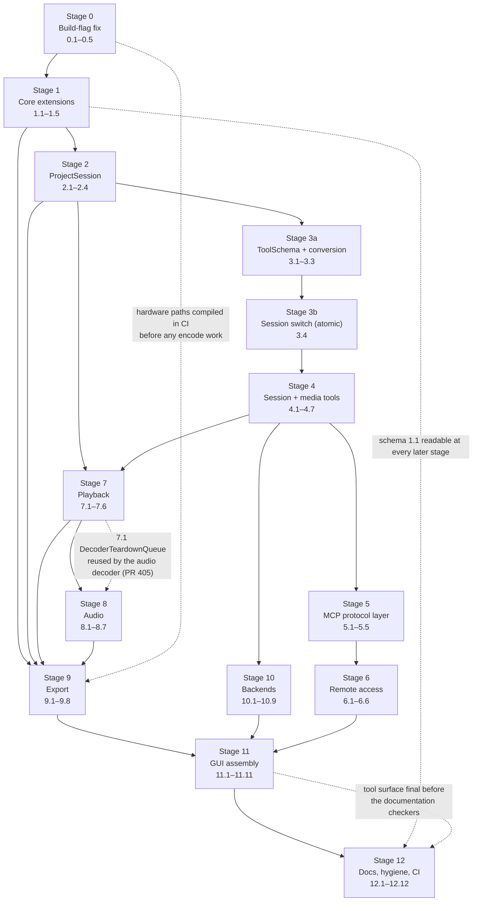

# Implementation Plan: End-to-End Editor Integration

## Overview

Implementation follows the **Migration and sequencing** table at the end of `design.md` exactly:
thirteen stages, 0 through 12, each of which leaves the tree buildable and CI green. Top-level
task numbers below **are** the design's stage numbers.

Three rules from the design govern the whole plan and are not restated in every task:

- **Tests land with their stage.** Each stage's property, unit and integration tests are part of
  that stage, never batched into a trailing task. A property whose subject does not exist yet is
  not written as a disabled test.
- **New dependencies enter optionally.** Every third-party addition arrives as
  `PALMIER_ENABLE_<X>` (default ON) with *optional* detection setting `PALMIER_HAVE_<X>`, and the
  code behind an absent guard degrades to a working fallback (`NullAudioSink`, loopback-only
  binding, software encode). No stage may make configuration fail on a host that configured
  successfully at the previous stage.
- **Schema 1.1 from stage 1 onward**, with every 1.1 field optional on read, so a document saved
  at any stage is readable at every later stage.

Language and tooling are fixed by the existing tree: **C++20**, CMake, GoogleTest for
example-based tests, **RapidCheck** (`RC_GTEST_PROP`) for property tests, registered through
`palmier_register_test()`. Every property test carries the tag comment
`// Feature: end-to-end-editor-integration, Property {n}: {property text}` and runs at least 100
generated cases.

---

## Tasks

### Stage 0 — Build-flag fix (no C++)

- [x] 0. Make vendor hardware-codec paths compile in CI
  - [x] 0.1 Make vendor SDK detection optional
    - In `cmake/PalmierDependencies.cmake`, change the `libva`, `vpl`/`libmfx` and `ffnvcodec`
      lookups so a miss records `PALMIER_VAAPI_AVAILABLE=OFF` / `PALMIER_QSV_AVAILABLE=OFF` /
      `PALMIER_NVENC_AVAILABLE=OFF` and emits a status message instead of appending to the fatal
      missing-dependency list
    - _Requirements: 8.1, 8.9_

  - [x] 0.2 Gate the `PALMIER_HAVE_*` definitions on `ENABLE AND FOUND`
    - In `src/media/CMakeLists.txt`, define `PALMIER_HAVE_VAAPI` / `PALMIER_HAVE_QSV` /
      `PALMIER_HAVE_NVENC` only when `PALMIER_ENABLE_*` is ON **and** the SDK was found, and link
      `PkgConfig::LIBVA` / `PkgConfig::LIBVPL` only inside that same branch
    - Follow the already-correct form in `src/gpu/CMakeLists.txt` as the model
    - This is the root cause of audit item 8: today the options cannot be left ON without the SDKs
    - _Requirements: 8.1, 8.9_

  - [x] 0.3 Report each vendor path in the configuration summary
    - In `cmake/PalmierSummary.cmake`, print each of VAAPI, NVENC, QSV as
      `enabled (SDK found)` / `disabled (SDK not found)` / `disabled (option OFF)`
    - _Requirements: 8.1, 8.9_

  - [x] 0.4 Configure the hardware paths ON in CI and add an SDK-free configure job
    - In `.github/workflows/ci.yml`, install `nv-codec-headers` and `libvpl-dev` alongside
      `libva-dev`, and configure with
      `-DPALMIER_ENABLE_VAAPI=ON -DPALMIER_ENABLE_NVENC=ON -DPALMIER_ENABLE_QSV=ON`
    - Assert after configure that the summary lists each vendor path as enabled with the SDK found
    - Add a second configure job with no vendor SDKs installed that asserts configuration succeeds
      and the summary lists each path as disabled
    - _Requirements: 8.1, 8.9_

  - [x] 0.5 Enforce the per-test time limit and property iteration floor in the test harness
    - In `tests/CMakeLists.txt`, give `palmier_register_test()` `PROPERTIES TIMEOUT 600` and keep
      the `RC_PARAMS=max_success=${PALMIER_PBT_MIN_SUCCESS}` environment with a floor of 100
    - _Requirements: 15.2, 15.8_

### Stage 1 — Core extensions (additive to `Palmier::core` / `Palmier::gpu`)

- [x] 1. Extend the domain core and GPU effect set
  - [x] 1.1 Add `ChangeOrigin::Reset` and `TimelineEngine::reset`
    - `src/core/ChangeSet.hpp`: new `ChangeOrigin::Reset`
    - `src/core/TimelineEngine.{hpp,cpp}`: `[[nodiscard]] CommandResult reset(Project initial)`
      swaps the project value in place, clears the undo and redo stacks, and emits a `ChangeSet`
      with `origin = ChangeOrigin::Reset` so the executor's applied-command counter never counts it
    - Extend `tests/core/timeline_engine_test.cpp` with reset, observer-notification and
      history-clearing cases
    - _Requirements: 3.4, 4.3_

  - [x] 1.2 Add track commands and promote `SetTransitionCommand` into the core
    - `src/core/EditCommands.{hpp,cpp}`: `AddTrackCommand` (appends after the last track of its
      kind, rejects beyond 64 per kind), `RemoveTrackCommand` (removes the track and its clips,
      preserving the relative order of the rest)
    - Move `SetTransitionCommand` out of `src/services/ToolRegistry.cpp` into
      `src/core/EditCommands` as a real `EditCommand` (audit finding)
    - Extend `tests/core/edit_commands_test.cpp`
    - _Requirements: 3.3, 3.8, 3.10_

  - [x] 1.3 Add the invert-colors effect (upstream PR 408, ported here)
    - `src/core/Effect.hpp`: `EffectType::InvertColors`
    - `src/gpu/EffectKernels.{hpp,cpp}`: software reference branch in `applyEffectSoftware` plus the
      matching GLSL/SPIR-V kernel, wired through `gpu/Compositor`
    - Per-channel rule: R, G, B become 255 minus input; alpha is unchanged
    - _Requirements: 14.4_

  - [x]* 1.4 Write property tests for the invert-colors effect
    - **Property 73: Invert-colors channel arithmetic** — **Validates: Requirements 14.4**
    - **Property 74: Invert-colors agrees between playback and export** —
      **Validates: Requirements 14.5**
    - File: `tests/gpu/invert_colors_property_test.cpp`; new target `palmier_gpu_invert_colors_tests`
    - _Requirements: 14.4, 14.5_

  - [x] 1.5 Move the document schema to 1.1 with optional reads
    - `src/core/SchemaVersion.{hpp,cpp}`: version 1.1
    - `src/services/ProjectStore.cpp`: read/write `effects[].type = "invert_colors"`,
      `tracks[].name` (default `""`) and `clipGroups` (default `[]`, reserved for upstream PR 397);
      every 1.1 field optional on read so 1.0 documents round-trip unchanged
    - Extend `tests/services/project_store_test.cpp` with a 1.0-document read and a
      future-major-version rejection
    - _Requirements: 3.9, 4.7, 4.10, 14.4_

### Stage 2 — Project_Session (introduce only, no existing caller changes)

- [x] 2. Introduce the session abstraction
  - [x] 2.1 Implement `services::ProjectSession`
    - `src/services/ProjectSession.{hpp,cpp}`: owns exactly one `TimelineEngine` and the
      `MediaManager` media library for its lifetime; `Status`, `engine()`, `mediaLibrary()`,
      `status()`, `modified()`, `revision()`, `documentPath()`, `createProject()`, `openProject()`,
      `markModified()`, `observeStatus()`
    - Default construction yields an empty project at the documented default frame rate, canvas
      resolution and colour space
    - `createProject`/`openProject` build a complete `Project` value locally and commit with
      `TimelineEngine::reset` only on full success; they are not `EditCommand`s and are not undoable
    - _Requirements: 1.1, 1.10, 3.2, 3.4, 3.5, 3.8, 3.9, 4.6, 4.10_

  - [x] 2.2 Move saving off the UI thread with a revision guard
    - Add the `services::RawFileWriter` injection seam used by the save-failure tests
    - `ProjectSession::requestSave(path, SaveCompletion)` captures `(Project snapshot, revision r)`,
      hands them to a `std::jthread` calling `ProjectSaveService::save`, and returns immediately;
      completion is marshalled back — on success clear the dirty flag and record the path only if
      the revision is still `r`, otherwise record the path and stay modified; on failure leave the
      in-memory project, its modified state and any previously saved file untouched
    - This is the Linux adaptation of upstream PR 403
    - _Requirements: 4.1, 4.4, 4.6, 14.6, 14.7_

  - [x]* 2.3 Write persistence property tests for the session
    - **Property 16: Save/open round-trip preserves the project** — **Validates: Requirements 4.7**
    - **Property 17: Saving a loaded project is idempotent** — **Validates: Requirements 4.8**
    - **Property 19: Unmodified until the next tool-applied edit** — **Validates: Requirements 4.6**
    - File: `tests/services/project_session_roundtrip_property_test.cpp`; new target
      `palmier_services_project_session_tests`, which also carries the `ProjectSession` and
      `TimelineEngine::reset` unit tests
    - _Requirements: 4.6, 4.7, 4.8_

  - [x]* 2.4 Write the save-failure property test
    - **Property 18: A failed save preserves the file and the modified state** —
      **Validates: Requirements 4.4, 14.7**
    - File: `tests/services/project_save_failure_property_test.cpp`, injecting the three failure
      kinds through `services::RawFileWriter`
    - _Requirements: 4.4, 14.7_

### Stage 3 — ToolSchema, then the session switch (the only atomic multi-file step)

- [x] 3. Unify argument specification, then retarget the tool surface at the session
  - [x] 3.1 Implement `services::ToolSchema`
    - `src/services/ToolSchema.{hpp,cpp}`: `ArgSpec` (name, `JsonKind`, required, description,
      `minInt`/`maxInt`, `minNum`/`maxNum`, `minLength`/`maxLength`, `enumValues`, `uuid`),
      `ToolSchema::arg()`, `toJsonSchema()` rendering the draft-07 object schema, and `validate()`
      enforcing exactly the same constraint set
    - Unit tests in `tests/services/tool_schema_test.cpp`; new target
      `palmier_services_tool_schema_tests`
    - _Requirements: 9.3, 9.9_

  - [x] 3.2 Convert each existing tool to `ToolSchema`, one tool at a time
    - `src/services/ToolRegistry.{hpp,cpp}`: `Tool` gains `ToolSchema schema`, and `inputSchema`
      becomes `schema.toJsonSchema()`
    - For each of `timeline.read`, `add_clip`, `delete_clip`, `move_clip`, `trim_clip`,
      `split_clip`, `reorder_clips`, `add_effect`, `add_transition`, `generation.generate`,
      `timeline.export`: declare its `ArgSpec` list and assert the rendered schema is **byte-equal
      to today's hand-written `inputSchema`** before moving to the next tool
    - Lift every acceptance rule a handler enforced privately (for example
      `sourceOutNs > sourceInNs`) into the `ArgSpec` vocabulary, and add the `invert_colors` value
      to the `add_effect` type enum
    - _Requirements: 3.1, 9.3, 9.9, 9.12, 14.4_

  - [x]* 3.3 Write the schema/handler conformance property test
    - **Property 50: The advertised schema and the handler agree** —
      **Validates: Requirements 9.12**
    - File: `tests/services/tool_schema_conformance_property_test.cpp`
    - _Requirements: 9.12_

  - [x] 3.4 Switch the tool surface from `TimelineEngine&` to `ProjectSession&` in one commit
    - `buildDefaultToolRegistry(ProjectSession&, ToolRegistryHooks)` replaces the
      `TimelineEngine&` form; every handler resolves the engine at invocation time
    - `src/services/McpToolExecutor.{hpp,cpp}`: `TimelineEngine*` → `ProjectSession*`,
      `validateAgainstSchema` delegates to `ToolSchema::validate`, default budget becomes 60 s, and
      an `InvocationSource { Gui, Mcp, Agent }` argument is added for logging only
    - `src/app/ApplicationComposition.{hpp,cpp}`: construct the single `ProjectSession` and pass it
      through; add the `projectSession()` accessor
    - Purely mechanical `engine` → `session.engine()` substitution — no behavioural change; update
      `tests/services/mcp_tool_executor_test.cpp` and `tests/app/application_composition_test.cpp`
      in the same commit
    - _Requirements: 1.1, 1.7, 3.5, 9.4, 9.16, 11.5_

### Stage 4 — New session and media tools

- [x] 4. Make the headless surface able to build a project
  - [x] 4.1 Implement `services::MediaImportService`
    - `src/services/MediaImportService.{hpp,cpp}`: `ImportedAsset`, `import()`, `isPending()`;
      probe → validate → register exactly one asset; duplicate detection via
      `std::filesystem::weakly_canonical` against the library; 30 s probe/validation timeout;
      errors name the path and classify empty / missing / unreadable / undecodable; rejected
      containers and codecs named in the error
    - _Requirements: 2.1, 2.2, 2.3, 2.4, 2.5, 2.7, 2.8, 2.9_

  - [x]* 4.2 Write the media-import property tests
    - **Property 4: Import result completeness and optional-field rule** —
      **Validates: Requirements 2.2**
    - **Property 5: Rejected imports name the format and leave the library unchanged** —
      **Validates: Requirements 2.3**
    - **Property 78: A rejected import classifies its failure and changes nothing** —
      **Validates: Requirements 2.4**
    - **Property 6: Import is idempotent over path spellings** — **Validates: Requirements 2.5**
    - **Property 7: Media library entry count invariant** — **Validates: Requirements 2.6**
    - File: `tests/services/media_import_property_test.cpp`; new target
      `palmier_services_media_import_tests`
    - _Requirements: 2.2, 2.3, 2.4, 2.5, 2.6_

  - [x] 4.3 Add the `project.*` tools
    - `project.create`, `project.open`, `project.save`, `project.info` in
      `src/services/ToolRegistry.cpp` with the `ToolSchema` argument sets and success-result fields
      given in the design's tool table; `ToolRegistryHooks` gains `createProject`, `openProject`,
      `saveProject`, `projectInfo`
    - Every tool other than `project.create`/`project.open` returns "no project is open" when no
      project is current
    - _Requirements: 3.1, 3.2, 3.4, 3.5, 3.8, 3.9_

  - [x] 4.4 Add the `media.*` tools
    - `media.import` and `media.list` wired to `MediaImportService` through the new
      `importMedia` / `listMedia` hooks, returning the fields listed in the design's tool table
    - _Requirements: 2.2, 3.1_

  - [x] 4.5 Add the track tools
    - `timeline.add_track` and `timeline.remove_track` backed by the stage-1 `AddTrackCommand` /
      `RemoveTrackCommand`, so both are undoable through the same path as every other edit
    - _Requirements: 3.1, 3.3, 3.8, 3.10_

  - [x]* 4.6 Write the project-tool property tests
    - **Property 8: project.create carries exactly the requested settings** —
      **Validates: Requirements 3.2**
    - **Property 10: project.open reports the loaded project accurately** —
      **Validates: Requirements 3.4**
    - **Property 11: No project open blocks every other tool** — **Validates: Requirements 3.5**
    - **Property 12: Track and clip counts equal successful call counts** —
      **Validates: Requirements 3.7**
    - **Property 13: Out-of-range arguments are rejected and named** —
      **Validates: Requirements 3.8**
    - **Property 14: A failed open preserves the previous session exactly** —
      **Validates: Requirements 3.9, 4.10**
    - File: `tests/services/project_tools_property_test.cpp`; new target
      `palmier_services_project_tools_tests`
    - _Requirements: 3.2, 3.4, 3.5, 3.7, 3.8, 3.9, 4.10_

  - [x]* 4.7 Write the track-tool property tests
    - **Property 9: add_track appends after the last track of its kind** —
      **Validates: Requirements 3.3**
    - **Property 15: remove_track preserves the order of remaining tracks** —
      **Validates: Requirements 3.10**
    - File: `tests/services/timeline_track_tools_property_test.cpp`
    - _Requirements: 3.3, 3.10_

  - [x] 4.8 Checkpoint
    - Ensure all tests pass, ask the user if questions arise. The headless sequence of Requirement
      3.6 is now runnable except for export.

### Stage 5 — MCP protocol layer

- [x] 5. Replace the bespoke envelope with JSON-RPC 2.0
  - [x] 5.1 Implement `services::McpSessionRegistry`
    - `src/services/McpSessionRegistry.{hpp,cpp}`: `McpSessionRecord`, `create()` minting a 256-bit
      value from `std::random_device` as 64 lowercase hex characters, `touch()` returning
      `NotFound` / expired, `markInitialized()`, `expireIdle()`, `activeCount()`; options for
      max sessions 1–32 (default 8) and idle timeout 30–3600 s (default 300); issued ids retained
      in a never-pruned set so uniqueness holds for the process lifetime
    - _Requirements: 9.10, 9.11, 9.14, 9.15, 10.9, 10.11_

  - [x] 5.2 Implement `services::McpProtocolHandler`
    - `src/services/McpProtocolHandler.{hpp,cpp}`: `McpRequestContext`, `McpReply`,
      `kSupportedProtocolVersions`, `handle()`; dispatch order parse (−32700) → envelope (−32600)
      → method (−32601) → session state → `ToolSchema::validate` (−32602) → execute
    - `initialize` negotiates the requested version when supported and otherwise the highest
      supported, returning server name, version and a `tools` capability;
      `notifications/initialized` answers 202 with a zero-byte body; `tools/list` returns one entry
      per registered tool; `tools/call` returns a `content` array whose first entry is
      `"type":"text"` with `isError` false, or `isError` true naming the failing tool and reason
    - `MainThreadInvoker` seam with the 60 s budget; tests and headless builds supply the inline
      invoker
    - _Requirements: 9.1, 9.2, 9.3, 9.4, 9.5, 9.6, 9.7, 9.8, 9.9, 9.10, 9.14, 9.15, 9.16_

  - [x] 5.3 Extend the `McpServer` transport and update its contract test in the same commit
    - `src/services/McpServer.{hpp,cpp}`: `start(const BindDecision&)`, header capture into
      `McpRequestContext`, `Mcp-Session-Id` emission, 202-with-empty-body support, a 1 MiB body cap
      yielding −32700, and delegation to `McpProtocolHandler`; `dispatch()` keeps its pure,
      socket-free shape so the existing transport unit tests remain valid
    - Extend `tests/services/mcp_http_integration_test.cpp` to drive real loopback HTTP POSTs
      through `initialize` → `notifications/initialized` → `tools/list` → `tools/call`, asserting
      the JSON-RPC envelope on every response and `name`/`description`/`inputSchema` on every
      `tools/list` entry
    - _Requirements: 9.1, 9.6, 9.10, 9.11, 10.1, 15.3_

  - [x]* 5.4 Write the JSON-RPC protocol property tests
    - **Property 43: JSON-RPC envelope round-trip** — **Validates: Requirements 9.1, 9.13**
    - **Property 44: initialize negotiates a supported protocol version** —
      **Validates: Requirements 9.2**
    - **Property 45: tools/list describes every registered tool** — **Validates: Requirements 9.3**
    - **Property 46: tools/call success shape** — **Validates: Requirements 9.4**
    - **Property 47: A failing tool leaves the project and history untouched** —
      **Validates: Requirements 9.5**
    - **Property 48: Protocol faults map to their assigned codes and create no edit command** —
      **Validates: Requirements 9.6, 9.7, 9.8, 9.9**
    - File: `tests/services/mcp_protocol_property_test.cpp`; new target
      `palmier_services_mcp_protocol_tests`
    - _Requirements: 9.1, 9.2, 9.3, 9.4, 9.5, 9.6, 9.7, 9.8, 9.9, 9.13_

  - [x]* 5.5 Write the session-identity property tests
    - **Property 49: Session identifiers are opaque and unique for the process lifetime** —
      **Validates: Requirements 9.11**
    - **Property 51: Session-state violations are rejected without touching the project** —
      **Validates: Requirements 9.14, 9.15**
    - File: `tests/services/mcp_session_property_test.cpp`; new target
      `palmier_services_mcp_session_tests`
    - _Requirements: 9.11, 9.14, 9.15_

### Stage 6 — Remote access (defaults to loopback, so CI is green before `libssl-dev` lands)

- [x] 6. Add opt-in authenticated remote MCP access
  - [x] 6.1 Implement `app::AppSettings` and extend `AppConfig`
    - `src/app/AppSettings.{hpp,cpp}`: precedence built-in defaults → `key=value` file at
      `$XDG_CONFIG_HOME/palmier-pro/config` → environment variables → command-line flags, producing
      an `AppConfig`
    - `AppConfig` gains `RemoteAccessConfig remote` and `MainThreadInvoker mainThreadInvoker`
    - _Requirements: 10.2, 16.3_

  - [x] 6.2 Implement `services::RemoteAccessGate` and `RejectionLog`
    - `src/services/RemoteAccessGate.{hpp,cpp}`: `RemoteAccessConfig`, `BindDecision`,
      `RejectionReason`, `Admission`, `validate()`, `admit()`, `noteSessionCreated/Closed()`
    - Bind-time: absent configuration yields `127.0.0.1:19789`; enabling requires a valid
      IPv4/IPv6 literal, a 32–512 printable-ASCII bearer token and `acknowledged == true`; any
      unmet prerequisite still binds loopback and carries the named unmet prerequisites, never the
      token; enabled without TLS emits exactly one warning before the first accepted request and
      still performs the non-loopback bind
    - Per-request: loopback-only returns `Allow` unconditionally; non-loopback checks source-block
      list, then constant-time bearer comparison (401), then `Origin` against the allow-list
      extended with the bound address and loopback hosts (403), then the session-count limit
    - `RejectionLog` records a UTC millisecond timestamp, the source address and a reason **code**
      only — the presented credential is never passed to the logger; five 401s from one source
      inside a 60 s window install a 60 s block for that source alone
    - _Requirements: 10.1, 10.2, 10.3, 10.4, 10.5, 10.7, 10.8, 10.9, 10.10, 10.12, 10.13_

  - [x] 6.3 Add the optional TLS transport and the non-loopback bind
    - `src/services/TlsTransport.{hpp,cpp}` on OpenSSL 3.x behind `PALMIER_ENABLE_OPENSSL`
      (default ON) with optional detection setting `PALMIER_HAVE_OPENSSL`; when the guard is absent,
      configuring TLS is an unmet prerequisite and the gate falls back to loopback
    - Wire the gate into `McpServer` strictly upstream of `McpProtocolHandler`; a plaintext request
      on a TLS port fails the handshake and is closed and logged without producing an `HttpRequest`
    - Install `libssl-dev` in `.github/workflows/ci.yml`
    - Construct the gate in `ApplicationComposition` with a `remoteAccessGate()` accessor
    - _Requirements: 10.6, 10.7, 10.12_

  - [x]* 6.4 Write the admission-gate property tests
    - **Property 52: A non-loopback bind requires all prerequisites, and failure falls back to
      loopback without leaking the token** — **Validates: Requirements 10.2, 10.3, 10.12**
    - **Property 53: Non-loopback admission is exactly the conjunction of its checks** —
      **Validates: Requirements 10.4, 10.5**
    - **Property 54: Every rejection is logged completely and without the credential** —
      **Validates: Requirements 10.8**
    - **Property 56: Loopback-only configurations preserve the current developer experience** —
      **Validates: Requirements 10.10**
    - **Property 58: The 401 rate limiter blocks the offending source only** —
      **Validates: Requirements 10.13**
    - File: `tests/services/remote_access_gate_property_test.cpp`; new target
      `palmier_services_remote_access_tests`
    - _Requirements: 10.2, 10.3, 10.4, 10.5, 10.8, 10.10, 10.12, 10.13_

  - [x]* 6.5 Write the session-limit and idle-expiry property tests
    - **Property 55: The session limit rejects only the excess request** —
      **Validates: Requirements 10.9**
    - **Property 57: Idle sessions expire exactly at their configured timeout** —
      **Validates: Requirements 10.11**
    - File: `tests/services/mcp_session_property_test.cpp` (extends the stage-5 file), driven by an
      injected clock
    - _Requirements: 10.9, 10.11_

  - [x]* 6.6 Write the remote-access and TLS integration tests
    - `tests/services/remote_access_http_integration_test.cpp`: bind a non-loopback-configured
      endpoint on a test-local address and issue three requests — no bearer token, a wrong token,
      the configured token — asserting 401, 401, 200 and a byte-identical project after each
      rejection
    - One HTTPS-succeeds / plaintext-rejected test, skipped with a recorded reason when
      `PALMIER_HAVE_OPENSSL` is absent
    - _Requirements: 10.6, 15.4_

### Stage 7 — Playback

- [x] 7. Assemble the decode → composite → present pipeline
  - [x] 7.1 Implement `media::DecoderTeardownQueue`
    - `src/media/DecoderTeardownQueue.{hpp,cpp}`: single dedicated thread; `MediaDecoder` objects
      are moved in as `unique_ptr` and the caller returns immediately; drain-to-empty is observable
    - This is the Linux adaptation of upstream PR 405 and **must precede stage 8** so the audio
      decoder reuses it
    - _Requirements: 14.8_

  - [x]* 7.2 Write the decoder-teardown property test
    - **Property 75: Decoder teardown never deadlocks or stalls** —
      **Validates: Requirements 14.8**
    - File: `tests/media/decoder_teardown_property_test.cpp`; new target
      `palmier_media_decoder_teardown_tests`
    - _Requirements: 14.8_

  - [x] 7.3 Implement `DecodeWorkerPool` and `media::DecoderClipFrameProvider`
    - `src/media/DecodeWorkerPool.{hpp,cpp}`: N = 2 workers, one `MediaDecoder` per active asset,
      decoded frames pushed to a bounded lock-protected per-clip queue
    - `src/media/DecoderClipFrameProvider.{hpp,cpp}`: implements `gpu::ClipFrameProvider`, maps
      `(Clip, timelinePosition)` to `sourceIn + (position - timelineStart)`, keeps decoders in an
      LRU cache, seeks when the request is not the next sequential frame, converts `DecodedFrame`
      to `gpu::SourceFrame`, and hands retired decoders to `DecoderTeardownQueue`; a decode failure
      is returned as an error so `Compositor::renderAt` emits no partial frame
    - _Requirements: 5.1, 5.5, 14.8_

  - [x]* 7.4 Write the frame-fidelity property test
    - **Property 20: Presented frames match the decoded source frames** —
      **Validates: Requirements 5.1**
    - File: `tests/media/playback_frame_fidelity_property_test.cpp`; new target
      `palmier_media_playback_tests`
    - _Requirements: 5.1_

  - [x] 7.5 Construct the playback engine in the composition root and complete the transport
    - `ApplicationComposition` constructs the single `gpu::Compositor`, the provider and the
      `ui::PreviewController`, exposing `playbackEngine()` and `compositor()`
    - `src/ui/PreviewController.{hpp,cpp}`: play, pause, stop, seek-with-clamp, end-of-timeline
      halt, playhead indicator updates at ≥10 Hz within 100 ms of the presented frame, drop
      accounting, decode-failure pause naming the asset, and runtime fallback to software
      compositing with a session-lifetime accessor and a status-bar notice
    - _Requirements: 1.1, 5.2, 5.3, 5.4, 5.5, 5.6, 5.7, 5.8, 5.9, 5.10_

  - [x]* 7.6 Write the playback transport and pacing property tests
    - **Property 21: Presentation rate stays within bounds and drops stay under 5%** —
      **Validates: Requirements 5.2**
    - **Property 22: Playhead indicator cadence** — **Validates: Requirements 5.3**
    - **Property 23: A decode failure pauses and retains the last good frame** —
      **Validates: Requirements 5.5**
    - **Property 24: Playback frame accounting matches the export planner** —
      **Validates: Requirements 5.7**
    - **Property 79: Each transport command reaches its specified resting state** —
      **Validates: Requirements 5.4, 5.8, 5.10**
    - **Property 25: Seek clamps to the timeline bounds** — **Validates: Requirements 5.9**
    - File: `tests/ui/preview_playback_property_test.cpp`; new target
      `palmier_ui_preview_playback_tests`, driven by an injected `PlaybackClock`
    - _Requirements: 5.2, 5.3, 5.4, 5.5, 5.7, 5.8, 5.9, 5.10_

### Stage 8 — Audio (`NullAudioSink` first, real sinks additive behind optional detection)

- [x] 8. Build the audio decode → mix → output pipeline
  - [x] 8.1 Add the audio surface to `MediaDecoder`
    - `src/media/MediaDecoder.{hpp,cpp}`: `AudioFrame`, `openAudioStream(int)`, `nextAudioFrame()`,
      `seekAudio(Duration)`, `hasAudio()`; `IDecodeBackend` gains `decodeAudio()` and
      `seekAudio()`, with the FFmpeg backend converting through `libswresample` into the
      interleaved-float `AudioBuffer` that `AudioGraph` already consumes
    - Buffers declare 8 000–192 000 Hz, 1–8 channels, and non-decreasing presentation timestamps
      per stream; audio decode is always software, so `CodecBridge` is not involved
    - _Requirements: 6.1_

  - [x]* 8.2 Write the audio-decode property test
    - **Property 26: Decoded audio buffers conform to the declared ranges** —
      **Validates: Requirements 6.1**
    - File: `tests/media/audio_decode_property_test.cpp`
    - _Requirements: 6.1_

  - [x] 8.3 Add `media::IAudioSink` and the always-compiled `NullAudioSink`
    - `src/media/AudioSink.{hpp,cpp}`: the sink interface plus `NullAudioSink`, which consumes and
      discards buffers while advancing a monotonic sample position from a steady clock
    - This makes "audio output unavailable" a normal code path and lets the audio tests run in CI
      with no sound card — it lands **before** the real sinks
    - _Requirements: 6.7_

  - [x] 8.4 Implement `media::AudioEngine`
    - `src/media/AudioEngine.{hpp,cpp}`: fixed output format 48 000 Hz / 2 interleaved channels /
      `SampleFormat::F32`; `start()`, `stop()`, `presentationPosition()` (the master clock),
      `outputAvailable()`, `notice()`, `renderRange()` for the export path
    - Mixes every clip on an unmuted audio-bearing track at its clip gain through `AudioGraph`,
      resampling per source; an audio-less asset contributes exactly silence with no error; an
      audio decode failure yields silence for the rest of that clip and an error naming the asset;
      mute and gain changes take effect within 200 ms without moving the playhead; unavailable
      output suppresses audio, keeps video running and raises a notice within 2 s
    - _Requirements: 6.2, 6.3, 6.4, 6.6, 6.7, 6.9_

  - [x]* 8.5 Write the audio-engine property tests
    - **Property 27: Mixing honours mute and gain and delivers without dropout** —
      **Validates: Requirements 6.2**
    - **Property 28: Audio and video stay within 40 milliseconds** —
      **Validates: Requirements 6.3**
    - **Property 29: Mute and gain changes take effect within 200 milliseconds** —
      **Validates: Requirements 6.4**
    - **Property 30: An asset without audio contributes exactly silence** —
      **Validates: Requirements 6.6**
    - **Property 31: Export mix duration and sample range invariant** —
      **Validates: Requirements 6.8, 6.11**
    - **Property 32: An audio decode failure yields silence for the rest of the clip** —
      **Validates: Requirements 6.9**
    - File: `tests/media/audio_engine_property_test.cpp`; new target
      `palmier_media_audio_engine_tests` using `IAudioSink` fakes
    - _Requirements: 6.2, 6.3, 6.4, 6.6, 6.8, 6.9, 6.11_

  - [x] 8.6 Add the PipeWire and ALSA sinks behind optional detection
    - PipeWire sink (`libpipewire-0.3`, MIT) behind `PALMIER_ENABLE_PIPEWIRE` /
      `PALMIER_HAVE_PIPEWIRE`; ALSA sink (`libasound2`, LGPL-2.1-or-later) behind
      `PALMIER_ENABLE_ALSA` / `PALMIER_HAVE_ALSA`; startup selection order PipeWire → ALSA → Null
    - Request a quantum of at most 512 frames when the project frame rate exceeds 48 fps
    - Install `libpipewire-0.3-dev` and `libasound2-dev` in `.github/workflows/ci.yml`
    - _Requirements: 6.2, 6.7_

  - [x] 8.7 Wire the audio engine into the composition root and make the sink the clock
    - `ApplicationComposition` constructs the single `AudioEngine` with the selected sink and the
      `DecoderTeardownQueue`, exposing `audioEngine()`
    - `PreviewController::pump` reads `AudioEngine::presentationPosition()` each pump: a frame more
      than one interval behind the audio position is counted dropped and skipped, more than one
      interval ahead waits, otherwise it is presented
    - _Requirements: 1.1, 6.3, 6.7_

### Stage 9 — Export

- [ ] 9. Complete encode, mux and the export coordinator
  - [x] 9.1 Implement `media::EncoderSelector` and the hardware-skip helper
    - `src/media/EncoderSelector.{hpp,cpp}`: `EncoderSelection` with only the
      `EncoderSelection::hardware(...)` and `EncoderSelection::software(codec, reason)`
      constructors, so no path can report both hardware use and software fallback
    - Selection order: software immediately when hardware is not requested, not compiled in for the
      vendor, or the codec is absent from `GpuCaps::encodeCodecs`; otherwise a capability probe on
      a detached thread awaited with a 3000 ms deadline, a timeout treated as no compatible device;
      on a positive probe the vendor encoder, retrying initialization exactly once before falling
      back to `libx264` / `libx265` / `libvpx-vp9` with resolution, frame rate and bit rate
      unchanged and a reason naming hardware initialization failure
    - `tests/support/HardwareSkip.hpp`: `PALMIER_SKIP_WITHOUT_HW(codec, operation)` consulting
      `gpu::BridgeAvailability::fromBuildConfig()` and the live `GpuCaps`, calling `GTEST_SKIP()`
      with a reason naming the missing SDK or device
    - _Requirements: 8.2, 8.3, 8.4, 8.8, 15.5_

  - [x]* 9.2 Write the encoder-selection property tests
    - **Property 40: Exactly one encoder selection with consistent flags** —
      **Validates: Requirements 8.2, 8.8**
    - **Property 41: Hardware init failure retries once then falls back with parameters intact** —
      **Validates: Requirements 8.3**
    - **Property 42: Software selection uses the documented encoder for each codec** —
      **Validates: Requirements 8.4**
    - File: `tests/media/encoder_selector_property_test.cpp`; new target
      `palmier_media_encoder_selector_tests` using synthetic `GpuCaps` and `BridgeAvailability` so
      the tests always run
    - _Requirements: 8.2, 8.3, 8.4, 8.8_

  - [~] 9.3 Add the audio stream to the encoder and the export engine
    - `src/media/MediaEncoder.{hpp,cpp}`: `AudioEncodeSpec`, `std::optional<AudioEncodeSpec> audio`
      on `EncodeSpec`, `submitAudio(const AudioBuffer&, Duration)`, and a `finish()` that flushes
      both streams and writes the trailer
    - `src/media/ExportEngine.{hpp,cpp}`: for each video frame render, submit the frame, then submit
      that frame interval's audio mixed by an export-local `AudioGraph`; a timeline with no clip on
      an unmuted audio-bearing track still gets one silent stream spanning the full duration
    - _Requirements: 6.5, 6.11_

  - [~] 9.4 Implement `services::ExportCoordinator`
    - `src/services/ExportCoordinator.{hpp,cpp}`: `ExportRequest2`, `ExportOutcome`,
      `ExportProgressReport`, `begin()`, `cancel()`, `running()`, and the pure static `validate()`
      called before any file is created
    - One `std::thread` per export over a **value-copy `Project` snapshot**, an export-local
      `GpuContext`, `Compositor`, decoders, `AudioGraph` and `MediaEncoder`; progress marshalled to
      the main thread monotonically at ≤1 s intervals; a scope guard calls `MediaEncoder::finish()`
      best-effort then removes the output path on any failure, cancellation or mid-export hardware
      failure; a second concurrent request is rejected without disturbing the running export; an
      existing destination without overwrite acknowledgement is rejected and preserved
      byte-for-byte
    - _Requirements: 6.10, 7.1, 7.2, 7.3, 7.4, 7.5, 7.6, 7.7, 7.9, 7.10, 7.11, 8.11_

  - [ ]* 9.5 Write the export-coordinator property tests
    - **Property 33: Export runs exactly the requested parameters and never touches the project** —
      **Validates: Requirements 7.1, 7.2**
    - **Property 34: Progress is monotonic, bounded and timely** — **Validates: Requirements 7.3**
    - **Property 35: A successful export matches the planner** — **Validates: Requirements 7.4**
    - **Property 36: Any failure after encoding begins leaves no file and no project change** —
      **Validates: Requirements 6.10, 7.5, 8.11**
    - **Property 37: Cancellation leaves no file and no project change** —
      **Validates: Requirements 7.7**
    - **Property 39: Invalid export requests are rejected before any file exists** —
      **Validates: Requirements 7.6, 7.9, 7.11**
    - File: `tests/services/export_coordinator_property_test.cpp`; new target
      `palmier_services_export_coordinator_tests`
    - _Requirements: 6.10, 7.1, 7.2, 7.3, 7.4, 7.5, 7.6, 7.7, 7.9, 7.11, 8.11_

  - [ ]* 9.6 Extend the export determinism property test
    - **Property 38: Two successive exports are identical** — **Validates: Requirements 7.8**
    - File: `tests/media/media_export_ordering_property_test.cpp` (extends the existing test and its
      `palmier_media_export_ordering_property_tests` target)
    - _Requirements: 7.8_

  - [~] 9.7 Wire export into the tool surface and the composition root
    - Connect the `timeline.export` hook to `ExportCoordinator` so the tool returns the output path,
      encoded frame count, selected encoder name, hardware/fallback flags, audio presence and
      duration; expose `exportCoordinator()`
    - Add `ApplicationComposition::codecBackendReport()` returning a `CodecBackendStatus` per
      VAAPI, NVENC/NVDEC, QSV and FFmpeg software backend with compiled-in and usable-on-host
      booleans, always reporting the software backend as both, within 3000 ms and without changing
      any selection or export state
    - _Requirements: 1.1, 3.1, 7.2, 8.7_

  - [ ]* 9.8 Write the hardware-versus-software output comparison test
    - Export the ≥300-frame 1920×1080/30 fps fixture once with hardware and once with software
      encoding, asserting both outputs decode, both frame counts equal the fixture count, and the
      durations differ by at most one frame interval; guard with `PALMIER_SKIP_WITHOUT_HW`
    - _Requirements: 8.6, 15.5_

  - [~] 9.9 Checkpoint
    - Ensure all tests pass, ask the user if questions arise. The headless sequence of Requirement
      3.6 now completes end to end.

### Stage 10 — Pluggable backends (offline-first, no network dependency)

- [ ] 10. Make agent reasoning and generation pluggable
  - [~] 10.1 Implement the offline interpreter and the interpreter registry
    - `src/services/OfflineIntentInterpreter.{hpp,cpp}`: at least 12 documented phrase patterns
      (`split the clip at the playhead`, `mute track N`, `unmute track N`, `add a video track`,
      `add an audio track`, `delete the selected clip`, `import <path>`,
      `export as mp4 to <path>`, `save the project`, `undo`, `redo`, `show the timeline`) matched
      case-insensitively on the whitespace-trimmed utterance, resolving to tool invocations with
      captured arguments, issuing no network request and answering well inside 1 s
    - `src/services/AgentInterpreterRegistry.{hpp,cpp}`: ids `offline` (default), `hosted`, `byok`;
      replaces `makeUnconfiguredInterpreter()`; `AppConfig` gains `agentInterpreterId` and
      `ApplicationComposition` exposes `agentInterpreterId()`
    - Reject an utterance that is empty after whitespace removal or longer than 2000 characters
      with the permitted range; quote an unmappable utterance and invoke no tool; report credential
      or backend failures without touching the project
    - _Requirements: 11.1, 11.2, 11.3, 11.4, 11.8, 11.9_

  - [ ]* 10.2 Write the offline-interpreter property tests
    - **Property 59: The offline interpreter is case- and whitespace-insensitive** —
      **Validates: Requirements 11.3**
    - **Property 60: Interpreter output is always executable** — **Validates: Requirements 11.2**
    - **Property 61: Unmappable utterances change nothing** — **Validates: Requirements 11.4**
    - **Property 64: Utterance length bounds are enforced** — **Validates: Requirements 11.9**
    - File: `tests/services/offline_interpreter_property_test.cpp`; new target
      `palmier_services_agent_offline_tests`
    - _Requirements: 11.2, 11.3, 11.4, 11.9_

  - [ ]* 10.3 Write the agent-equivalence property test
    - **Property 62: The agent path equals a direct tool invocation** —
      **Validates: Requirements 11.5, 11.10**
    - File: `tests/services/agent_equivalence_property_test.cpp`
    - _Requirements: 11.5, 11.10_

  - [ ]* 10.4 Write the mention-resolution property test
    - **Property 63: A unique @mention is substituted; a non-unique one is refused** —
      **Validates: Requirements 11.6, 11.7**
    - File: `tests/services/mention_resolver_property_test.cpp` (extends the existing
      `palmier_services_mention_resolver_tests` target)
    - _Requirements: 11.6, 11.7_

  - [~] 10.5 Implement the generative backend registry and its clients
    - `src/services/GenerativeBackendRegistry.{hpp,cpp}`: ids `offline` | `hosted` | `byok`, all
      compiled in and selected by configuration string with no recompilation
    - `src/services/HostedGenerativeBackend.{hpp,cpp}` and
      `src/services/ByokGenerativeBackend.{hpp,cpp}`: GPLv3 HTTPS clients reading credentials from
      `SecretStore` at runtime, with no endpoint credential values checked in
    - An unknown id or absent credentials installs `offline`, records a startup error naming the
      rejected id and the unmet requirement in `startupErrors()`, and still constructs every other
      component; `ApplicationComposition` exposes `generativeBackendId()`
    - Route every `generation.generate` invocation from the tool surface, the endpoint and the agent
      through the selected backend; reject offline requests within 1 s with the unmet precondition
      named and no library, clip or undo entry added
    - _Requirements: 12.1, 12.2, 12.4, 12.8_

  - [ ]* 10.6 Write the generation lifecycle property tests
    - **Property 65: A successful generation is one undoable edit** —
      **Validates: Requirements 12.3**
    - **Property 66: Invalid generation requests never reach the network** —
      **Validates: Requirements 12.9**
    - File: `tests/services/generative_lifecycle_property_test.cpp`; new target
      `palmier_services_generative_lifecycle_tests`, with a network seam that fails the test if
      invoked
    - _Requirements: 12.3, 12.9_

  - [ ]* 10.7 Extend the generation atomicity property test
    - **Property 67: A failed or timed-out job leaves nothing behind** —
      **Validates: Requirements 12.7, 12.10**
    - File: `tests/services/generative_atomicity_property_test.cpp` (extends the existing test)
    - _Requirements: 12.7, 12.10_

  - [ ]* 10.8 Write the repository hygiene property test
    - **Property 68: Every source file carries the GPLv3 SPDX header and no credentials** —
      **Validates: Requirements 12.6**
    - File: `tests/docs/repository_hygiene_property_test.cpp`
    - _Requirements: 12.6_

  - [ ]* 10.9 Write the offline-mode availability sweep test
    - One representative operation from each of edit, playback, save, open, export and `tools/call`
      succeeds while Offline_Mode applies, and the generation-unavailable indication requires no
      dismissal and blocks no other command
    - _Requirements: 12.5_

### Stage 11 — GUI assembly (last, because it consumes every service above)

- [ ] 11. Mount the editor shell on the composed graph
  - [~] 11.1 Implement `ui::GuiToolGateway`
    - `src/ui/GuiToolGateway.{hpp,cpp}`: one method per gesture (`moveClip`, `trimClip`,
      `splitClip`, `reorderClips`, `addClip`, `deleteClip`, `addEffect`, `addTransition`,
      `addTrack`, `removeTrack`, `importMedia`, `createProject`, `openProject`, `saveProject`,
      `exportTimeline`), each building `Json` arguments and calling
      `McpToolExecutor::executeTool(name, args, InvocationSource::Gui)` and returning the existing
      `ui::GestureResult`
    - _Requirements: 1.7_

  - [~] 11.2 Build the docked shell, the menu bar and the status bar
    - `src/ui/MainWindow.{hpp,cpp}` takes `app::ApplicationComposition&` and builds five
      `QDockWidget`s — timeline (bottom), preview (central), inspector (right), media browser
      (left), agent chat (right, tabbed with the inspector) — each bound to the composition's single
      view-model instance, all visible with no further user action
    - Menus in order: **File** (New, Open…, Save, Save As…, Quit), **Edit** (Undo, Redo, Delete
      Clip, Split at Playhead), **Playback** (Play/Pause, Stop, Go to Start), **Export** (Export
      Video…, Cancel Export), **Help** (Documentation, About); Undo/Redo enabled from
      `canUndo()/canRedo()`
    - `setMinimumSize(1024, 640)` on the window and `setMinimumSize(80, 60)` on each dock; status
      bar hosts the persistent GPU-unavailable notice from `gpuUnavailableNotice()`, the
      software-compositing notice and the audio-unavailable notice
    - This is the Linux adaptation of upstream PR 404: a fixed minimum-size contract rather than
      per-frame layout recomputation
    - _Requirements: 1.2, 1.3, 1.4, 1.6, 1.8, 1.11, 5.6, 6.7_

  - [~] 11.3 Add the timeline panel and the timer-driven preview view
    - `src/ui/TimelinePanel.{hpp,cpp}`: a `QTreeView` over the existing `TimelineModel` plus a
      transport bar and the playhead indicator
    - `src/ui/PreviewView.{hpp,cpp}`: drive `PreviewController::pump` from a `QTimer` and paint the
      presented frame
    - _Requirements: 1.2, 5.3_

  - [~] 11.4 Re-point view-model gesture methods at the gateway
    - In `TimelineViewModel`, `InspectorViewModel`, `MediaBrowserViewModel` and
      `AgentChatViewModel`, keep the read-side projections but route every mutating gesture through
      `GuiToolGateway` instead of `TimelineEngine::apply`, so the GUI stops mutating project state
      directly
    - _Requirements: 1.7_

  - [~] 11.5 Implement `ui::ProjectFileActions` and the file dialogs
    - `src/ui/ProjectFileActions.{hpp,cpp}`: File > Save to the recorded document path with a
      confirmation naming the written path; File > Save As / first save via a destination prompt
      defaulting to `.palmier`; File > Open refreshing all four panels through the existing
      `ChangeSet` broadcast; a dismissed prompt writes nothing, loads nothing and reports no error
    - Explicit `PendingIntent` state machine for the unsaved-changes prompt: exactly three options,
      no state change and no file write while displayed, then exactly one outcome with no further
      prompting — save continues the pending close/open only if the write succeeds, discard
      continues without writing, cancel abandons the pending operation
    - _Requirements: 4.1, 4.2, 4.3, 4.5, 4.9, 4.10_

  - [~] 11.6 Implement `ui::ExportDialog` and the export progress surface
    - `src/ui/ExportDialog.{hpp,cpp}`: output path, container, codec, resolution, frame rate, bit
      rate, audio inclusion, hardware preference and overwrite acknowledgement, submitted through
      `GuiToolGateway::exportTimeline`
    - Status-bar progress bar with a cancel button, fed by the coordinator's marshalled progress
      callback, keeping the window responsive throughout
    - _Requirements: 7.1, 7.3, 7.7_

  - [~] 11.7 Guard startup construction and finish the accessor set
    - Wrap composition so a failure to construct any component named in Requirement 1.1 yields
      `ComponentConstructionError{componentName, reason}`; `src/app/main.cpp` reports it and exits
      without showing the shell
    - Verify every Requirement 1.1 accessor returns a non-null reference to the same instance for
      the process lifetime, and that startup with no supplied project path makes an empty default
      project current
    - _Requirements: 1.1, 1.9, 1.10_

  - [ ]* 11.8 Write the shell layout property test
    - **Property 1: Panel reachability under any window size** — **Validates: Requirements 1.4**
    - File: `tests/ui/shell_layout_property_test.cpp`; new target `palmier_ui_shell_tests` run under
      `xvfb`
    - _Requirements: 1.4_

  - [ ]* 11.9 Extend the edit-equivalence property test
    - **Property 2: GUI, MCP and agent produce identical project state** —
      **Validates: Requirements 1.7, 9.4, 11.5**
    - File: `tests/services/edit_equivalence_property_test.cpp` (extends the existing test) — this
      is what proves the gesture re-pointing in 11.4 changed no behaviour
    - _Requirements: 1.7, 9.4, 11.5_

  - [ ]* 11.10 Extend the undo round-trip property test
    - **Property 3: Undo restores the immediately prior state** — **Validates: Requirements 1.8**
    - File: `tests/core/timeline_undo_redo_roundtrip_property_test.cpp` (extends the existing test)
    - _Requirements: 1.8_

  - [ ]* 11.11 Write the shell unit and responsiveness tests
    - Qt widget tests under `xvfb`: five panels present and visible, five menus in the required
      order each with an activatable action, each notice persistent until dismissal or exit, and
      Undo disabled on an empty history
    - One injected construction failure per component named in Requirement 1.1
    - One test per (trigger × outcome) pair of the unsaved-changes prompt, plus an assertion that
      nothing is written or changed while the prompt is displayed
    - Main-thread event-latency sampling during an export (200 ms bound) and during a slow
      successful and a slow failing save (100 ms bound)
    - _Requirements: 1.2, 1.3, 1.6, 1.9, 1.11, 4.5, 7.3, 14.6_

  - [~] 11.12 Checkpoint
    - Ensure all tests pass, ask the user if questions arise. The full import → edit → play →
      save → open → export workflow is now reachable from the GUI.

### Stage 12 — Documents, suite hygiene, CI

- [ ] 12. Author the checked-in document set and close out verification
  - [~] 12.1 Author `docs/UPSTREAM_PARITY.md`
    - Provenance block: `upstream-repository: https://github.com/palmier-io/palmier-pro`,
      `upstream-ref`, `linux-ref`, `comparison-date: YYYY-MM-DD`, plus the three status definitions
      stated in reachability terms
    - Two fixed-column tables: the 22 upstream tool categories and the 12 capability areas, each
      entry exactly once with one status, `linux-components` (or `none`), a priority and a 1–200
      character rationale whenever the status is `absent` or `partial`, and
      `macos-framework` / `linux-replacement` (name or `out-of-scope: <reason>`) where applicable
    - Build-order list: a projection containing exactly the `absent` and `partial` entries, sorted
      `must` before `should` before `later`
    - _Requirements: 13.1, 13.2, 13.3, 13.4, 13.5, 13.7, 13.9_

  - [~] 12.2 Author `docs/PORT_BACKLOG.md` for all ten identified upstream changes
    - Provenance block with `upstream-repository`, `upstream-range` and
      `window: 2026-06-25..2026-07-25`; one entry per change carrying identifier, ≤200-character
      summary, one disposition of `port`/`adapt`/`not-applicable`, a rationale of at least one
      sentence naming the affected Linux component, a `check:` block with `given`/`when`/`then` for
      every `port`/`adapt` entry, and a `status` field
    - **Implemented by this feature** (entry records the landing component and `status: complete`
      once its check passes): **PR 403** → `ProjectSession::requestSave` (task 2.2);
      **PR 405** → `media::DecoderTeardownQueue` (task 7.1); **PR 408** → `EffectType::InvertColors`
      (task 1.3); **PR 404** → the `MainWindow` minimum-size contract (task 11.2);
      **PR 399** → the `FetchContent` pins and the documented package set (tasks 0.4, 12.6)
    - **Backlog entry only — the deferred implementation is not part of this feature**:
      **PR 397** multicam ripple trim (`clipGroups` reserved by task 1.5),
      **PR 406** generation model catalog, **PR 396** upscale generation mode,
      **PR 395** source-or-prompt audio generation; each entry is authored with its disposition,
      rationale and acceptance check and left at `status: not-started`
    - **PR 401** non-English README maintenance: `not-applicable`, with the structural reason and
      no acceptance check
    - _Requirements: 14.1, 14.2, 14.3, 14.9, 14.12_

  - [~] 12.3 Implement `tests/support/ReportParser` and the two report checkers
    - `tests/support/ReportParser.{hpp,cpp}`: `parseParityReport`, `parsePortBacklog`,
      `checkParityReport`, `checkPortBacklog`, producing `ParityEntry` / `BacklogEntry` values and a
      `std::vector<Defect>` over the defect kinds `MissingEntry`, `DuplicateEntry`, `InvalidStatus`,
      `InvalidPriority`, `MissingRationale`, `MissingCheck`, `MissingField`, `DuplicateIdentifier`,
      `OutOfOrder`
    - Dependency-free and total — a malformed document yields defects, never an exception; reads
      from `${PROJECT_SOURCE_DIR}/docs/` via a `PALMIER_DOCS_DIR` compile definition; new target
      `palmier_docs_tests`
    - _Requirements: 13.8, 14.11_

  - [ ]* 12.4 Write the parity-report property tests
    - **Property 69: Parity_Report well-formedness** —
      **Validates: Requirements 13.1, 13.2, 13.3, 13.5, 13.6, 13.9**
    - **Property 70: The parity check detects every malformation** —
      **Validates: Requirements 13.8**
    - File: `tests/docs/parity_report_property_test.cpp`, asserting the checked-in document has no
      defects and holding over generated well-formed documents and mutations
    - _Requirements: 13.1, 13.2, 13.3, 13.5, 13.6, 13.8, 13.9_

  - [ ]* 12.5 Write the port-backlog property tests
    - **Property 71: Port_Backlog well-formedness** —
      **Validates: Requirements 14.1, 14.3, 14.9, 14.10**
    - **Property 72: The backlog check detects every malformation** —
      **Validates: Requirements 14.11**
    - File: `tests/docs/port_backlog_property_test.cpp`
    - _Requirements: 14.1, 14.3, 14.9, 14.10, 14.11_

  - [~] 12.6 Author the operator and agent-user documentation set
    - `docs/BUILD.md`: the complete configure/build/test/launch sequence from a clean checkout, the
      native package names per supported distribution family, every `PALMIER_*` option with its
      default and effect, and the minimum host specification
    - `docs/MCP_CLIENTS.md`: the full client configuration entry for Claude Code, Codex and Cursor
      at `127.0.0.1:19789`, and the confirmation that the client lists the Requirement 3.1 tools
    - `docs/REMOTE_ACCESS.md`: bind address, token generation (≥32 characters), acknowledgement
      flag, TLS material or the tunnel alternative, Origin allow-list, maximum sessions (≤32), idle
      timeout (≤3600 s), and the unencrypted-traffic warning
    - `docs/TOOLS.md`: every tool under the name `tools/list` returns, with its description, each
      argument's JSON type and required/optional marking, and every success-result field
    - `docs/HARDWARE_ENCODE.md`: per-vendor driver and runtime prerequisites, the CMake option that
      compiles each path, a host-verification command, and the L4 validation procedure with its
      fixture, command and recorded values
    - `docs/QUICKSTART.md`: the launch → import → add tracks → place clip → play → save → re-open →
      export walkthrough with the observable result of each step, plus remediation for no compatible
      GPU, unavailable audio output and a refused MCP connection
    - Trim `README.md` to an overview plus links into `docs/`, so each checked name lives in exactly
      one file
    - _Requirements: 16.1, 16.2, 16.3, 16.4, 16.5, 16.6_

  - [~] 12.7 Implement the documentation consistency checker
    - Emit `palmier_options.txt` at configure time from `get_cmake_property(... CACHE_VARIABLES)`
      filtered to `PALMIER_*`
    - Extract the documented option names from `docs/BUILD.md` and the documented tool, argument and
      result names from `docs/TOOLS.md`, and compare them two-way against that list and against the
      live `ToolRegistry::describe()` plus each `ToolSchema`; never write to the documentation
    - _Requirements: 16.7, 16.8_

  - [ ]* 12.8 Write the documentation consistency property tests
    - **Property 76: Documentation and the running system agree on every name** —
      **Validates: Requirements 16.4, 16.7**
    - **Property 77: The documentation check reports every mismatch and modifies nothing** —
      **Validates: Requirements 16.8**
    - File: `tests/docs/documentation_consistency_property_test.cpp`
    - _Requirements: 16.4, 16.7, 16.8_

  - [~] 12.9 Delete the placeholder test and add the suite-hygiene property in the same task
    - Delete `tests/palmier_placeholder_property_test.cpp` and its `palmier_placeholder_tests`
      target, and in the **same commit** add:
    - **Property 80: Every registered test asserts a named component and none is a placeholder** —
      **Validates: Requirements 15.6**
    - File: `tests/docs/suite_hygiene_property_test.cpp` — so Requirement 15.6 is never transiently
      violated
    - _Requirements: 15.6_

  - [~] 12.10 Write the end-to-end test and the fixture generator
    - `tests/e2e/editor_end_to_end_test.cpp` drives the assembled `ApplicationComposition` with the
      null audio sink and an injected probe/decode/encode backend triple producing real bytes:
      `project.create` at 1920×1080/30 fps → `media.import` of a fixture with one video and one
      audio stream of ≥2 s → `timeline.add_track` ×2 → `timeline.add_clip` ×2 → play ≥24 consecutive
      frames under a controlled clock → `project.save` → `project.open` → `timeline.export`, then
      assert the output probes and its duration equals the timeline duration within one frame
      interval; every step goes through the Tool_Surface, so it also covers Requirement 3.6
    - Generate the 2-second synthetic A/V source and the reference `.palmier` document into
      `tests/fixtures/` at build time rather than checking in binaries; a missing or unreadable
      fixture makes the consuming test **fail** with the fixture named, never skip
    - New target `palmier_e2e_tests`
    - _Requirements: 3.6, 15.1, 15.9_

  - [~] 12.11 Publish the CI test log, summary and skip reasons
    - Run `ctest --output-on-failure --output-junit ctest-results.xml` under `xvfb-run -a`, and
      upload **unconditionally** the full test log plus a generated summary listing every test's
      name and its outcome of passed, failed or skipped with its recorded skip reason
    - _Requirements: 15.2, 15.5, 15.7_

  - [~] 12.12 Add the separate `l4-validation` CI job
    - A manually-triggered / self-hosted job that exports the ≥300-frame 1920×1080/30 fps fixture
      with `h264_nvenc`, records the selected encoder name, the elapsed wall-clock milliseconds and
      the output size in bytes as job output, and exits non-zero if the encoder is not
      `h264_nvenc`, the software-fallback flag is true, or the size is 0 — while still publishing
      the measurements
    - _Requirements: 8.5, 8.10, 16.5_

  - [~] 12.13 Final checkpoint
    - Ensure all tests pass, ask the user if questions arise.

---

## Notes

- Sub-tasks marked `*` are test-only and can be deferred for a faster slice; they are nevertheless
  placed inside their own stage, never batched at the end, because the design requires a stage's
  tests to land with the stage. Tasks that a requirement names as a deliverable in its own right —
  the report and documentation checkers (12.3, 12.7), the placeholder deletion paired with Property
  80 (12.9), the end-to-end test (12.10) and the CI jobs (12.11, 12.12) — are **not** optional.
- Task 3.4 is the only unavoidable multi-file atomic commit. It is safe because 3.2 has already
  proved each converted tool's schema byte-equal to today's, reducing 3.4 to a mechanical
  substitution.
- Cross-stage dependencies the design calls out explicitly: `DecoderTeardownQueue` (7.1) precedes
  the audio stage; `NullAudioSink` (8.3) precedes the real sinks (8.6); every new dependency enters
  behind optional `PALMIER_ENABLE_<X>` / `PALMIER_HAVE_<X>` detection with a working fallback, so no
  stage breaks configuration on a host that configured at the previous stage.
- Upstream ports implemented here: **PR 403, 405, 408, 404, 399**. Upstream changes authored as
  backlog entries only, with the implementation deferred beyond this feature: **PR 397, 406, 396,
  395**. **PR 401** is `not-applicable`.
- `xvfb`-dependent Qt tests stay confined to `palmier_ui_shell_tests` and `palmier_e2e_tests`, so a
  host without a display can still run the full non-GUI suite.

---

## Task Dependency Graph



```json
{
  "waves": [
    { "id": 0,  "tasks": ["0.1", "0.2", "0.3", "0.4", "0.5"] },
    { "id": 1,  "tasks": ["1.1", "1.2", "1.3", "1.5"] },
    { "id": 2,  "tasks": ["1.4", "2.1"] },
    { "id": 3,  "tasks": ["2.2", "3.1"] },
    { "id": 4,  "tasks": ["2.3", "2.4", "3.2"] },
    { "id": 5,  "tasks": ["3.3", "3.4"] },
    { "id": 6,  "tasks": ["4.1", "4.3"] },
    { "id": 7,  "tasks": ["4.2", "4.4"] },
    { "id": 8,  "tasks": ["4.5", "5.1"] },
    { "id": 9,  "tasks": ["4.6", "4.7", "5.2"] },
    { "id": 10, "tasks": ["5.3", "6.1"] },
    { "id": 11, "tasks": ["5.4", "5.5", "6.2"] },
    { "id": 12, "tasks": ["6.3", "6.4", "6.5"] },
    { "id": 13, "tasks": ["6.6", "7.1"] },
    { "id": 14, "tasks": ["7.2", "7.3"] },
    { "id": 15, "tasks": ["7.4", "7.5", "8.1"] },
    { "id": 16, "tasks": ["7.6", "8.2", "8.3"] },
    { "id": 17, "tasks": ["8.4", "8.6"] },
    { "id": 18, "tasks": ["8.5", "8.7", "9.1"] },
    { "id": 19, "tasks": ["9.2", "9.3"] },
    { "id": 20, "tasks": ["9.4", "10.1"] },
    { "id": 21, "tasks": ["9.5", "9.6", "9.7", "10.2"] },
    { "id": 22, "tasks": ["9.8", "10.3", "10.4", "10.5"] },
    { "id": 23, "tasks": ["10.6", "10.7", "10.8", "10.9", "11.1"] },
    { "id": 24, "tasks": ["11.2", "11.4"] },
    { "id": 25, "tasks": ["11.3", "11.5", "11.6"] },
    { "id": 26, "tasks": ["11.7", "11.8", "11.9", "11.10"] },
    { "id": 27, "tasks": ["11.11", "12.1", "12.2", "12.3"] },
    { "id": 28, "tasks": ["12.4", "12.5", "12.6"] },
    { "id": 29, "tasks": ["12.7", "12.9", "12.10"] },
    { "id": 30, "tasks": ["12.8", "12.11", "12.12"] }
  ]
}
```

Checkpoint tasks (4.8, 9.9, 11.12, 12.13) are intentionally excluded from the wave schedule.


---


## Progress

**Complete:** stages 0–8 in full. Stage 8 closed with 8.6 and 8.7: `PipeWireAudioSink` and
`AlsaAudioSink` land behind `PALMIER_ENABLE_PIPEWIRE` / `PALMIER_HAVE_PIPEWIRE` and
`PALMIER_ENABLE_ALSA` / `PALMIER_HAVE_ALSA`, `AudioSinkSelector` performs the startup
PipeWire → ALSA → Null selection (requesting a ≤512-frame quantum above 48 fps), and
`ApplicationComposition` now constructs the single `AudioEngine` behind
`audioEngine()` / `audioSinkName()` / `audioOutputAvailable()` / `audioUnavailableNotice()`, with
the sink offered to `PreviewController` as an optional injectable `AudioMasterClock` so a frame
more than one interval behind the audio position is dropped and one more than an interval ahead
waits. `.github/workflows/ci.yml` installs the two dev packages, and the configuration summary
reports each sink.

**Stage 9 in progress:** 9.1 and 9.2 are done — `media::EncoderSelector` with the
`hardware(...)` / `software(codec, reason)` constructor pair (so no selection can report both
hardware use and software fallback), the 3000 ms probe deadline, the single initialization retry
before the documented software fallback, and `tests/support/HardwareSkip.hpp`
(`PALMIER_SKIP_WITHOUT_HW`), covered by Properties 40, 41 and 42 on
`palmier_media_encoder_selector_tests`. **9.3–9.9 remain**, so the stage-9 parent stays open.
Stages 10–12 are untouched.

**Test count:** 952 registered tests, all passing in both trees
(`100% tests passed, 0 tests failed out of 952`, about 10 seconds of wall clock) — 951 from
tasks 8.6/8.7 (`palmier_media_audio_sink_tests`) and 9.1/9.2
(`palmier_media_encoder_selector_tests`) plus the one unit test added with the Property 19 fix
below. Confirmed over **five** consecutive `build-nogui` runs and once in `build-ui` under
`xvfb-run -a`, with no flakes.

**Property 19 flake fixed — root cause was the test's generator, not `ProjectSession`.**
`ProjectSessionPersistenceProperties.UnmodifiedAfterSaveUntilTheNextToolAppliedEdit` (task 2.3)
failed on a minority of seeds. Replaying the reported seed with shrinking disabled showed the real
failing assertion is the *pre-save* edit, `RC_ASSERT(...apply(before.command).changed())`, with the
engine reporting `clips must be ordered by timelineStart` — **not** anything about `modified()`,
the save thread or the revision guard. The generator draws tracks that legally overlap (an incoming
clip may overlap its predecessor by up to its own transition region), and `drawEditInvocation`
then offered `timeline.split_clip` at the target clip's midpoint. When the following clip starts
before that midpoint, `SplitClipCommand` inserts the right half after the left one and the track
would no longer be ordered by `timelineStart`, so `TimelineEngine` correctly refuses the command
and rolls back — the property, which asserts the drawn invocation succeeds, then failed. The
`std::jthread` save of task 2.2 was ruled out: the property observes completion deterministically
through `awaitSaveCompletions()`, which waits on the in-flight counter that each worker decrements
under the same mutex that publishes its completion record, so no ordering is left to chance.
The fix constrains the generator to invocations that are legal for the drawn project — the split
point is capped at the next clip's start, and `delete_clip` / `move_clip` only target clips whose
removal cannot leave the predecessor overlapping the successor beyond its transition region. No
property was weakened, no bound loosened, no sleep, retry or skip added, and `max_success` is
unchanged. The product behaviour the diagnosis relies on is now pinned by a new unit test,
`SplitClipCommand.SplitPastAnOverlappingSuccessorIsRejectedAndRolledBack` in
`tests/core/edit_commands_test.cpp` (the +1 in the test count).
Verification after the fix: the reported seed passes; the single property passed **30/30**
consecutive `ctest` runs (`--repeat until-fail:30`, each with a fresh random seed); ten independent
runs at `RC_PARAMS=max_success=1000` passed (about 10 000 generated cases); and the whole
`palmier_services_project_session_tests` file at `max_success=1000` passed.

**Earlier flake check on `PresentationRateWithinBoundsAndDropsUnderFivePercent` (Property 21):**
not reproducible, and still passing here. It was run 15 times in isolation and three times at
`max_success=1000` (roughly 5 000 generated cases across independent seeds), all passing; the test
is driven entirely by the injected `ManualClock`, so its outcome is a pure function of the
RapidCheck seed and the earlier failures were on pre-convergence revisions of the test. No bound
was loosened.

**Verification configuration:** Qt 6.8.3 is installed at `/usr/local` via `aqtinstall`, and
**PipeWire and ALSA development packages (`pipewire-devel`, `alsa-lib-devel`) are now installed on
this host**, so both audio sinks compile and are enabled in both trees.

- `build-nogui/` (`-DPALMIER_BUILD_UI=OFF`) remains the primary verification tree and covers the
  headless surface of core, gpu, media, services and app composition.
- `build-ui/` (`-DPALMIER_BUILD_UI=ON`) builds `src/ui` and the `palmier-pro` executable, and runs
  the same suite under `xvfb-run -a`. This keeps stage 11 unblocked.

`PKG_CONFIG_PATH=/usr/local/lib/pkgconfig` is required when configuring either tree, because
FFmpeg is a from-source install under `/usr/local` and is discovered through `pkg-config`.

```
cmake --build build-nogui -j$(nproc)
ctest --test-dir build-nogui --output-on-failure
PKG_CONFIG_PATH=/usr/local/lib/pkgconfig cmake --build build-ui -j$(nproc)
xvfb-run -a ctest --test-dir build-ui --output-on-failure
```

`build-nogui/`, `build-ui/`, `build/` and any other `build-*/` directory are local artifacts and
are not committed.

**One requirement conflict resolved in task 6.4:** the loopback fallback of Requirements 10.3 and
10.12 binds `127.0.0.1:19789`, not the configured port. `RemoteAccessGate::computeDecision` was
carrying the configured port through the fallback; the requirement text and design Property 52 both
name 19789, so the implementation was corrected. A configuration that never enabled remote access
still honours its configured port (Requirements 10.1, 16.3) — that is a different antecedent, and
both branches are asserted by Property 52.
