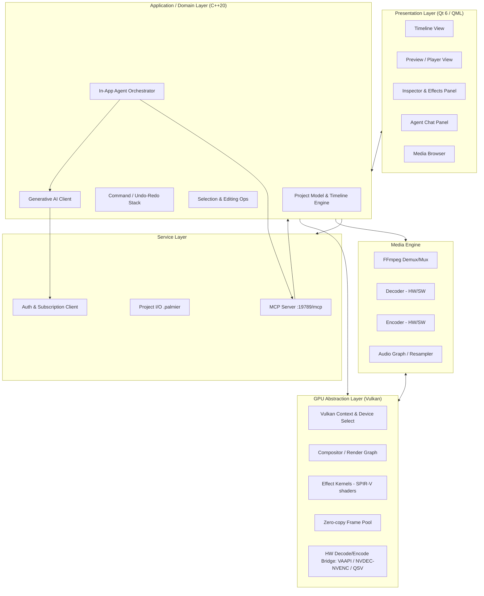
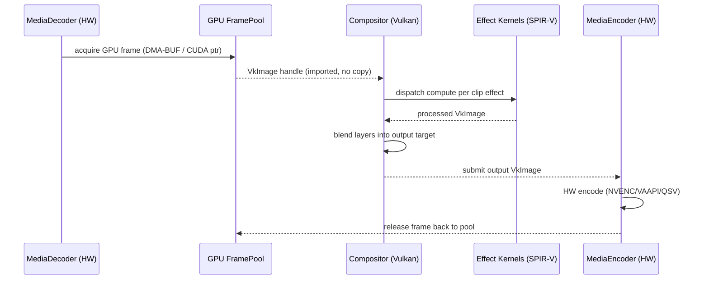

# Design Document: Palmier Pro for Linux (with GPU Support)

## Overview

Palmier Pro is an open-source, AI-native, multi-track video editor. The original
([palmier-io/palmier-pro](https://github.com/palmier-io/palmier-pro)) is a native macOS
application written in Swift 6.2 / SwiftUI targeting Apple Silicon, with three defining
capabilities: a Premiere-style timeline editor, in-timeline generative AI (image/video/audio),
and a built-in **MCP (Model Context Protocol) server** that lets external AI agents
(Claude, Codex, Cursor) and an in-app agent operate on the same project. *(Feature summary
paraphrased from the project's public README; content was rephrased for compliance with
licensing restrictions.)*

This document describes a **Linux port** that reaches **feature parity** with the original
while adding **first-class GPU acceleration** (NVIDIA, AMD, and Intel) as the headline new
capability. Because none of the original's Apple frameworks (SwiftUI, AVFoundation, Metal,
VideoToolbox, Core Image) exist on Linux, the port is a ground-up reimplementation on a
cross-distribution native stack: **C++ (C++20) with Qt 6 for UI, FFmpeg for media I/O and
codecs, and Vulkan for GPU compositing/rendering and hardware-accelerated decode/encode**.

The design preserves the wire-level and behavioral contracts that make the original valuable —
most importantly the MCP server surface at `http://127.0.0.1:19789/mcp` and the project/timeline
data model — so that agent integrations and project files remain compatible across platforms.

> **Assumptions to validate with the user** (the original's internal source was not inspected
> in depth for this design; these are derived from public documentation):
> 1. The MCP endpoint (`127.0.0.1:19789`, HTTP transport) and its tool surface should be
>    replicated exactly for agent compatibility. The exact tool names/schemas are assumed and
>    must be confirmed against the upstream MCP implementation.
> 2. The generative-AI processing is a **closed-source hosted service**; the Linux client will
>    call the same backend API (login + subscription) rather than reimplement it. The editor,
>    MCP server, and agent chat are GPLv3 and will be reimplemented open-source.
> 3. Project file format compatibility with the macOS version is desired but not guaranteed by
>    upstream; we define our own documented `.palmier` format and provide a best-effort importer.

## Goals and Non-Goals

**Goals**
- Feature parity with original: multi-track timeline editing, media import, playback,
  trimming/splitting/reordering, transitions/effects, export, in-timeline generative AI,
  in-app agent chat, and the MCP server.
- Run on mainstream Linux distributions (Ubuntu 22.04+, Fedora 39+, Arch, Debian 12+).
- GPU-accelerated decode, effects/compositing, and encode across NVIDIA, AMD, and Intel.
- Graceful CPU fallback when no supported GPU is present.

**Non-Goals**
- Reimplementing the proprietary hosted generative-AI inference (we call the existing service).
- Bit-for-bit reproduction of macOS-only UI chrome or Apple-exclusive codecs (e.g., ProRes
  encode is decode-only / best-effort).
- Mobile or Windows support (out of scope for this spec).

## Architecture



**Layering rationale**

- **Presentation (Qt 6 / QML):** Cross-distro, GPU-friendly (Qt RHI can run on Vulkan),
  accessible, and mature. QML for fluid timeline interactions; C++ for models exposed via
  `QAbstractItemModel`.
- **Application/Domain:** Pure C++20, UI-agnostic and headless-capable so the MCP server can
  drive identical editing operations without a UI. All mutations flow through a **Command**
  object for uniform undo/redo and for agent-issued edits.
- **Service:** MCP server, project persistence, auth/subscription for generative features.
- **Media Engine:** FFmpeg (libav*) for container/codec breadth; abstracts hardware vs software
  paths behind a single decoder/encoder interface.
- **GPU Abstraction (Vulkan):** One rendering/compute backend for compositing and effects, plus
  a bridge to vendor hardware codec paths. Isolates all vendor differences behind capability
  probing.

## Platform Mapping (macOS → Linux)

| Concern | Original (macOS) | Linux Port |
| --- | --- | --- |
| UI framework | SwiftUI / AppKit | Qt 6 (QML + C++) |
| Language | Swift 6.2 | C++20 |
| Media I/O & codecs | AVFoundation | FFmpeg (libavformat/libavcodec/libswscale/libswresample) |
| GPU render/compute | Metal | Vulkan (+ SPIR-V compute shaders) |
| HW video codec | VideoToolbox | VAAPI (Intel/AMD), NVDEC/NVENC (NVIDIA), Quick Sync (Intel) |
| Image processing | Core Image | Vulkan compute effect kernels |
| Color management | ColorSync | LittleCMS + shader-based transforms |
| Packaging | .dmg | Flatpak (primary), AppImage, `.deb`/`.rpm` |
| MCP transport | HTTP `127.0.0.1:19789` | HTTP `127.0.0.1:19789` (unchanged) |

## Components and Interfaces

### Component 1: Timeline Engine (Project Model)

**Purpose:** Owns the authoritative, in-memory representation of a project — tracks, clips,
transitions, effects, and playhead state — and applies edits through commands.

**Interface:**
```cpp
class TimelineEngine {
public:
    // Query
    Project snapshot() const;                       // immutable view for readers (UI/MCP)
    std::optional<Clip> clip(ClipId id) const;
    Duration duration() const;                       // total timeline length

    // Mutation (all return a Command result for undo/redo + MCP responses)
    CommandResult apply(std::unique_ptr<EditCommand> cmd);
    CommandResult undo();
    CommandResult redo();

    // Change notification (UI + MCP subscribers)
    Subscription observe(std::function<void(const ChangeSet&)> cb);
};
```

**Responsibilities:**
- Enforce timeline invariants (no negative durations, no overlapping clips on a single track).
- Emit granular `ChangeSet` events so both the Qt views and MCP subscribers stay in sync.
- Serve as the single source of truth for UI, playback, export, and agent operations.

### Component 2: MCP Server

**Purpose:** Expose the editor's timeline to external agents over the same endpoint/transport as
the original, mapping MCP tool calls to `EditCommand`s on the `TimelineEngine`.

**Interface:**
```cpp
class McpServer {
public:
    McpServer(TimelineEngine& engine, ToolRegistry tools);
    void start(std::string_view host = "127.0.0.1", uint16_t port = 19789); // path: /mcp
    void stop();
};

struct McpTool {
    std::string name;                 // e.g., "timeline.add_clip"
    JsonSchema  inputSchema;
    std::function<Json(const Json&)> handler; // translates to EditCommand
};
```

**Responsibilities:**
- Serve MCP over HTTP at `http://127.0.0.1:19789/mcp` (loopback only, matching the original).
- Advertise tools for reading the timeline and performing edits (add/trim/split/move/delete
  clips, add transitions/effects, trigger generation, export).
- Reuse the exact same command path as the UI so agent edits are undoable and observable.

### Component 3: Media Engine (FFmpeg)

**Purpose:** Import/probe media, decode frames (preferring hardware), and encode/mux on export.

**Interface:**
```cpp
class MediaDecoder {
public:
    static Result<MediaDecoder> open(const std::filesystem::path&, DecodePrefs);
    MediaInfo info() const;                          // streams, codecs, resolution, fps
    // Decodes next frame; may return a GPU-resident frame (zero-copy) or CPU frame
    Result<DecodedFrame> nextFrame();
    Result<void> seek(Duration ts);
};

class MediaEncoder {
public:
    static Result<MediaEncoder> create(const EncodeSpec&); // codec, bitrate, hw preference
    Result<void> submit(const RenderedFrame&);       // accepts GPU or CPU frames
    Result<void> finish();
};
```

**Responsibilities:**
- Probe and normalize heterogeneous inputs (H.264/HEVC/AV1/ProRes-decode/VP9, PCM/AAC/Opus).
- Select hardware decode/encode when available; expose frames as GPU textures for zero-copy.
- Drive the audio graph (resampling, mixing) via libswresample.

### Component 4: GPU Abstraction Layer (Vulkan)

**Purpose:** Provide a single vendor-neutral surface for compositing, effect kernels, and a
bridge to hardware codecs. **This is the core of the new Linux GPU capability** and is detailed
in the low-level section below.

**Interface:**
```cpp
class GpuContext {
public:
    static Result<GpuContext> create(GpuSelectionPolicy policy);
    GpuCaps capabilities() const;                    // decode/encode/compute support flags
    FramePool& framePool();                          // pooled GPU-resident frames
};

class Compositor {
public:
    // Composites all visible clips at a timeline position into one output frame on-GPU
    Result<RenderedFrame> renderAt(const Project&, Duration position, RenderTarget);
    void registerEffect(EffectId, SpirvModule kernel);
};
```

**Responsibilities:**
- Enumerate/select the best GPU per policy; expose capabilities to the media engine.
- Run the compositing render graph and per-clip effect kernels (SPIR-V compute/fragment).
- Keep frames GPU-resident from decode → effects → composite → encode (zero-copy) where the
  vendor path allows it; otherwise transfer explicitly and transparently.

### Component 5: Generative AI Client & Auth

**Purpose:** Call the existing hosted generative service for in-timeline image/video/audio
generation, gated by login + subscription (parity with original's closed-source processing).

**Interface:**
```cpp
class GenerativeClient {
public:
    Result<GenerationJob> submit(const GenerationRequest&); // model, prompt, params
    Result<GenerationStatus> poll(JobId);
    Result<MediaAsset> fetchResult(JobId);           // downloaded into media browser
};
```

**Responsibilities:**
- Authenticate (token from `AuthClient`), submit generation jobs, stream progress to the UI,
  and land results as importable clips on the timeline.
- Surface the same model choices as the original service (e.g., video/image generators) subject
  to backend availability.

### Component 6: In-App Agent Orchestrator

**Purpose:** Provide the built-in agent chat that operates the editor through the same MCP tools
external agents use.

**Responsibilities:**
- Maintain a chat session, translate user intents into MCP tool calls, and render results.
- Reuse `McpServer` tool handlers to guarantee identical behavior with external agents.

## Data Models

### Project

```cpp
struct Project {
    Uuid           id;
    std::string    name;
    FrameRate      timelineFps;        // e.g., 24/30/60
    Resolution     canvas;             // width x height
    ColorSpace     colorSpace;         // e.g., Rec.709, Rec.2020
    std::vector<Track> tracks;
    std::vector<MediaAssetRef> assets; // referenced media (path or asset id)
    SchemaVersion  version;            // for forward/backward compatibility
};
```

**Validation rules:**
- `timelineFps > 0`, `canvas.width > 0 && canvas.height > 0`.
- Every `Clip.assetRef` resolves to an entry in `assets`.
- `version` is a known, supported schema version.

### Track & Clip

```cpp
struct Track {
    Uuid id;
    TrackKind kind;                    // Video | Audio
    bool muted;
    bool locked;
    std::vector<Clip> clips;           // sorted, non-overlapping by timelineStart
};

struct Clip {
    ClipId       id;
    MediaAssetRef assetRef;
    Duration     timelineStart;        // position on timeline
    Duration     sourceIn;             // in-point within source
    Duration     sourceOut;            // out-point within source (sourceOut > sourceIn)
    std::vector<Effect> effects;
    std::optional<Transition> transitionIn;
    double       gain;                 // audio; 1.0 = unity
    double       opacity;              // video; [0,1]
};
```

**Validation rules:**
- `sourceOut > sourceIn`; clip duration = `sourceOut - sourceIn`.
- Clips within a track are ordered by `timelineStart` and must not overlap (except within an
  explicit transition region).
- `opacity ∈ [0,1]`, `gain ≥ 0`.

### GPU Capability Descriptor

```cpp
struct GpuCaps {
    std::string vendor;                // "NVIDIA" | "AMD" | "Intel" | "software"
    bool   supportsCompute;            // Vulkan compute for effects
    bool   hwDecode;                   // VAAPI / NVDEC / QSV available
    bool   hwEncode;                   // VAAPI / NVENC / QSV available
    std::set<CodecId> decodeCodecs;    // e.g., H264, HEVC, AV1
    std::set<CodecId> encodeCodecs;
    size_t vramBytes;
};
```

## Low-Level Design: GPU Integration Layer

This section details the headline new capability. The design keeps frames GPU-resident across
the pipeline and abstracts three vendor backends behind one interface.

### Device selection policy

```pascal
ALGORITHM selectGpu(policy)
INPUT: policy (Auto | PreferVendor(v) | ForceIndex(i) | ForceSoftware)
OUTPUT: GpuContext

BEGIN
  devices ← vulkan.enumeratePhysicalDevices()

  IF policy = ForceSoftware OR devices is empty THEN
    RETURN GpuContext.softwareFallback()      // FFmpeg SW decode + CPU compositing
  END IF

  candidates ← EMPTY LIST
  FOR each d IN devices DO
    caps ← probeCaps(d)                        // query compute + VAAPI/NVDEC/QSV bridges
    score ← scoreDevice(d, caps, policy)       // discrete GPU > iGPU; hwEncode adds weight
    candidates.add({device: d, caps: caps, score: score})
  END FOR

  best ← argmax(candidates by score)
  ctx  ← createContext(best.device, best.caps)
  ASSERT ctx.capabilities().supportsCompute = true   // required for effect kernels
  RETURN ctx
END
```

**Preconditions:** Vulkan loader present; at least the software path is always available.
**Postconditions:** Returns a usable context; never throws for "no GPU" — degrades to software.

### Vendor backend mapping for hardware codecs

| Vendor | Decode | Encode | Vulkan interop |
| --- | --- | --- | --- |
| NVIDIA | NVDEC (via FFmpeg `cuvid`) | NVENC | CUDA↔Vulkan external memory, or VK Video |
| AMD | VAAPI | VAAPI (VCN) | DMA-BUF import into Vulkan |
| Intel | VAAPI / Quick Sync | VAAPI / QSV | DMA-BUF import into Vulkan |
| none | FFmpeg SW | FFmpeg SW (x264/x265/SVT-AV1) | CPU staging buffers |

### Zero-copy frame lifecycle



### Compositing render pass

```pascal
ALGORITHM renderAt(project, position, target)
INPUT: project, position (timeline time), target (GPU render target)
OUTPUT: RenderedFrame
PRECONDITION: 0 <= position <= project.duration
POSTCONDITION: output matches painter's-order blend of all visible clips at `position`

BEGIN
  visible ← EMPTY LIST
  FOR each track IN project.tracks WHERE track.kind = Video AND NOT track.muted DO
    clip ← clipAt(track, position)
    IF clip ≠ NULL THEN visible.add({clip: clip, z: track.index})
  END FOR

  sortAscendingByZ(visible)                    // bottom track drawn first
  clearTarget(target)                          // transparent/black canvas

  FOR each v IN visible DO
    frame ← decodeFrameForClip(v.clip, position)   // prefer GPU-resident
    LOOP INVARIANT: target holds correct blend of all lower-z clips processed so far
    FOR each effect IN v.clip.effects DO
      frame ← dispatchEffectKernel(effect, frame)  // SPIR-V compute
    END FOR
    blend(target, frame, v.clip.opacity)           // alpha-composite onto target
  END FOR

  RETURN present(target)
END
```

**Loop invariant:** After processing the first *k* visible clips (sorted by z), `target` contains
exactly the alpha-composited result of those *k* clips in painter's order.

### Effects as SPIR-V compute kernels

Effects (brightness/contrast, blur, crop/transform, color grade, transitions) are implemented as
compute shaders compiled to SPIR-V and registered with the `Compositor`. Each kernel reads an
input `VkImage`, writes an output `VkImage`, and receives parameters via a uniform/push-constant
block. This gives a uniform, GPU-accelerated effect model across all vendors and a clean
extension point for future effects.

## Key Functions with Formal Specifications

### `TimelineEngine::apply(cmd)`

```cpp
CommandResult apply(std::unique_ptr<EditCommand> cmd);
```
**Preconditions:** `cmd != nullptr`; `cmd` targets ids that exist in the current project.
**Postconditions:** On success, project reflects the edit, the command is pushed on the undo
stack, and a `ChangeSet` is emitted to all observers. On failure, project is unchanged and a
descriptive error is returned (no partial mutation).
**Invariants preserved:** Track clip lists remain ordered and non-overlapping.

### `MediaEncoder::submit(frame)` / export

```cpp
Result<void> submit(const RenderedFrame& frame);
```
**Preconditions:** Encoder created with a valid `EncodeSpec`; frame resolution matches spec.
**Postconditions:** Frame is queued to the (hardware or software) encoder in presentation order;
returns error without corrupting the output stream on failure.

## Example Usage

```cpp
// Headless edit + export driven the same way the UI and MCP server drive it.
auto gpu     = GpuContext::create(GpuSelectionPolicy::Auto).value();
TimelineEngine engine;

auto asset = MediaDecoder::open("input.mp4", {.preferHardware = true}).value();
engine.apply(std::make_unique<AddClipCommand>(/*track*/0, asset.info(),
             /*at*/Duration::zero()));
engine.apply(std::make_unique<AddEffectCommand>(clipId, Effect::brightness(0.1)));

Compositor comp{gpu};
auto enc = MediaEncoder::create({.codec = CodecId::H264, .preferHardware = true}).value();
for (Duration t = 0; t <= engine.duration(); t += frameStep) {
    auto frame = comp.renderAt(engine.snapshot(), t, target).value();
    enc.submit(frame);
}
enc.finish();
```

```cpp
// Starting the MCP server so external agents can edit the same project.
McpServer mcp{engine, buildDefaultToolRegistry()};
mcp.start("127.0.0.1", 19789);   // http://127.0.0.1:19789/mcp
```

## Correctness Properties

*A property is a characteristic or behavior that should hold true across all valid executions of
a system — essentially, a formal statement about what the system should do. Properties serve as
the bridge between human-readable specifications and machine-verifiable correctness guarantees.*

### P1: Undo/redo round-trip

For any command `c`, `apply(c)` followed by `undo()` restores the exact prior project state, and
`redo()` reproduces the post-`apply` state.

**Validates: Requirements 2.9**

### P2: No partial edits (atomicity)

For any command `c` (including a generative request that fails at the provider), the operation
either fully applies or leaves the project unchanged; there is never a partial mutation.

**Validates: Requirements 6.6**

### P3: Track ordering and non-overlap invariant

After any sequence of commands, every track's clips remain ordered by `timelineStart` and
non-overlapping outside explicit transition regions.

**Validates: Requirements 2.2, 2.3**

### P4: UI / MCP / agent edit equivalence

For any `EditCommand`, issuing it through the UI, an MCP tool call, or the in-app agent produces
the same resulting project state.

**Validates: Requirements 7.4, 8.1, 8.4**

### P5: GPU/CPU parity

For any source frame and set of effect parameters, compositing on the GPU versus the software
fallback yields visually equivalent output within a bounded per-pixel tolerance.

**Validates: Requirements 10.7**

### P6: Export frame ordering

For any exported timeline, rendered frames are emitted in strictly increasing presentation time.

**Validates: Requirements 11.1**

### P7: Graceful degradation

With no supported GPU (or when `ForceSoftware` is selected), the application remains fully
functional using the software decode/composite/encode path.

**Validates: Requirements 10.4, 13.3**

### P8: Split contiguity and duration conservation

For any clip and any interior playhead position, splitting the clip produces two contiguous,
non-overlapping clips whose combined duration equals the original clip duration and whose combined
source range equals the original source range.

**Validates: Requirements 2.5**

### P9: Reorder preserves clip count

For any track and any reordering of its clips, the total number of clips on that track is
unchanged.

**Validates: Requirements 2.7**

### P10: Trim adjusts duration to boundary

For any clip and any valid trim boundary, after trimming the clip's duration equals
`sourceOut - sourceIn` for the new boundary.

**Validates: Requirements 2.4**

### P11: Project persistence round-trip

For any valid project, serializing it to the `.palmier` store and then deserializing it yields an
equivalent project (all clips, tracks, edits, and media references preserved).

**Validates: Requirements 3.5**

### P12: Generated-clip version retention

For any clip replaced by a generated clip, the prior version remains retained and selectable.

**Validates: Requirements 3.4**

## Error Handling

| Scenario | Condition | Response | Recovery |
| --- | --- | --- | --- |
| No compatible GPU | Vulkan enumerates zero suitable devices | Log + notify; switch to software path | Continue with CPU pipeline |
| HW decode unsupported for codec | Vendor lacks codec (e.g., AV1 on old GPU) | Fall back to FFmpeg SW decode for that stream | Transparent to user |
| Unsupported media file | FFmpeg probe fails | Reject import with clear message | User picks another file |
| MCP port in use | `19789` already bound | Report conflict; refuse to start server | User frees port / configurable override |
| Generative auth failure | Missing/expired subscription token | Prompt login/subscription | Retry after auth |
| Export encoder failure | HW encoder init fails | Retry with software encoder | Complete export via CPU |
| GPU device lost | Vulkan `VK_ERROR_DEVICE_LOST` | Recreate context; if repeated, drop to software | Preserve project state |

## Testing Strategy

**Unit testing:** Timeline invariants, command apply/undo/redo, project (de)serialization,
clip math (trim/split/ripple), and capability probing (mocked device descriptors).

**Property-based testing:** Encode properties P1–P4, P6, and P8–P12 as generative tests.
**Property Test Library:** [RapidCheck](https://github.com/emil-e/rapidcheck) (C++). Generate
random command sequences and assert invariants (ordering/non-overlap, undo round-trip,
UI/MCP/agent equivalence, monotonic export timestamps, split/trim clip math, reorder count
conservation, and project serialization round-trip). Each property test must reference its design
property and run a minimum of 100 iterations. Tag format:
**Feature: palmier-pro-linux, Property {number}: {property_text}**.

**GPU/rendering tests:** Golden-image comparison of GPU vs software compositor (property P5)
within tolerance; run across available CI GPU runners (NVIDIA/AMD/Intel) where possible, plus a
software-only lane for P7.

**Integration testing:** End-to-end import → edit → export on sample media per codec; MCP
protocol conformance tests driving edits via HTTP and asserting resulting project state;
generative client tests against a mocked backend.

## Performance Considerations

- Keep frames GPU-resident (zero-copy DMA-BUF / CUDA-Vulkan interop) to avoid PCIe round-trips.
- Pool GPU frames to avoid per-frame allocation; cap pool by available VRAM (`GpuCaps.vramBytes`).
- Decode-ahead and a render cache for scrubbing; prioritize the playhead position.
- Prefer hardware encode for export; parallelize effect kernels across compute queues.
- Target real-time (≥ timeline fps) preview for 1080p on iGPU and 4K on discrete GPUs.

## Security Considerations

- MCP server binds to loopback (`127.0.0.1`) only, matching the original; no external exposure.
- Validate/normalize all MCP tool inputs against JSON schemas before creating commands.
- Treat imported media as untrusted; rely on FFmpeg sandboxing/limits and validate probe output.
- Store auth tokens via the platform secret store (libsecret / Secret Service API), not plaintext.
- Generative requests sent over TLS to the hosted backend; no local storage of credentials.

## Dependencies

- **Qt 6** (Core, Gui, Quick/QML, Widgets) — UI and application shell.
- **FFmpeg (libav\*)** — demux/mux, decode/encode, scaling, audio resampling; hardware
  accel via VAAPI, NVDEC/NVENC, Quick Sync.
- **Vulkan SDK** + **shaderc/glslang** — GPU context, compositor, SPIR-V effect kernels.
- **libva** (VAAPI), NVIDIA driver + **CUDA/NVENC** headers, **oneVPL/QSV** (Intel) — vendor
  hardware codec paths.
- **LittleCMS (lcms2)** — color management.
- **libsecret** — secure credential storage.
- **RapidCheck**, **GoogleTest** — testing.
- **Packaging:** Flatpak (primary), AppImage, `.deb`/`.rpm`.
- **License:** GPLv3 (matching upstream) for editor, MCP server, and agent chat.

## Open Questions (to confirm with the user / upstream)

1. Exact MCP tool names/schemas from upstream to guarantee agent compatibility.
2. The hosted generative-AI API contract (endpoints, auth flow, supported models).
3. Desired degree of `.palmier` project-file compatibility with the macOS version.
4. Minimum supported GPU generations per vendor and target preview resolutions.
